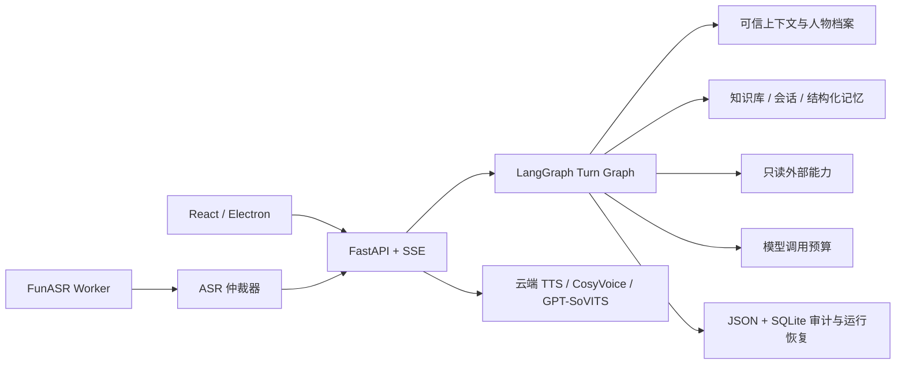

# Mindspace

> 当前源码版本：**0.5.8**
> 面向 Windows 的本地优先 AI 角色陪伴框架，使用 LangGraph 编排对话、检索、工具、记忆、档案与语音链路。

Mindspace 将模型调用、RAG、结构化人物档案、长期记忆、ASR、TTS 和桌面 Launcher 组合成一套可检查、可恢复、可扩展的应用框架。项目重点不是“把所有内容都塞进 Prompt”，而是明确每类信息的来源、可信等级、生命周期和写入权限。

## 0.5.8 重点

- 实时语音入口新增“通话 / 面对面”选择，默认保持原通话逻辑。
- 面对面模式可保存当前场景，并在后续每轮语音中持续加载。
- 面对面场景通过临时高优先级 Prompt 层提供现场感，不作为人物事实、长期记忆或 JSON Patch 证据。
- `interaction.voice_entry_mode` 与 `interaction.face_to_face_scene` 保存用户上次选择和内容。

## 0.5.7 成熟化改造

- 模型调用按 `planner`、`research_review`、`generation`、`protocol_repair` 和 `memory_extract` 独立计数，单轮总上限为 5。
- 普通闲聊只进行正文生成；时间词本身不会误触联网规划。
- 流式正文按检查点持久化，页面刷新、SSE 断线和 Core 重启都不会自动重复生成。
- 检索候选、工具结果和调度状态仅用于审计，不会升级为长期用户事实。
- 用户可以直接编辑人物档案，支持 revision 冲突保护、版本历史和恢复。
- Prompt Inspector 可解释某轮模型实际接收的规则、档案、历史、检索与裁剪结果。
- ASR 使用确定性三阶段仲裁，低置信内容不会误停 TTS、误调 LLM 或写入长期记忆。
- 情绪模型保持关闭，不占用显存，仅保留未来接口边界。

完整版本记录见 [CHANGELOG.md](CHANGELOG.md)，机器可读记录位于 [docs/release-history.json](docs/release-history.json)。

## 核心链路



一轮对话的真实节点、条件边、Prompt 顺序和模型 HTTP 输入，可从 [代码精读指南](docs/CODE_READING_GUIDE.md) 开始阅读。

## 仓库结构

| 路径 | 作用 |
| --- | --- |
| `src/mindspace_graph/` | LangGraph、API、Prompt、RAG、档案、上下文、ASR/TTS 适配 |
| `frontend/` | 对话产品界面和 Prompt Inspector |
| `desktop/` | Electron Launcher、组件安装、更新和故障诊断 |
| `tests/` | 后端单元、集成、恢复、可信分层和中文场景测试 |
| `scripts/` | 启动、验证、打包、更新和运行时准备脚本 |
| `docs/` | 架构、算法、调用链、运行手册和版本化设计文档 |
| `vendor/` | 必需的第三方语音代码或适配器；模型权重不在仓库内 |

以下内容不会上传到 Git：

- API 密钥、签名私钥和用户配置；
- 会话、人物档案、日志、数据库和下载缓存；
- Python/Node 私有环境；
- ASR、TTS、向量和角色音色模型；
- 安装包、blockmap、Core ZIP 与 Electron 解包目录；
- 本地参考音频和声音候选。

## 开发环境

建议环境：

- Windows 10/11 x64；
- PowerShell 7；
- Python 3.11；
- [uv](https://docs.astral.sh/uv/)；
- Node.js 20 或更高版本；
- 本地 ASR/TTS 可选 NVIDIA GPU，纯文字与云端接口不要求 GPU。

克隆时初始化第三方子模块：

```powershell
git clone --recurse-submodules https://github.com/Spirtxiaoqi7/Mindspace.git
Set-Location .\Mindspace
```

安装后端和前端开发依赖：

```powershell
uv sync --extra dev --extra embeddings
npm --prefix frontend ci
npm --prefix desktop ci
```

默认 `demo` 模式不需要 API Key。启动 Core：

```powershell
pwsh -NoProfile -File .\scripts\start.ps1 -OpenBrowser
```

独立语音服务：

```powershell
pwsh -NoProfile -File .\scripts\start-asr.ps1
pwsh -NoProfile -File .\scripts\start-tts.ps1
```

Web 界面默认位于 <http://127.0.0.1:8765/>，OpenAPI 位于 <http://127.0.0.1:8765/api/docs>。

## 配置和密钥

环境变量示例位于 [config/.env.example](config/.env.example)。也可以在产品设置界面配置 OpenAI-compatible LLM、SiliconFlow TTS、本地语音和只读能力。

请勿提交：

- `MINDSPACE_LLM_API_KEY`；
- `MINDSPACE_TTS_SILICONFLOW_API_KEY`；
- `runtime/update-keys/private.pem`；
- `runtime/config/settings.json`；
- 任何真实用户档案、会话或声音素材。

公开接口只返回脱敏配置；Prompt Inspector 默认同样脱敏。

## 模型和语音边界

- 中文向量、ASR/VAD/标点、CosyVoice 和 GPT-SoVITS 权重均按需安装，不进入源码仓库。
- `vendor/CosyVoice` 固定为上游 Git 子模块；`vendor/GPT-SoVITS` 是构建所需的代码快照。
- 角色权重、克隆声音、参考音频及生成音频可能具有额外授权要求，不属于 Mindspace 源码许可范围。
- 情绪推断运行链路在 0.5.7 中保持关闭，接口位置见 [EMOTION_INTERFACE.md](docs/EMOTION_INTERFACE.md)。

第三方来源和许可证边界见 [THIRD_PARTY_NOTICES.md](THIRD_PARTY_NOTICES.md)。

## 测试

后端：

```powershell
.\.venv\Scripts\python.exe -m ruff check src tests
.\.venv\Scripts\python.exe -m pytest -q
```

前端：

```powershell
npm --prefix frontend run check
npm --prefix frontend test -- --run
npm --prefix frontend run build
```

Launcher：

```powershell
npm --prefix desktop run check
npm --prefix desktop test
```

综合验证：

```powershell
pwsh -NoProfile -File .\scripts\verify.ps1
pwsh -NoProfile -File .\scripts\verify-source-integrity.ps1
```

## 打包

生成 Core 更新包：

```powershell
pwsh -NoProfile -File .\scripts\build-update.ps1 -Version 0.5.8
```

生成 Electron Launcher：

```powershell
npm --prefix desktop run package:app
```

详细的离线运行时、更新签名、安装包和回滚规则见 [PACKAGING.md](docs/PACKAGING.md) 与 [ONLINE_UPDATE_RELEASE.md](docs/ONLINE_UPDATE_RELEASE.md)。

## 文档索引

- [产品与首次使用](docs/PRODUCT_INTRODUCTION.md)
- [产品架构](docs/PRODUCT_ARCHITECTURE.md)
- [完整调用链](docs/APPLICATION_FULL_CHAIN.md)
- [代码精读指南](docs/CODE_READING_GUIDE.md)
- [工程师手册](docs/ENGINEER_HANDBOOK.md)
- [记忆、RAG 与 Prompt](docs/DEVELOPER_MEMORY_RAG_PROMPT.md)
- [JSON 档案与记忆](docs/structured-json-memory.md)
- [模型输入和 JSON 编排](docs/LLM_JSON_ORCHESTRATION.md)
- [七项成熟化改造](docs/MATURITY_HARDENING.md)
- [ASR 最终复核与仲裁](docs/ASR_FINAL_REFINEMENT.md)
- [语音通话与面对面互动](docs/VOICE_INTERACTION_MODES.md)
- [运行手册](docs/RUNTIME_RUNBOOK.md)
- [验证手册](docs/VERIFICATION.md)

## 许可说明

仓库公开并不自动授予模型权重、角色声音、参考音频或第三方项目的再分发权。Mindspace 原创代码的统一许可证应以仓库根目录未来发布的 `LICENSE` 为准；在许可证明确前，请勿将源码公开可读误解为获得商业或再分发授权。
