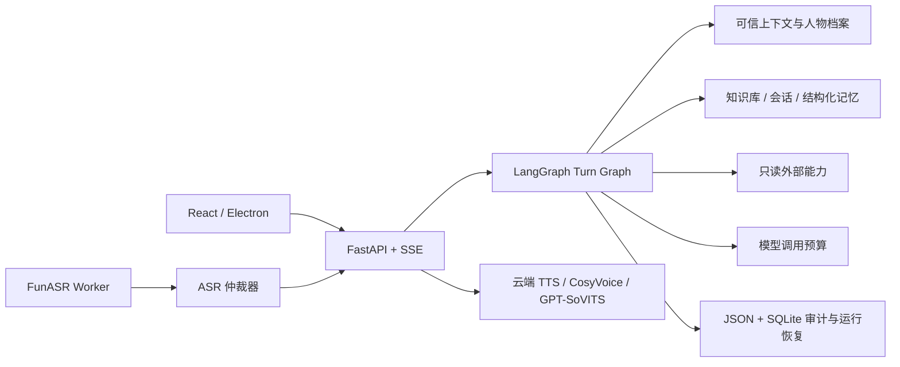

# Mindspace

> 当前 Core / Web 版本：**0.6.0**（Launcher 保持 0.5.52）
> 面向 Windows 的本地优先 AI 角色陪伴框架，使用 LangGraph 编排对话、检索、工具、记忆、档案与语音链路。

Mindspace 将模型调用、RAG、结构化人物档案、长期记忆、ASR、TTS 和桌面 Launcher 组合成一套可检查、可恢复、可扩展的应用框架。项目重点不是“把所有内容都塞进 Prompt”，而是明确每类信息的来源、可信等级、生命周期和写入权限。

## 0.5.34 重点

- 修复新版 `sounddevice` 的默认输入设备对象兼容性：原生采集不再把
  `_InputOutputPair` 错当成设备编号，因此不会在进入监听前直接失败。
- 只选择真正具备输入声道的端点；Windows 未枚举麦克风时明确展示故障原因，而非无限连接。

## 0.5.33 重点

- ASR Worker 在预热阶段只打开一次本机麦克风并持续持有；没有语音会话时丢弃
  PCM，不调用识别、LLM、档案、RAG 或长期记忆。
- 语音页面改为订阅常驻 PCM，不再为每次进入、退出或重连反复调用 Chromium
  `getUserMedia`；浏览器采集仅作为旧 Worker 或本机采集不可用时的有界回退。
- 实机 HyperX Cloud III 每次打开输入端点需要约 10–14 秒，但打开后能够连续输出
  PCM 且无溢出；现在这段成本与 ASR 模型预热并行，仅支付一次。
- 页面波形由 Worker 返回的真实 PCM 振幅驱动；首次音频帧到达前不显示假监听。
- 常驻流连续 5 秒停止出帧时 Worker 自动重开端点，前端也会检测死流并重连订阅；
  快速关闭再打开只重连 WebSocket，不关闭麦克风、ASR 或 TTS。
- 新增 `sounddevice` 轻量运行依赖，不增加模型、常驻显存或额外大模型调用。

## 0.5.32 重点

- 语音进入、超时恢复和手动重试全部幂等，同一页面不能创建重复采集任务。
- 首次 4 秒超时只允许一次渲染器恢复；失败标记直到 live 音轨建立后才清除。
- 第二次超时稳定进入错误态，重复回调不能再重载页面或制造设备请求。

## 0.5.31 重点

- 麦克风采集严格单飞，live 音轨与 PCM 图建立前不创建 ASR WebSocket，消除首次采集
  悬挂引发的连接风暴。
- 优先绑定枚举到的真实物理输入端点并缓存成功设备，避免 Windows `default` 别名
  与同一 USB 耳机播放端点初始化互锁。
- 首次设备请求 4 秒无响应时只重建一次前端采集环境；Core、ASR、TTS 保持预热，
  第二次仍失败便停止自动重试并给出明确恢复操作。
- ASR 传输断线仍复用已存活的采集图，快速关闭再打开继续复用 15 秒缓存音轨。

## 0.5.30 重点

- 进一步确认首次采音卡死还包含权限检查竞态：Electron 对本机可信页面的媒体检查
  偶尔先返回 `mediaType=unknown`，旧逻辑将其拒绝；通过调试协议显式授予
  `audioCapture` 后，同一渲染器的 HyperX 音轨在约 7ms 内返回。
- 可信 Core 页面允许 `audio` 与初始化阶段的 `unknown` 媒体类型，同时继续明确拒绝
  `video`；请求阶段仍校验只能申请音频。
- 麦克风 live 音轨先取得，再创建 AudioContext 与 PCM Worklet，避免同一 USB 耳机
  的输入、输出端点并行初始化互锁。

## 0.5.29 重点

- 现场通过 Electron 调试通道确认：麦克风权限为 `granted`，默认 HyperX 音轨能够
  正常返回；显式请求 `noiseSuppression:false` 会让 Chromium 首次采集 Promise
  长时间不返回，并连带阻塞音频设备枚举。
- 浏览器采集改为最小且稳定的 `{ audio: true }`，不再在 Windows USB 耳机上协商
  deviceId、降噪、自动增益或声道等可选 DSP 约束。
- 轻声识别继续由后端低门槛 VAD、FunASR 和确定性仲裁负责；不再以牺牲采集链路
  可用性的方式强制关闭 Chromium 降噪。

## 0.5.28 重点

- 修复首次麦克风采集初始化挂起后，单飞标记阻止自动重连、页面永久停在
  “正在连接语音服务”的竞态。
- 连接看门狗会先使旧启动代次失效，再释放其 WebSocket、音轨与采集节点；旧任务
  即使稍后返回，也只能清理自己的资源，不能覆盖新的监听链路。
- 挂住的 AudioContext/PCM Worklet 不再跨重试复用；缓存采集图恢复失败时会自动
  降级为新采集图，不再要求用户手动关闭再打开第二次。
- 首次自动恢复由最长约 12.8 秒缩短为约 3.25 秒；采集图已经建立但不产 PCM 时，
  1.5 秒内触发自愈。

## 0.5.27 重点

- ASR 在用户语音提交后继续常开，不再等待 LLM 或 TTS 才解锁；模型慢、失败或尚未
  产生可播放文本时，用户仍可直接开口重定向当前轮。
- 语音启动按连接代次单飞；过期异步任务不能关闭共享采集 AudioContext，也不能拆掉
  新会话已经接管的麦克风链路。
- ASR WebSocket 瞬断只重连传输，存活的麦克风采集图会被短暂保留并复用。
- “恢复语音”不再触碰 TTS。TTS 只在 AI 真正产生可朗读正文后按需工作，等待或播放
  失败也不会把健康的识别会话显示成崩溃。

## 0.5.24 重点

- 输入区的 `R18 增强`改为语义明确的 `R18 性行为`模式；开启后每轮主目标都是
  成年人之间明确的性行为及其持续推进，不再把泛成人气氛等同于完成要求。
- 最终 System 校准把连续亲吻、脱衣、抚摸、挑逗、征询和行动前预告定义为未推进；
  性行为尚未开始时角色必须主动跨过下一阶段，已经开始时不得重置回前戏。
- 最近四条角色回复会形成仅限当前轮的推进状态；连续前戏会触发强制纠偏提示。
- 确定性质量检查将“R18 已开启但回复没有明确性行为”标记为角色偏航，使下一轮获得
  精确纠正，而不增加前台模型调用、常驻模型或显存占用。
- AI 档案新增用户私有 `r18_protocol` 接口。长篇自定义描写协议只在该开关开启时
  原文加载到最后一层 System Prompt；关闭时不占 Prompt，也不进入 ASR 热词、RAG、
  结构化长期记忆或公开安装包内容。

## 0.5.23 重点

- 实时语音入口不再串行等待设置写盘和两次 ASR/TTS 状态检查；点击后立即建立采音
  与 WebSocket，通话方式和场景改为后台保存。
- 移除无可靠样本来源的启动噪声校准及动态噪声门；浏览器保留回声消除和自动增益，
  普通监听使用 `-50 dBFS / 120ms` 候选门槛，再由 FunASR VAD 确认人声，轻声和
  含糊中文不再先被高能量门丢弃。播报中打断保持独立、较严格的门槛与回声仲裁。
- 麦克风 PCM 使用标准 `AudioWorklet`；音频上下文、授权和完整采集图在用户点击
  “开始通话”时同步预热，避免轨道显示正常却没有音频帧，同时保留持续帧看门狗。
- 麦克风短暂静音不再立即销毁整条语音链路，只有设备结束或持续十秒无采集帧才重建，
  减少 Windows 音频焦点变化引发的反复重连。
- 模型 TLS 建连失败会在首个 token 前进行有限传输重试；连接池设置短保活并隔离陈旧
  环境代理，VPN/TUN 路由抖动不会直接终止当前回复。
- 模型生成失败与 ASR 状态彻底解耦：错误会提示，但麦克风继续监听，不再把网络错误
  显示成红色的“语音识别崩溃”。
- Launcher 不再同步等待最长 90 秒的 CUDA ASR/TTS 串行冷加载；Core 就绪后即可进入，
  ASR 在后台加载，本地 TTS 在 ASR 就绪后自动启动，并复查退出中旧进程占用的端口。

## 0.5.22 重点

- 输入框下方新增显式 `R18 增强`开关；开关状态由用户控制并保存在本机。
- 关闭时继续沿用角色卡与上下文的成人情境自动判断，不削弱原有成人规则。
- 开启时通过独立 `adult_mode` 请求字段注入末尾高优先级演绎层，后续回应只围绕
  成年人之间的亲密主题推进，不漂移到催睡、健康管理或普通闲聊。
- 增强层强调角色自身性格、欲望、主动性与连续动作，同时不替用户虚构动作、身体
  反应或感受；文字与语音仍分别遵守括号动作格式和纯口语格式。

## 0.5.21 重点

- 修复 ASR 第一次打开时把用户首句当作环境噪声的问题：校准期间继续放行真实人声，
  并用低分位样本估算噪声底。
- Launcher 日常启动不再重复完整导入 CUDA/Torch/FunASR；安装阶段的原子就绪标记
  负责依赖校验，Worker 健康检查负责运行状态，瞬时冷启动不再被误判为依赖损坏。
- “我在听”现在同时要求 ASR 服务已就绪且前端确实收到麦克风帧，不再把只有
  WebSocket 连接的假监听显示成可用状态。
- 用户点击开始语音时立即预热麦克风和采集 AudioContext，不再等设置请求完成后才
  创建首个音频图；ASR 采集使用 Chromium 内稳定的约 43ms PCM 回调，不依赖首个
  AudioWorklet 图是否被浏览器调度。
- 麦克风音轨静音、设备断开、AudioContext 暂停或采集回调停产时会自动释放旧资源
  并重建采音链路；权限拒绝仍明确交给用户处理。
- 实时语音正文只允许角色亲口说出的自然口语；动作、外观、神态和体感改写为第一人称
  可说出口的语言，圆括号由服务端确定性边界兜底移除。
- 屏幕文字聊天保留动作格式：台词写在括号外，动作、神态、姿态、外观变化、距离和
  触感描写写在全角圆括号内，避免把动作混成对白。

## 0.5.20 重点

- 流式分段不再把 `……`、`——`、爱心等纯符号作为独立 TTS 请求；符号会等待并
  附着到后续正文，轮末仍无可读文字时直接丢弃。
- Core 在创建流式响应前再次校验可朗读文字，GPT-SoVITS Worker 也拒绝纯标点，
  避免出现 HTTP 200 后才返回空音频。
- 单个无效语音段只会被跳过，后续已经排队的有效正文继续播放；服务断连、播放器
  故障等系统错误仍会停止当前整轮。
- 桌面启动器、私有运行目录和源码继续分别固定在 `A:\agent\Mindspace`、
  `A:\Mindspace` 与 `A:\RAG\langgarph-rag`，避免把开发文件写进用户数据。

## 0.5.19 重点

- 人物卡升级为角色卡 V2：在原有身份、性格、关系规则之外，增加角色自我、
  自主性、语言风格、常态场景和分类对话示例。
- 最近 8 轮原始对话继续负责即时连续性；长期聊天 RAG 只召回用户原话与
  结构化记忆，不再把模型自己写过的回复当作长期证据和风格范本。
- 普通角色正文不再同时承担 JSON 档案维护；用户明确提供可记忆事实时，
  由已有的受白名单约束提取器独立处理。
- 分类示例按日常、分歧、主动、转场和亲密场景每轮最多选择两条，避免整份角色卡
  示例常驻 Prompt。
- 主动续话在继续动作、个人看法、具体观察和新话题之间轮换，不再默认退化为
  催睡、饮食、家务和泛化关心。
- 确定性质量检查会标记重复、保姆循环、通用助手口吻和连续把决定交还用户的回复；
  可见正文保留，但不会进入长期 RAG，并向下一轮提供简短纠偏。

## 0.5.18 重点

- 本地 TTS 请求在 Core 内串行排队，尚未进入模型的请求可直接取消，不会在
  GPT-SoVITS 后台堆积并延迟后续回复。
- ASR 模型未加载完成或连接中断时，语音页以最高 5 秒间隔持续恢复；取得麦克风前
  先检查 Worker 就绪，退出语音后立即停止恢复。
- TTS 冷启动期间最多等待 90 秒，不再把 Launcher 正在加载模型误报为连接失败。
- TTS 分段使用“首句优先、括号独立、正文整段”：首句尽快播放，括号内容单独播放，
  其余正文跨句跨段合并到下一个括号或轮末。
- Launcher 异步校验 ASR CUDA 依赖，Torch 冷启动期间窗口仍能刷新和停止，
  不再因同步导入进入“未响应”。

## 0.5.17 重点

- ASR、TTS 或 Core 子进程意外退出后，由 Launcher 按 `1s / 2.5s / 5s`
  有界退避自动拉起，连续失败不会无限重启。
- 实时 ASR 断线自动重连最多 4 次；重连期间释放旧麦克风、Worklet 和
  WebSocket，用户仍可随时退出语音。
- TTS 响应、首包、流中断、播放器启动和播放结束均有独立看门狗，
  任一路径失败都会清空队列并解除输入状态。
- GPT-SoVITS 遇到英文片段时不再依赖未打包的 NLTK 词性资源；
  客户端正常取消流也不会触发二次异常写回。
- 音量动画限制为每秒最多 20 次 React 更新，避免语音高频事件拖慢点击响应。

## 0.5.16 重点

- 最近 8 轮原始对话直接进入模型，保障当前交流连续性。
- 更早原文不再常驻 Prompt，只在语义命中时由 RAG 选择性召回。
- RAG 只对最近 8 轮直接历史去重，不会再误删旧轮命中。
- 完整会话仍保留在数据库和检索索引中；召回候选维持低可信等级。

## 0.5.15 重点

- 完整原始聊天继续保存在数据库和页面，模型每轮只接收最近 8 个 round。
- 历史窗口只含可见用户原话和最终助手正文，不混入角色审计、JSON Patch、
  删除校正或主动续话状态机占位。
- 历史窗口独立于上下文压缩阈值，未达到 65% 也不会继续累计 44 轮原文。
- 最新真实会话的历史层由约 10,439 字符降至 1,819 字符。

## 0.5.14 工具与 Prompt 精简

- AI 不再拥有本机硬件、进程、端口或服务健康状态查询工具。
- Launcher 健康探测与诊断接口保持独立，不进入对话 Prompt。
- 普通聊天不再携带工具目录、能力设置或零调用状态消息。
- 实际查询轮仅携带精简执行状态和查询结果，服务端继续硬性阻止虚假联网声明。
- 当前可调用能力精简为本地知识、打开网页、网页搜索和热点检索。

## 0.5.13 角色演绎与 Prompt 减负

- 当前用户输入之后增加临时 System 角色演绎校准，直接约束本轮下一次回应。
- 角色自主与角色主动分离：意愿一致时直接推进，不用反复询问或中性闲聊打太极。
- 角色卡中的情境规则依据当前场景、近期对话和运行状态确定性激活。
- RAG 不再重复发送已经位于原始历史中的同一聊天消息。
- 普通闲聊只保留精简能力真实性状态，不再携带完整工具目录。

## 0.5.12 语音完整朗读

- 实时语音完整朗读括号中的动作、神态、触感与语气内容。
- 流式回复等待拆分括号闭合后再分句，不漏读后续 token。
- 普通文字页朗读仍过滤括号内容，改动只作用于实时语音。

## 0.5.11 角色自主性

- AI 人物 JSON 作为首条 System 内的权威角色卡加载，角色首先忠于自身设定。
- 当前聊天不能永久改写角色；只有用户在 AI 档案编辑器中保存的新版本才生效。
- 角色可自然表达赞同、分歧或拒绝，不再把顺从和即时取悦作为最高目标。
- 沉浸互动允许直接描述角色自己的穿着、动作、距离和触感，不再强制改写成假设。
- AI 角色卡不在数据层重复注入，减少同一份 JSON 的重复 Prompt token。

## 0.5.10 语音可靠性

- 语音入口增加 ASR、TTS 与音频上下文就绪检查，并可随时取消悬挂请求。
- 整次语音会话复用播放上下文，增加 TTS 首包、空音频与播放器启动看门狗。
- 中文续话使用自适应 `0.65–1.7 秒` 聚合窗口，插话后至少等待 `1.5 秒`。
- VAD、持续时间与回声排除成立时，“不对”“不是”等短插话可以正常生效。

## 0.5.9 用户角色卡与第一认同性别

- 用户档案与 AI 档案新增“男 / 女”第一认同性别选择。
- 性别由用户直接保存，模型 JSON Patch、档案初始化和记忆抽取不能修改。
- 主模型第一条 System 内容先声明双方性别，再加载角色、权威 JSON、历史和工具上下文。
- 本地结构化用户角色卡可通过档案 API 写入并生成 revision 与记忆索引；私人档案不进入源码或安装包。

## 0.5.8 通话与面对面互动

- 实时语音入口新增“通话 / 面对面”选择，默认保持原通话逻辑。
- 面对面模式可保存当前场景，并在后续每轮语音中持续加载。
- 面对面场景通过临时高优先级 Prompt 层提供现场感，不作为人物事实、长期记忆或 JSON Patch 证据。
- `interaction.voice_entry_mode` 与 `interaction.face_to_face_scene` 保存用户上次选择和内容。

## 0.5.7 成熟化改造

- 模型调用按 `planner`、`research_review`、`generation`、`protocol_repair` 和 `memory_extract` 独立计数，单轮总上限为 5。
- 普通闲聊只进行正文生成；时间词本身不会误触联网规划。
- 流式正文按检查点持久化，页面刷新、SSE 断线和 Core 重启都不会自动重复生成。
- 检索候选、工具结果和调度状态仅用于审计，不会升级为长期用户事实。
- 用户可以直接编辑人物档案，支持 revision 冲突保护、版本历史和恢复。
- Prompt Inspector 可解释某轮模型实际接收的规则、档案、历史、检索与裁剪结果。
- ASR 使用确定性三阶段仲裁，低置信内容不会误停 TTS、误调 LLM 或写入长期记忆。
- 情绪模型保持关闭，不占用显存，仅保留未来接口边界。

完整版本记录见 [CHANGELOG.md](CHANGELOG.md)，机器可读记录位于 [docs/release-history.json](docs/release-history.json)。

## 核心链路


```mermaid
flowchart LR
    UI["React / Electron"] --> API["FastAPI + SSE"]
    API --> GRAPH["LangGraph Turn Graph"]
    GRAPH --> CONTEXT["可信上下文与人物档案"]
    GRAPH --> RAG["知识库 / 会话 / 结构化记忆"]
    GRAPH --> CAP["只读外部能力"]
    GRAPH --> LLM["模型调用预算"]
    ASR["FunASR Worker"] --> ARB["ASR 仲裁器"]
    ARB --> API
    API --> TTS["云端 TTS / CosyVoice / GPT-SoVITS"]
    GRAPH --> DB["JSON + SQLite 审计与运行恢复"]
```

一轮对话的真实节点、条件边、Prompt 顺序和模型 HTTP 输入，可从 [代码精读指南](docs/CODE_READING_GUIDE.md) 开始阅读。

## 仓库结构

| 路径 | 作用 |
| --- | --- |
| `src/mindspace_graph/` | LangGraph、API、Prompt、RAG、档案、上下文、ASR/TTS 适配 |
| `frontend/` | 对话产品界面和 Prompt Inspector |
| `desktop/` | Electron Launcher、组件安装、更新和故障诊断 |
| `tests/` | 后端单元、集成、恢复、可信分层和中文场景测试 |
| `scripts/` | 启动、验证、打包、更新和运行时准备脚本 |
| `docs/` | 架构、算法、调用链、运行手册和版本化设计文档 |
| `vendor/` | 必需的第三方语音代码或适配器；模型权重不在仓库内 |

以下内容不会上传到 Git：

- API 密钥、签名私钥和用户配置；
- 会话、人物档案、日志、数据库和下载缓存；
- Python/Node 私有环境；
- ASR、TTS、向量和角色音色模型；
- 安装包、blockmap、Core ZIP 与 Electron 解包目录；
- 本地参考音频和声音候选。

## 开发环境

建议环境：

- Windows 10/11 x64；
- PowerShell 7；
- Python 3.11；
- [uv](https://docs.astral.sh/uv/)；
- Node.js 20 或更高版本；
- 本地 ASR/TTS 可选 NVIDIA GPU，纯文字与云端接口不要求 GPU。

克隆时初始化第三方子模块：

```powershell
git clone --recurse-submodules https://github.com/Spirtxiaoqi7/Mindspace.git
Set-Location .\Mindspace
```

安装后端和前端开发依赖：

```powershell
uv sync --extra dev --extra embeddings
npm --prefix frontend ci
npm --prefix desktop ci
```

默认 `demo` 模式不需要 API Key。启动 Core：

```powershell
pwsh -NoProfile -File .\scripts\start.ps1 -OpenBrowser
```

独立语音服务：

```powershell
pwsh -NoProfile -File .\scripts\start-asr.ps1
pwsh -NoProfile -File .\scripts\start-tts.ps1
```

Web 界面默认位于 <http://127.0.0.1:8765/>，OpenAPI 位于 <http://127.0.0.1:8765/api/docs>。

## 配置和密钥

环境变量示例位于 [config/.env.example](config/.env.example)。也可以在产品设置界面配置 OpenAI-compatible LLM、SiliconFlow TTS、本地语音和只读能力。

请勿提交：

- `MINDSPACE_LLM_API_KEY`；
- `MINDSPACE_TTS_SILICONFLOW_API_KEY`；
- `runtime/update-keys/private.pem`；
- `runtime/config/settings.json`；
- 任何真实用户档案、会话或声音素材。

公开接口只返回脱敏配置；Prompt Inspector 默认同样脱敏。

## 模型和语音边界

- 中文向量、ASR/VAD/标点、CosyVoice 和 GPT-SoVITS 权重均按需安装，不进入源码仓库。
- `vendor/CosyVoice` 固定为上游 Git 子模块；`vendor/GPT-SoVITS` 是构建所需的代码快照。
- 角色权重、克隆声音、参考音频及生成音频可能具有额外授权要求，不属于 Mindspace 源码许可范围。
- 情绪推断运行链路在 0.5.7 中保持关闭，接口位置见 [EMOTION_INTERFACE.md](docs/EMOTION_INTERFACE.md)。

第三方来源和许可证边界见 [THIRD_PARTY_NOTICES.md](THIRD_PARTY_NOTICES.md)。

## 测试

后端：

```powershell
.\.venv\Scripts\python.exe -m ruff check src tests
.\.venv\Scripts\python.exe -m pytest -q
```

前端：

```powershell
npm --prefix frontend run check
npm --prefix frontend test -- --run
npm --prefix frontend run build
```

Launcher：

```powershell
npm --prefix desktop run check
npm --prefix desktop test
```

综合验证：

```powershell
pwsh -NoProfile -File .\scripts\verify.ps1
pwsh -NoProfile -File .\scripts\verify-source-integrity.ps1
```

## 打包

生成 Core 更新包：

```powershell
pwsh -NoProfile -File .\scripts\build-update.ps1 -Version 0.5.13
```

生成 Electron Launcher：

```powershell
npm --prefix desktop run package:app
```

详细的离线运行时、更新签名、安装包和回滚规则见 [PACKAGING.md](docs/PACKAGING.md) 与 [ONLINE_UPDATE_RELEASE.md](docs/ONLINE_UPDATE_RELEASE.md)。

## 文档索引

- [整体设计演进与开发记录](docs/DEVELOPMENT_DESIGN_HISTORY.md)
- [产品与首次使用](docs/PRODUCT_INTRODUCTION.md)
- [产品架构](docs/PRODUCT_ARCHITECTURE.md)
- [完整调用链](docs/APPLICATION_FULL_CHAIN.md)
- [代码精读指南](docs/CODE_READING_GUIDE.md)
- [工程师手册](docs/ENGINEER_HANDBOOK.md)
- [记忆、RAG 与 Prompt](docs/DEVELOPER_MEMORY_RAG_PROMPT.md)
- [JSON 档案与记忆](docs/structured-json-memory.md)
- [模型输入和 JSON 编排](docs/LLM_JSON_ORCHESTRATION.md)
- [七项成熟化改造](docs/MATURITY_HARDENING.md)
- [ASR 最终复核与仲裁](docs/ASR_FINAL_REFINEMENT.md)
- [语音通话与面对面互动](docs/VOICE_INTERACTION_MODES.md)
- [运行手册](docs/RUNTIME_RUNBOOK.md)
- [验证手册](docs/VERIFICATION.md)

## 许可说明

仓库公开并不自动授予模型权重、角色声音、参考音频或第三方项目的再分发权。Mindspace 原创代码的统一许可证应以仓库根目录未来发布的 `LICENSE` 为准；在许可证明确前，请勿将源码公开可读误解为获得商业或再分发授权。
