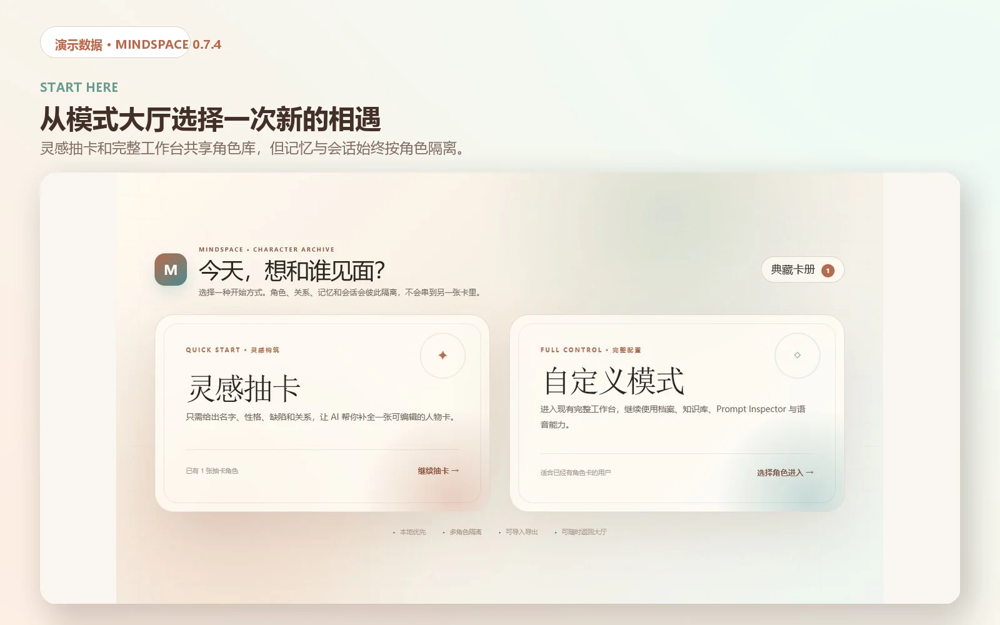
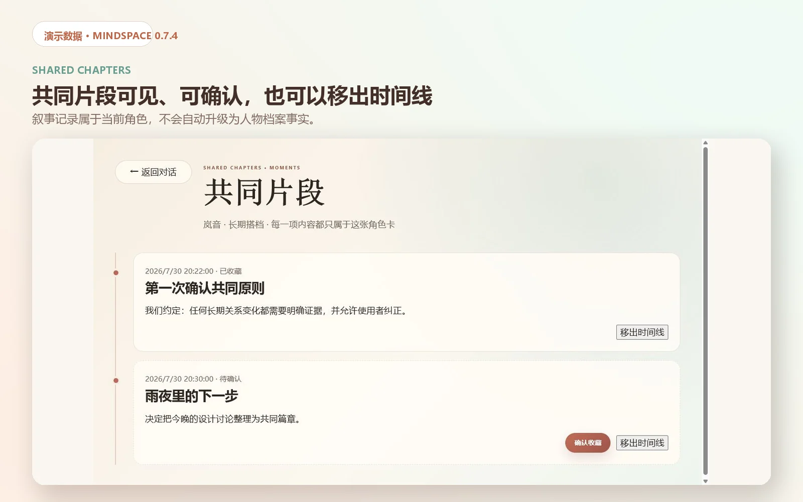
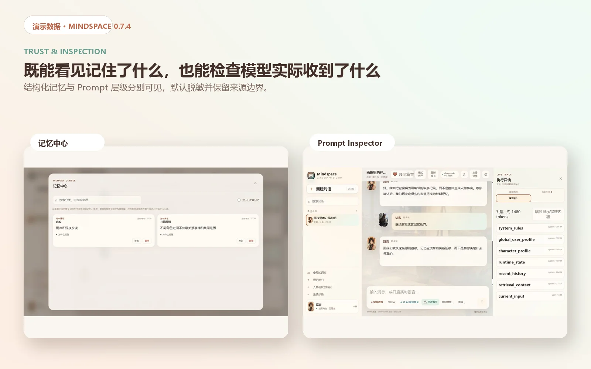
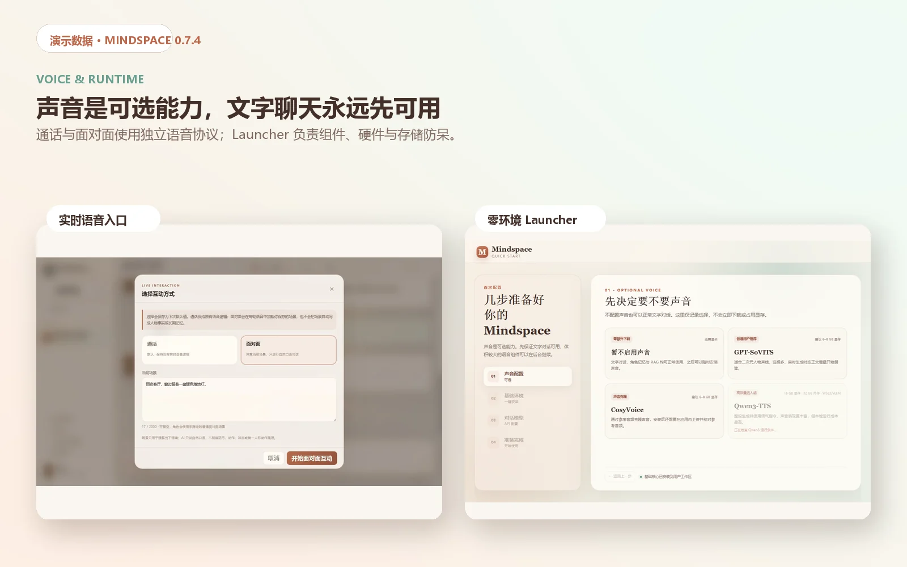
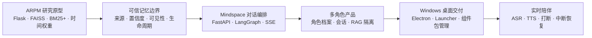
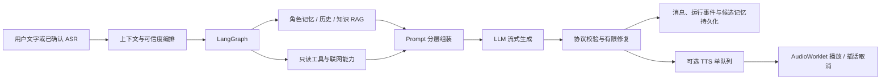

<div align="center">

# Mindspace

### 拥有长期记忆、角色一致性与本地数据边界的 Windows AI 伴侣

**A local-first Windows AI companion with persistent memory, inspectable context, role consistency and optional real-time voice.**

[](CHANGELOG.md#080---2026-08-04)
[](docs/LAUNCHER_ONBOARDING.md)
[](https://douyinqijun.cn/download/)
[](docs/PRODUCT_ARCHITECTURE.md)
[](#本地优先不等于完全离线)

[官网](https://douyinqijun.cn/) ·
[立即下载](https://douyinqijun.cn/download/) ·
[功能介绍](https://douyinqijun.cn/features/) ·
[更新记录](https://douyinqijun.cn/changelog/) ·
[ARPM 起源](#从-arpm-到-mindspace) ·
[开发文档](#文档与开发入口)

<br />


<sub>截图来自 Mindspace 0.7.4 隔离演示环境；角色、对话与记忆均为合成演示数据。</sub>

</div>

---

## Mindspace 是什么

Mindspace 不是一个只把角色卡塞进 System Prompt 的聊天壳。它把模型调用、人物档案、近期原文、
长期记忆、RAG、只读工具、ASR、TTS 与桌面运行时放进同一套可观察、可恢复的产品链路。

项目关注的是一个更难的问题：**当对话持续数周、角色越来越多、记忆越来越复杂时，AI 是否还能
知道“谁说过什么、什么已经确认、什么只是临时推测”，并保持自然的角色表现。**

| 连续陪伴 | 角色一致性 | 本地数据边界 | 故障可恢复 |
| --- | --- | --- | --- |
| 最近 8 轮原始对话、角色长期记忆、历史会话与知识库按需进入本轮 | 档案、关系状态、会话与召回均绑定当前角色 | 用户数据、模型、缓存与可选运行时由 Launcher 明确管理 | 流式中断、服务断开、残缺安装与更新失败都有有限恢复路径 |

### 它与普通角色聊天的差别

- **不全量塞 Prompt**：近期原文保持自然语气，远期内容交给分层检索。
- **不把推测当事实**：工具结果、检索候选、低置信 ASR 和叙事草稿拥有不同可信等级。
- **不让角色串线**：角色 A 的关系事件、场景、聊天向量和运行状态不能被角色 B 召回。
- **不隐藏模型输入**：Prompt Inspector 能显示规则、档案、历史、召回、当前输入与裁剪原因。
- **不强迫安装语音**：文字聊天始终是最小可用产品，本地 ASR/TTS 均为可选组件。
- **不以崩溃代替错误提示**：Launcher 对路径、下载、内存、显存和组件完整性执行预检。

## 真实产品展示

### 1. 模式大厅：从一次新的相遇开始

Core 就绪后先进入模式大厅。新用户可以使用“灵感抽卡”快速构筑角色；已有角色卡的用户可以进入
完整工作台。无论从哪种模式开始，角色、会话与记忆都使用同一套隔离规则。



### 2. 灵感抽卡：让不会写角色卡的用户也能开始

用户只需要提供角色名称、两个核心性格、一个人格缺陷、性别、关系和称呼。生成最多调用一次 LLM；
API 不可用或 JSON 无法修复时使用本地合法模板。生成结果先进入草稿，确认收藏前不会改写正式角色库。


角色卡支持预览、编辑、复制、归档、版本恢复和 `.mindspace-card` 导入导出。卡包不包含聊天、API Key、
长期记忆或全局用户档案。

### 3. 连续聊天：场景、关系与近期原文在同一轮汇合

聊天页显示当前角色、会话、模型、场景和共同篇章。新消息只跟随当前轮流式区域；用户主动上滑后，
界面不会强制把视图拉回底部。


### 4. 共同篇章：叙事可收藏，但不会冒充人物事实

共同片段、角色日记、默契问答和片刻故事全部按 `character_id` 隔离。叙事内容固定为
`narrative_only`：它可以成为可编辑的关系记录，但不能直接作为人物档案写回证据。



### 5. 记忆与模型输入：为什么记住、为什么这样回答

记忆中心展示由已提交 JSON 字段形成的结构化记忆，并允许修改、删除和恢复。Prompt Inspector
则按层展示某轮模型实际收到的内容，完整 Prompt 默认只短时保存在内存，磁盘仅保存长度、哈希和裁剪原因。



### 6. 语音与 Launcher：声音是能力，不是启动门槛

实时语音支持普通通话和面对面两种入口。面对面场景只作为当前语境，模型输出自然口语，不朗读括号
动作旁白。Launcher 负责声音方案选择、环境安装、组件下载、硬件门槛、存储位置、诊断与修复。



## 从 ARPM 到 Mindspace

Mindspace 的研究与设计起点是
[ARPM（Analysis-Based Role-Playing with Memory）](https://github.com/Spirtxiaoqi7/ARPM)。
ARPM 仓库创建于 2026 年 3 月，最初用于研究角色扮演中的长期记忆、混合检索、时间权重、角色感知
召回与拒答问题；对应研究论文可在 [arXiv:2605.14802](https://arxiv.org/abs/2605.14802) 阅读。

ARPM 解决的是“记忆怎样被检索”；Mindspace 继续追问“这些能力怎样成为普通用户真正能安装、理解、
纠正和长期使用的桌面产品”。


```mermaid
flowchart LR
    A["ARPM 研究原型<br/>Flask · FAISS · BM25+ · 时间权重"]
    B["可信记忆边界<br/>来源 · 置信度 · 可见性 · 生命周期"]
    C["Mindspace 对话编排<br/>FastAPI · LangGraph · SSE"]
    D["多角色产品<br/>角色档案 · 会话 · RAG 隔离"]
    E["Windows 桌面交付<br/>Electron · Launcher · 组件包管理"]
    F["实时陪伴<br/>ASR · TTS · 打断 · 中断恢复"]
    A --> B --> C --> D --> E --> F
```

| ARPM 阶段 | Mindspace 产品化 |
| --- | --- |
| Flask 研究原型 | FastAPI 服务、LangGraph 状态图、Electron 桌面应用 |
| 向量与 BM25+ 混合检索 | RRF、时间衰减、公平曝光、结构化记忆和历史对话召回 |
| 单角色实验 | 多角色档案、头像、会话、运行状态和向量索引隔离 |
| 检索日志 | Prompt Inspector、调用预算、写入审计与可信分层 |
| 文字自由对话 | 场景、共同篇章、实时 ASR/TTS、插话与恢复 |
| 手动准备环境 | 私有 Python/uv、组件续传、硬件防呆、更新与回滚 |

> ARPM 与 Mindspace 是连续的研究—产品演进，但不是同一时期、同一形态的应用。Mindspace 不会把
> 后续产品能力倒写成 ARPM 当时已经具备的功能。

## 完整产品能力

| 能力 | 当前实现 | 数据范围 |
| --- | --- | --- |
| 人物档案 | 用户可直接编辑；AI 只在授权入口提交建议 | 全局用户 / 当前角色 |
| 多角色 | 卡册、版本历史、复制、归档、导入导出 | `character_id` 隔离 |
| 近期历史 | 最近 8 轮完整原始对话 | 当前会话 |
| 长期记忆 | 已确认 JSON 字段、角色关系事件、选择性历史召回 | 全局或当前角色 |
| RAG | BM25+、向量、RRF、时间衰减、公平曝光、可选精排 | 角色库 / 全局知识库 |
| 场景 | 聊天内切换，允许新会话继承角色最近场景 | 当前会话 |
| 共同篇章 | 日记、共同片段、默契问答、片刻故事 | 当前角色，叙事只读证据 |
| Prompt 检查 | 分层、脱敏、token 估算、裁剪原因 | 当前运行，短时内存 |
| 只读能力 | 上下文路由、白名单授权、串行执行、能力声明保护 | 当前轮审计 |
| 实时语音 | 常驻 ASR、低置信仲裁、插话、单 TTS 队列 | 当前 VoiceIntent |
| 成人模式 | 成年确认后启用的可选会话模式 | 当前会话，不作为默认入口 |
| 桌面交付 | 私有运行时、断点续传、组件修复、硬件与路径防呆 | 本机 Launcher |
| 更新恢复 | SHA-256、签名清单、健康检查和本地回滚点 | Core / Launcher |

## 一轮对话实际经过什么


```mermaid
flowchart LR
    U["用户文字或已确认 ASR"] --> C["上下文与可信度编排"]
    C --> G["LangGraph"]
    G --> R["角色记忆 / 历史 / 知识 RAG"]
    G --> T["只读工具与联网能力"]
    R --> P["Prompt 分层组装"]
    T --> P
    P --> L["LLM 流式生成"]
    L --> V["协议校验与有限修复"]
    V --> S["消息、运行事件与候选记忆持久化"]
    V --> A["可选 TTS 单队列"]
    A --> O["AudioWorklet 播放 / 插话取消"]
```

外部能力保持串行执行，避免多个工具结果竞争写状态；每轮模型调用按用途计数，预算耗尽后非核心节点
直接降级，不允许内部无限重试。

### 模型实际输入顺序

| 顺序 | 层级 | 说明 |
| --- | --- | --- |
| 1 | 系统与开发规则 | 产品边界、角色优先级、调用与写入协议 |
| 2 | 全局用户档案 | 用户明确确认的稳定身份与偏好 |
| 3 | 当前角色档案 | 当前角色身份、人格、关系和表达方式 |
| 4 | 当前角色运行状态 | 当前关系阶段、临时目标和已确认事件 |
| 5 | 当前会话近期历史 | 最近 8 轮完整原文，不是仅保留 analysis |
| 6 | 当前角色长期记忆 | 结构化记忆与按需历史对话召回 |
| 7 | 全局知识与工具上下文 | 只在本轮需要时加入 |
| 8 | 当前用户输入 | 动态工具说明保持靠近 Prompt 尾部 |

## 数据边界

| 类型 | 典型内容 | 是否进入长期模型上下文 |
| --- | --- | --- |
| 全局用户数据 | 用户身份、稳定偏好、手动知识库 | 经用户确认后可以 |
| 当前角色数据 | AI 档案、关系状态、共同经历、聊天向量 | 仅对当前角色 |
| 当前会话数据 | 近期原文、场景、活动现场 | 仅当前会话或本轮 |
| 审计数据 | 工具结果、检索候选、节点状态、耗时 | 默认不进入长期上下文 |
| 临时证据 | 低置信 ASR、研究计划、候选写回 | 不作为已确认事实 |

### 本地优先不等于完全离线

- 人物卡、会话、记忆、知识库、运行事件、模型缓存和本地语音数据默认由用户电脑保存。
- 真实聊天需要用户配置 OpenAI-compatible 模型 API；请求会发送给用户选择的模型服务商。
- SiliconFlow 等云端 TTS 会发送待合成文本；本地 GPT-SoVITS、CosyVoice 和 Qwen3-TTS 不需要上传正文。
- 联网搜索只在路由实际触发并成功执行时才能声明“已搜索”；`call_count=0` 时服务端会阻止伪造联网结果。
- Prompt Inspector 默认脱敏，不显示 API Key；完整 Prompt 只在短时内存窗口内可临时查看。

## 语音配置梯度

| 方案 | 适合谁 | 建议配置 | 生成方式 |
| --- | --- | --- | --- |
| 不启用声音 | 只需要文字陪伴 | 无额外显存要求 | 不安装 ASR/TTS 也能聊天 |
| GPT-SoVITS | 希望选择多套二次元角色音色 | 6–8 GB 显存 | 口语正文按队列流式朗读 |
| CosyVoice | 希望用参考音频克隆声音 | 6–8 GB 显存 | 口语正文按队列流式朗读 |
| Qwen3-TTS | 追求更强语气与活人感 | 16 GB 显存、32 GB 内存、WSL2/vLLM | 隐藏语气标签，整轮单次合成 |
| SiliconFlow | 不想部署本地 TTS | 可用网络与 API Key | 云端流式合成 |

Qwen3-TTS 不是普通用户默认选项。Launcher 只有在 GPU、显存、内存、WSL2、运行时和本地模型预检
通过后才开放安装；语音服务故障只影响播放或识别，不应锁住文字聊天。

## 版本发展线

Mindspace 当前机器可读更新源记录了从 `0.4.4` 到 `0.8.0` 的 **64 个版本节点**。仓库不会为了补齐
数字而虚构没有记录的 `0.4.0–0.4.3`。

| 阶段 | 主要变化 |
| --- | --- |
| 0.4.x | 零环境安装、版本公告、更新中心与本地语音基础 |
| 0.5.x | 角色优先、Prompt 减负、RAG、档案写回、语音调度、三套 TTS 与 Launcher 成熟化 |
| 0.6.0 | 模式大厅、灵感抽卡、多角色卡册、角色级会话与记忆隔离 |
| 0.7.x | 共同篇章、场景、美术资源、交互回归、组件包管理与安装盘存储 |
| 0.8.x | 桌面交互收敛、人物与 API 入口整合、接口容错、快速启动与品牌视觉统一 |

<details>
<summary><strong>展开完整 63 个版本节点</strong></summary>

<!-- release-history:start -->
> 自动同步自 [docs/release-history.json](docs/release-history.json)，当前共 **64** 个版本节点。

#### 0.8.x

| 版本 | 日期 | 主题 | 状态 |
| --- | --- | --- | --- |
| [0.8.0](CHANGELOG.md#080---2026-08-04) | 2026-08-04 | 桌面交互整合与本地启动提速 | local_package |

#### 0.7.x

| 版本 | 日期 | 主题 | 状态 |
| --- | --- | --- | --- |
| [0.7.4](CHANGELOG.md#074---2026-07-30) | 2026-07-30 | 安装盘存储、组件包管理与硬件防呆 | 本地回归通过 |
| [0.7.3](CHANGELOG.md#073---2026-07-30) | 2026-07-30 | 交互回归与安装恢复 | 本地回归通过 |
| [0.7.2](CHANGELOG.md#072---2026-07-30) | 2026-07-30 | 会话场景与沉浸式背景 | 本地修复 |
| [0.7.1](CHANGELOG.md#071---2026-07-30) | 2026-07-30 | 共同篇章交互与日记可信修复 | 本地修复 |
| [0.7.0](CHANGELOG.md#070---2026-07-30) | 2026-07-30 | 共同篇章与二次元典藏手账 | 本地发布验证通过 |

#### 0.6.x

| 版本 | 日期 | 主题 | 状态 |
| --- | --- | --- | --- |
| [0.6.0](CHANGELOG.md#060---2026-07-30) | 2026-07-30 | 多角色架构与灵感抽卡 | 已记录 |

#### 0.5.x

| 版本 | 日期 | 主题 | 状态 |
| --- | --- | --- | --- |
| [0.5.52](CHANGELOG.md#0552---2026-07-29) | 2026-07-29 | Python 完整性强校验与自动修复 | 已记录 |
| [0.5.51](CHANGELOG.md#0551---2026-07-29) | 2026-07-29 | 私有 Python 启动环境隔离 | 已记录 |
| [0.5.50](CHANGELOG.md#0550---2026-07-29) | 2026-07-29 | 低带宽下载控制面与安装回退 | 已记录 |
| [0.5.49](CHANGELOG.md#0549---2026-07-29) | 2026-07-29 | NSFW 成年确认与语音状态同步 | 已记录 |
| [0.5.48](CHANGELOG.md#0548---2026-07-29) | 2026-07-29 | 首次引导与三引擎语音协议 | 已记录 |
| [0.5.47](CHANGELOG.md#0547---2026-07-29) | 2026-07-29 | R18 单次生成强度阶梯 | 已记录 |
| [0.5.46](CHANGELOG.md#0546---2026-07-29) | 2026-07-29 | Qwen 整轮单次合成与角色去理想化 | 已记录 |
| [0.5.45](CHANGELOG.md#0545---2026-07-29) | 2026-07-29 | 纯口语面对面与括号静音 | 已记录 |
| [0.5.44](CHANGELOG.md#0544---2026-07-29) | 2026-07-29 | Qwen 首句抢跑与延迟闸门清理 | 已记录 |
| [0.5.43](CHANGELOG.md#0543---2026-07-28) | 2026-07-28 | 恢复 CustomVoice 与声线锁定 | 已记录 |
| [0.5.42](CHANGELOG.md#0542---2026-07-28) | 2026-07-28 | 固定声线慢节奏与可听呼吸 | 已记录 |
| [0.5.41](CHANGELOG.md#0541---2026-07-28) | 2026-07-28 | 固定角色声线与前台链路减负 | 已记录 |
| [0.5.40](CHANGELOG.md#0540---2026-07-28) | 2026-07-28 | 轻量安装器 | 已记录 |
| [0.5.39](CHANGELOG.md#0539---2026-07-28) | 2026-07-28 | 启动、安装与中断恢复加固 | 已记录 |
| [0.5.38](CHANGELOG.md#0538---2026-07-28) | 2026-07-28 | Qwen3-TTS 接入与语音口语化 | 已记录 |
| [0.5.37](CHANGELOG.md#0537---2026-07-27) | 2026-07-27 | 统一语音会话与并发治理 | 已记录 |
| [0.5.36](CHANGELOG.md#0536---2026-07-27) | 2026-07-27 | 桌面数据目录兜底 | 已记录 |
| [0.5.35](CHANGELOG.md#0535---2026-07-27) | 2026-07-27 | 全局 R18 素材库与本机只读私有扩展 | 已记录 |
| [0.5.34](CHANGELOG.md#0534---2026-07-26) | 2026-07-26 | 原生麦克风设备对象兼容与明确故障提示 | 已记录 |
| [0.5.33](CHANGELOG.md#0533---2026-07-26) | 2026-07-26 | 本机麦克风常驻采集与真实音量链路 | 已记录 |
| [0.5.32](CHANGELOG.md#0532---2026-07-26) | 2026-07-26 | 有界采集恢复去重 | 已记录 |
| [0.5.31](CHANGELOG.md#0531---2026-07-26) | 2026-07-26 | 麦克风单飞、物理端点绑定与有界渲染器恢复 | 已记录 |
| [0.5.30](CHANGELOG.md#0530---2026-07-26) | 2026-07-26 | Electron 麦克风权限竞态与 USB 端点初始化顺序 | 已记录 |
| [0.5.29](CHANGELOG.md#0529---2026-07-26) | 2026-07-26 | Windows USB 麦克风首次采集约束修复 | 已记录 |
| [0.5.28](CHANGELOG.md#0528---2026-07-26) | 2026-07-26 | 首次采音死锁与采集图自愈 | 已记录 |
| [0.5.27](CHANGELOG.md#0527---2026-07-26) | 2026-07-26 | ASR 常开、采集单飞与 TTS 解耦 | 已记录 |
| [0.5.26](CHANGELOG.md#0526---2026-07-26) | 2026-07-26 | 实时语音采集管线重写与快速开关防呆 | 已记录 |
| [0.5.25](CHANGELOG.md#0525---2026-07-26) | 2026-07-26 | 实时语音并行首启与采集竞态修复 | 已记录 |
| [0.5.24](CHANGELOG.md#0524---2026-07-26) | 2026-07-26 | R18 性行为强制推进 | 已记录 |
| [0.5.23](CHANGELOG.md#0523---2026-07-26) | 2026-07-26 | 语音即时进入、稳定门限与模型连接恢复 | 已记录 |
| [0.5.22](CHANGELOG.md#0522---2026-07-26) | 2026-07-26 | R18 成人互动增强 | 已记录 |
| [0.5.21](CHANGELOG.md#0521---2026-07-26) | 2026-07-26 | ASR 首启采音、自愈监测与纯口语输出 | 已记录 |
| [0.5.20](CHANGELOG.md#0520---2026-07-26) | 2026-07-26 | TTS 纯标点隔离、队列续播与桌面版本固定 | 已记录 |
| [0.5.19](CHANGELOG.md#0519---2026-07-26) | 2026-07-26 | 角色卡 V2、检索分级与角色正文减负 | 已记录 |
| [0.5.18](CHANGELOG.md#0518---2026-07-26) | 2026-07-26 | ASR/TTS 持续恢复、单通道调度与分段重构 | 已记录 |
| [0.5.17](CHANGELOG.md#0517---2026-07-26) | 2026-07-26 | 语音服务崩溃恢复与页面解锁 | 已记录 |
| [0.5.16](CHANGELOG.md#0516---2026-07-25) | 2026-07-25 | 恢复 8 轮窗口之外的 RAG 选择性召回 | 已记录 |
| [0.5.15](CHANGELOG.md#0515---2026-07-25) | 2026-07-25 | 模型历史固定为最近 8 轮原始对话 | 已记录 |
| [0.5.14](CHANGELOG.md#0514---2026-07-25) | 2026-07-25 | 移除 AI 本机观测工具与进一步压缩 Prompt | 已记录 |
| [0.5.13](CHANGELOG.md#0513---2026-07-25) | 2026-07-25 | 角色演绎尾部校准与 Prompt 减负 | 已记录 |
| [0.5.12](CHANGELOG.md#0512---2026-07-25) | 2026-07-25 | 语音括号内容完整朗读 | 已记录 |
| [0.5.11](CHANGELOG.md#0511---2026-07-25) | 2026-07-25 | 角色自主性与沉浸表达 | 已记录 |
| [0.5.10](CHANGELOG.md#0510---2026-07-25) | 2026-07-25 | 语音会话可靠性与自然插话 | 已记录 |
| [0.5.9](CHANGELOG.md#059---2026-07-24) | 2026-07-24 | 用户角色卡与第一认同性别 | 已记录 |
| [0.5.8](CHANGELOG.md#058---2026-07-24) | 2026-07-24 | 通话与面对面互动 | 已记录 |
| [0.5.7](CHANGELOG.md#057---2026-07-23) | 2026-07-23 | 可信输入、运行恢复与调用预算 | 已记录 |
| [0.5.6](CHANGELOG.md#056---2026-07-23) | 2026-07-23 | 档案写回与时间、联网判断修复 | 已记录 |
| [0.5.5](CHANGELOG.md#055---2026-07-23) | 2026-07-23 | 中文整句复核与 CUDA 调度 | 已记录 |
| [0.5.4](CHANGELOG.md#054---2026-07-23) | 2026-07-23 | 低延迟与断线恢复 | 已记录 |
| [0.5.3](CHANGELOG.md#053---2026-07-22) | 2026-07-22 | 角色优先与事实约束 | 已记录 |
| [0.5.2](CHANGELOG.md#052---2026-07-22) | 2026-07-22 | 实时识别与智能词表 | 已记录 |
| [0.5.1](CHANGELOG.md#051---2026-07-21) | 2026-07-21 | 时间感知与自然续接 | 已记录 |
| [0.5.0](CHANGELOG.md#050---2026-07-21) | 2026-07-21 | 启动器分类与可靠下载 | 已记录 |

#### 0.4.x

| 版本 | 日期 | 主题 | 状态 |
| --- | --- | --- | --- |
| [0.4.7](CHANGELOG.md#047---2026-07-20) | 2026-07-20 | 版本公告与更新中心 | 已记录 |
| [0.4.6](CHANGELOG.md#046---2026-07-20) | 2026-07-20 | 语音与存储修复 | 已记录 |
| [0.4.5](CHANGELOG.md#045---2026-07-20) | 2026-07-20 | 更新与本地语音稳定性 | 已记录 |
| [0.4.4](CHANGELOG.md#044---2026-07-20) | 2026-07-20 | 零环境安装修复 | 已记录 |
<!-- release-history:end -->

</details>

逐条改动详情见 [CHANGELOG.md](CHANGELOG.md)，机器可读源见
[docs/release-history.json](docs/release-history.json)，设计取舍见
[整体设计演进与开发记录](docs/DEVELOPMENT_DESIGN_HISTORY.md)。

## 快速开始

### 普通用户

1. 从 [Mindspace 下载页](https://douyinqijun.cn/download/) 获取 Windows 10/11 x64 安装包。
2. 选择应用和数据存储位置。新安装的大型运行时、模型、缓存和数据默认跟随安装盘。
3. 启动 Launcher。Core 会作为文字聊天的基础服务自动准备。
4. 按引导配置 DeepSeek 或其他 OpenAI-compatible API Key。
5. 如果需要声音，再安装 ASR 和一种 TTS；声音组件可以后台下载，也可以以后再装。
6. 进入模式大厅，抽取第一张角色卡或载入已有角色。

完整安装包内嵌应用私有 CPython 3.11 与 uv，不依赖用户电脑已有 Python、Conda 或虚拟环境。
大型 ASR/TTS 模型仍作为可选组件按需下载。

> 未签名或测试渠道安装包可能触发 Windows 信誉提示。正式分发状态、文件哈希和已知问题以
> [下载页](https://douyinqijun.cn/download/)及[在线更新记录](https://douyinqijun.cn/changelog/)为准。

### 源码开发

基础环境：

- Python 3.11+
- Node.js 20+
- PowerShell 7
- 可访问的 OpenAI-compatible API

启动 Core 与前端开发环境：

```powershell
pwsh -NoProfile -File .\scripts\start.ps1
```

常用验证：

```powershell
python -m pytest
npm --prefix frontend test
npm --prefix frontend run check
npm --prefix frontend run build
npm --prefix desktop test
```

生成桌面应用：

```powershell
npm --prefix desktop run package:app
```

打包、签名、热更新和回滚规则见 [PACKAGING.md](docs/PACKAGING.md) 与
[ONLINE_UPDATE_RELEASE.md](docs/ONLINE_UPDATE_RELEASE.md)。

## 文档与开发入口

| 想了解什么 | 从这里开始 |
| --- | --- |
| 产品功能和第一次使用 | [产品介绍](docs/PRODUCT_INTRODUCTION.md) · [Launcher 引导](docs/LAUNCHER_ONBOARDING.md) |
| 整体架构与真实调用链 | [产品架构](docs/PRODUCT_ARCHITECTURE.md) · [完整调用链](docs/APPLICATION_FULL_CHAIN.md) |
| 为什么会演进成现在这样 | [整体设计演进与开发记录](docs/DEVELOPMENT_DESIGN_HISTORY.md) |
| 从主文件开始精读源码 | [代码精读指南](docs/CODE_READING_GUIDE.md) · [工程师手册](docs/ENGINEER_HANDBOOK.md) |
| 记忆、RAG 与 Prompt | [开发者记忆/RAG/Prompt](docs/DEVELOPER_MEMORY_RAG_PROMPT.md) · [结构化 JSON 记忆](docs/structured-json-memory.md) |
| 模型实际输入与写回 | [LLM JSON 编排](docs/LLM_JSON_ORCHESTRATION.md) · [成熟化改造](docs/MATURITY_HARDENING.md) |
| ASR、TTS 与实时语音 | [语音会话架构](docs/voice-session-architecture.md) · [ASR 最终仲裁](docs/ASR_FINAL_REFINEMENT.md) |
| 运行、诊断与验证 | [运行手册](docs/RUNTIME_RUNBOOK.md) · [验证手册](docs/VERIFICATION.md) |
| README 截图来源 | [展示资源说明](docs/readme/ASSETS.md) |

## 仓库结构

```text
src/mindspace_graph/   FastAPI、LangGraph、Prompt、检索、档案与持久化
frontend/              React 产品界面
desktop/               Electron Launcher、运行时与组件管理
scripts/               启动、安装、验证、打包和 README 维护脚本
docs/                  架构、产品、发布、语音、记忆与开发文档
config/                默认产品配置
tests/                 后端单元、集成、故障与迁移测试
```

## 许可与第三方资源

仓库公开并不自动授予模型权重、角色声音、参考音频或第三方项目的再分发权。Mindspace 原创代码的
统一许可证应以仓库根目录未来发布的 `LICENSE` 为准；在许可证明确前，请勿将“源码可读”理解为已获得
商业使用或再分发授权。

README 中的产品截图来自本仓库 0.7.4 前端和隔离合成数据；演示头像使用
`Mindspace Original AI-generated Asset`，详细来源见 [docs/readme/ASSETS.md](docs/readme/ASSETS.md)。

---

<div align="center">

**Mindspace — 让每一次对话，都能成为下一次相遇的上下文。**

[douyinqijun.cn](https://douyinqijun.cn/) ·
[GitHub](https://github.com/Spirtxiaoqi7/Mindspace) ·
[ARPM](https://github.com/Spirtxiaoqi7/ARPM)

</div>
