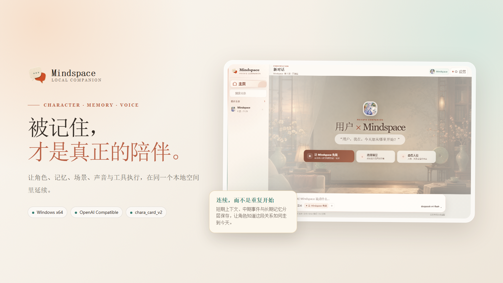
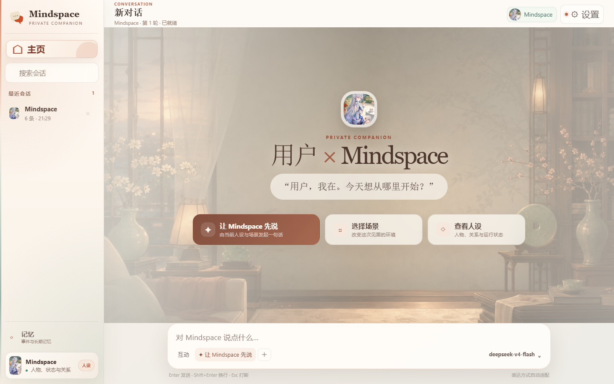
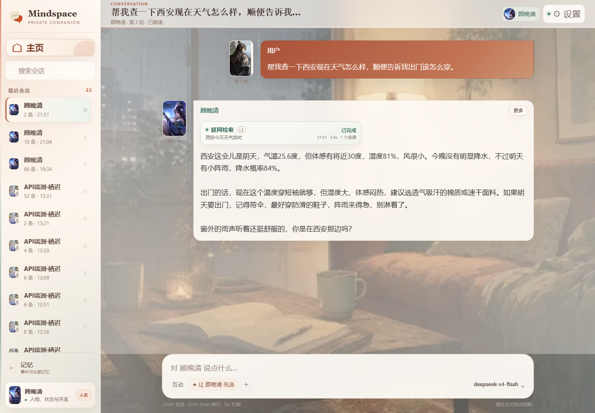
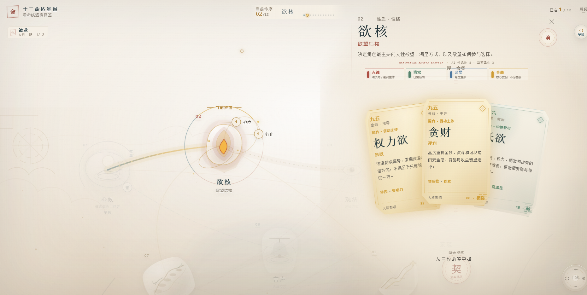
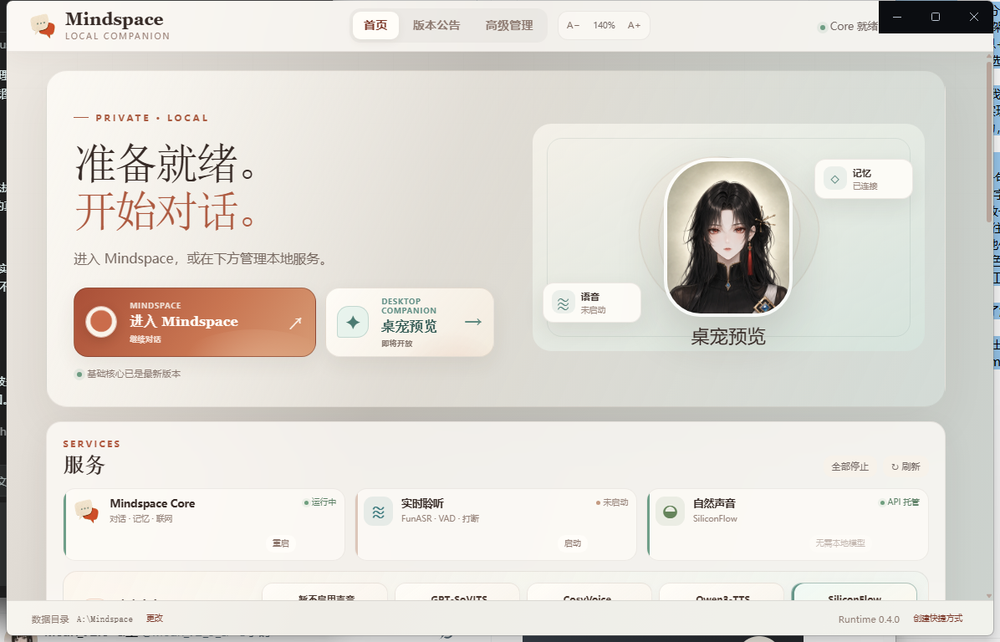
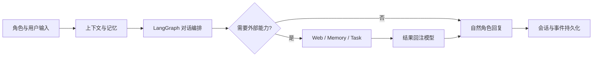

  

<h1 align="center">Mindspace</h1>

<strong>被记住，才是真正的陪伴。</strong>

  一个本地优先的 AI 角色陪伴系统。让角色、记忆、场景、声音与工具执行在同一个桌面空间里延续。

  <a href="https://www.douyinqijun.cn"><strong>下载 Windows Beta</strong></a>
  ·
  <a href="docs/README.md">阅读文档</a>
  ·
  <a href="docs/operations/non-exe-deployment.md">源码部署</a>
  ·
  <a href="CHANGELOG.md">更新日志</a>

  
  
  
  
  

  

---

## 不是另一个聊天壳

Mindspace 面向长期角色关系，而不是一次性问答。它把人物设定、会话连续性、事件记忆、长期召回、联网工具与本地语音组合成一套可见、可迁移、可由用户掌控的桌面体验。

| 关系会累积 | 角色可迁移 | 能力不冒充 | 运行权在你 |
|---|---|---|---|
| 近期上下文、会话压缩、事件记忆与长期 RAG 分层维持连续关系。 | 角色以标准 `chara_card_v2` 导入、导出和保存。 | 联网、记忆与任务工具展示状态、耗时和结果来源。 | 可连接常见 OpenAI 格式服务商，也可接入本地兼容服务。 |

## 看见真实的 Mindspace

<table>
  <tr>
    <td width="50%">
      
       <strong>角色从一个空间开始</strong>
       选择角色、场景和相处方式，再进入连续会话。
    </td>
    <td width="50%">
      
       <strong>联网执行真正可见</strong>
       工具状态、耗时和来源留在卡片里，角色用自然语言给出答案。
    </td>
  </tr>
  <tr>
    <td width="50%">
      
       <strong>十二次选择，长成一个角色</strong>
       V7 命格画布从八个方向与九十六张命签生成 V2 角色卡。
    </td>
    <td width="50%">
      
       <strong>本地能力留在桌面</strong>
       Launcher 集中管理 Core、语音、模型环境与数据目录。
    </td>
  </tr>
</table>

## 一套完整的角色体验

### 命格创作

输入角色名称、性别、关系、称呼、外表期待和相处期待。模型先生成八个彼此不同的角色方向，再形成九十六张轻量命签；完成十二项选择后，生成标准 V2 角色卡并直接进入聊天。

### 连续记忆

近期聊天负责即时一致性，会话压缩承接长上下文，事件记忆保存近期事项，长期 RAG 负责跨会话召回。角色与会话相互隔离，避免记忆串线。

### 自然工具调用

角色可以在需要实时或外部信息时调用联网检索，也可以查询记忆和管理任务。结构化结果保留在执行详情，最终回复仍保持角色语气与自然表达。

### 场景与互动

角色场景、聊天背景、快捷互动、消息操作与回复模式共同组成会话空间。角色卡、关系状态和场景上下文由后端权威数据注入，不依赖前端拼接人设。

### 本地语音

Launcher 可发现并复用已有本地环境，管理 FunASR、GPT-SoVITS、CosyVoice、Qwen3-TTS 与 FFmpeg。文本聊天与语音入口共享同一角色、记忆和工具链。

## 开始使用

| Windows 安装包 | 免安装与 Core | 源码部署 |
|---|---|---|
| 面向大多数内测用户，由 Launcher 管理运行环境与更新。 | 适合希望自行管理程序目录和数据目录的用户。 | 适合开发者、贡献者和自定义集成。 |
| [前往下载](https://www.douyinqijun.cn) | [查看 GitHub Releases](https://github.com/Spirtxiaoqi7/Mindspace/releases) | [阅读非 EXE 部署指南](docs/operations/non-exe-deployment.md) |

源码仓库和用户数据始终分离。开发目录记为 `<repo>`，用户选择的 Mindspace Home 记为 `<home>`；角色、会话、记忆、模型与密钥保存在 `<home>`，不进入源码提交。

## 模型与运行方式

Mindspace 使用 OpenAI 兼容接口连接云端或本地模型服务。桌面设置提供 DeepSeek、OpenAI、OpenRouter、SiliconFlow、Gemini、xAI、Groq、Mistral、Moonshot、智谱、百炼、火山方舟、Ollama、LM Studio、vLLM 等常见入口，也保留完整自定义配置。

聊天请求通过 LangGraph 编排角色上下文、召回、工具执行、结果回注与持久化。每轮工具执行都与会话和角色绑定，最终角色数据采用 `chara_card_v2`。

```mermaid
flowchart LR
    A[角色与用户输入] --> B[上下文与记忆]
    B --> C[LangGraph 对话编排]
    C --> D{需要外部能力?}
    D -->|否| E[自然角色回复]
    D -->|是| F[Web / Memory / Task]
    F --> G[结果回注模型]
    G --> E
    E --> H[会话与事件持久化]
```

## 文档导航

| 想了解 | 从这里开始 |
|---|---|
| 产品与角色体验 | [产品总览](docs/product/overview.md) · [角色与命格](docs/product/characters-destiny.md) · [记忆与上下文](docs/product/memory-context.md) |
| 安装与运行 | [非 EXE 部署](docs/operations/non-exe-deployment.md) · [桌面运行手册](docs/operations/runtime.md) · [打包说明](docs/operations/packaging.md) |
| 参与开发 | [架构总览](docs/architecture/overview.md) · [开发流程](docs/development/workflow.md) · [测试门禁](docs/development/testing.md) |
| 版本与安全 | [更新日志](CHANGELOG.md) · [发布历史](docs/release-history.json) · [安全策略](SECURITY.md) |

## 参与 Mindspace

- 提交问题与产品建议：[GitHub Issues](https://github.com/Spirtxiaoqi7/Mindspace/issues)
- 阅读贡献与分支流程：[开发流程](docs/development/workflow.md)
- 了解模块边界：[架构总览](docs/architecture/overview.md)
- 负责任地报告安全问题：[安全策略](SECURITY.md)

如果 Mindspace 的方向对你有价值，欢迎 Star、试用、反馈真实体验，或者从一个清晰的小改动开始贡献。

---

## English

**Mindspace is a local-first character companion system built for relationships that continue.** Characters, layered memory, scenes, voice, and visible tool execution live in one desktop experience.

- Build characters through the V7 Destiny Canvas and export standard `chara_card_v2` files.
- Maintain continuity with recent context, conversation compaction, event memory, and long-term RAG.
- Use web, memory, and task tools without exposing structured tool payloads as character replies.
- Connect OpenAI-compatible cloud providers or local compatible runtimes.
- Manage Core, voice services, model environments, and the user-selected data home from the desktop Launcher.

Start with the [Windows Beta](https://www.douyinqijun.cn), read the [documentation](docs/README.md), or follow the [source deployment guide](docs/operations/non-exe-deployment.md).
