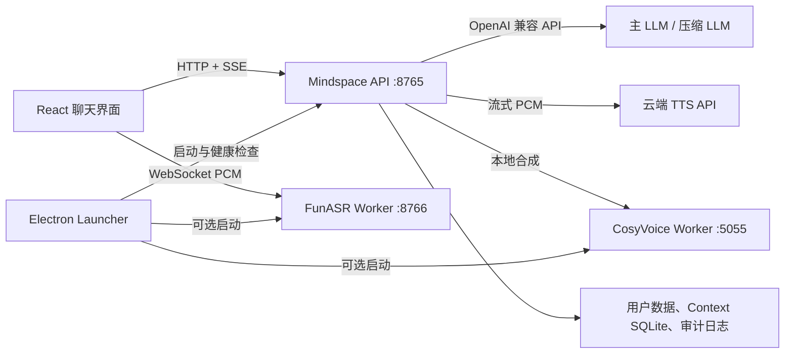
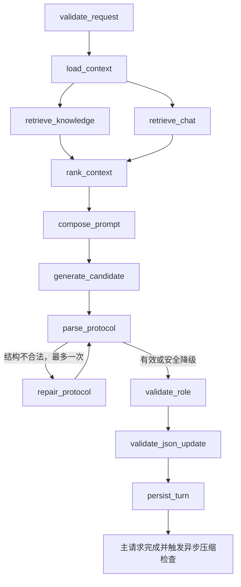

# Mindspace 应用全链路开发者手册

本文以当前仓库实际代码为准，说明从 Launcher、前端、ASR、LangGraph、Prompt、RAG、JSON 写回、结构化记忆、上下文追加与压缩、TTS 到在线更新的完整链路。它既是开发者入口，也是验收基线；没有接入代码的配置项不会被描述为已启用能力。

## 1. 进程与数据拓扑



- Launcher 管理应用版本、私有运行时、模型组件、服务进程与健康检查。
- `:8765` 同时提供前端静态资源、REST、SSE 和 ASR 代理 WebSocket。
- `:8766` 是本地 FunASR；没有兼容 NVIDIA 环境时不阻塞文字、RAG、LLM 和云端 TTS。
- `:5055` 是可选本地 CosyVoice；正式联网版默认使用云端 TTS，不要求打包本地 TTS 模型。
- 主 LLM 生成与上下文压缩是两个独立调用；压缩服务不属于 LangGraph 主图。

默认用户数据位于 Launcher 注入的 `MINDSPACE_RUNTIME_DIR`。源码运行时默认落在仓库的 `runtime`。

## 2. 一轮文字/语音对话

入口为 `POST /api/v1/chat/stream`。前端提交当前输入、会话、轮次、角色设定和交互模式，服务端使用已保存的 API 地址、密钥与模型覆盖客户端的敏感配置。



关键时序：

1. 知识库召回与聊天/结构化记忆召回并行。
2. `<response>` 内文本一生成就通过 `response.delta` 发给前端；不等待完整 JSON、存储或压缩。
3. 协议结构错误最多进行一次修复调用。已有可见正文会锁定，修复只补救协议，不替换已经显示或朗读的正文。
4. 前台角色校验是确定性正则检查。失败时保留正文但禁止本轮 JSON 写回；主请求完成后另有异步复杂角色审计，只能形成下一轮纠偏事件。
5. 持久化完成后发出 `run.completed`。压缩只在主运行计数归零后进入后台。

因此，压缩耗时不会延迟首字、首句 TTS 或本轮完成事件。

## 3. Prompt 的实际消息顺序

### 3.1 稳定基线

每个上下文 Epoch 以三个稳定消息开始：

1. `system`：角色扮演、纯文字互动边界、信息可信度、JSON Patch 规则和输出协议。
2. `system`：用户配置的角色系统提示与用户设定。
3. `user`：三份权威 JSON 的完整基线及 revision。

JSON 基线紧跟 system，用确定性键排序和紧凑序列化生成。它只在角色/用户 system 设定改变或权威 JSON revision 变化时重建，而不是每五轮机械移动历史窗口。

### 3.2 按轮追加尾部

每轮动态内容按固定顺序追加：

1. `turn_control`：`turn_id`、`base_revisions`、交互模式、删除事件、bootstrap 和本轮 Patch 上限。
2. `retrieval_context`：低可信知识、聊天与结构化记忆召回。
3. `tool_context`：仅在本轮存在真实 Skill/MCP/工具能力时出现。
4. `current_user`：当前用户明确输入。
5. `assistant_message`：模型最终可见正文。
6. `authoritative_json_patch`：仅在服务端真正提交 Patch 后追加，记录新 revision 和已提交变更。

第 `N+1` 轮在同一 Epoch 中使用第 `N` 轮完整 Prompt 作为字节级前缀，再追加新一轮动态尾部。工具位于动态尾部，未来工具集合变化不会破坏前面的 system、JSON 和既有对话前缀。

这替代了旧的“冻结 10 轮、每 5 轮重排”算法。常规轮次不重构前缀；只有以下事件建立新 Epoch：

- system/人物设定发生变化；
- 权威 JSON 在账本之外发生 revision 变化；
- 删除或重新生成导致历史失效；
- 异步压缩成功并原子激活新 Epoch。

### 3.3 信息可信度

1. 当前用户明确输入是常规 JSON 变更的唯一触发源。
2. 当前权威 JSON 是其字段范围内最高可信的持久事实。
3. 未删除原始历史只辅助理解，不能独立触发 JSON 修改。
4. 聊天与结构化记忆召回是低可信补充。
5. 知识库只补充外部事实，不覆盖人物、角色和关系 JSON。
6. 待处理删除事件是特殊负向证据，只用于次轮撤回、修正或确认。

召回 metadata、JSON 标签、曝光次数和记忆键不进入 Prompt；模型只看到实际召回文本及有限来源信息，不承担标签分类任务。

## 4. 权威 JSON 与写回

三份权威文档为：

| 文档 | 内容 | 模型权限 |
|---|---|---|
| `user-profile.json` | 用户身份、偏好、经历、交流边界 | 仅注册表允许的叶子字段 |
| `ai-profile.json` | AI 身份、性格、关系与行为规则 | 仅注册表允许的叶子字段 |
| `runtime-state.json` | 当前目标、话题、关系阶段、未决事项、待办 | 仅注册表允许的叶子字段 |

模型输出只有：

```text
<response>用户可见回复</response>
<json_update>{
  "turn_id":"round_10",
  "base_revisions":{"user_profile":3,"ai_profile":2,"runtime_state":8},
  "trigger":"current_user | profile_bootstrap | deletion_reconciliation | none",
  "patches":[]
}</json_update>
```

服务端验证 revision、trigger、证据 ID、字段注册表路径、操作、值类型和 Patch 数。普通轮最多 3 个小幅叶子 Patch；前三轮 bootstrap 使用独立上限，但只能把人物设定或当前输入中逐字存在的内容填入空字段。`schema_version`、`profile_type`、`revision` 和 `updated_at` 永远不能由模型修改。

`regenerate`、主动回复、角色校验失败和 JSON 校验失败都不会写 JSON。没有合格变更时必须是 `trigger=none, patches=[]`。

## 5. 结构化记忆与标签自消除

`structured-memory.json` 不是第二套模型判断，而是成功 JSON Patch 的服务端索引：

- `episodes`：一轮原始文本只保存一次；
- `active`：每条绑定一个已提交 JSON 叶子字段；
- `untagged`：无 Patch 文本的有界隔离池，不参与长期召回；
- `tombstones`：被替换、删除或容量淘汰的有界审计记录。

字段注册表为每个可写路径提供稳定 `field_code`、reducer、scope、生命周期、容量和冲突族。喜欢/不喜欢、执行/避免等对立字段共享稳定 `entity_id`，新极性会把旧活动绑定移入墓碑。实体层只接受确定性规范化和人工确认别名，不让主对话模型猜测同义词。

原始聊天和结构化记忆都由 `retrieve_chat` 检索，但 `source` 不同。隐藏主动信号已在近期历史和检索层同时过滤。

## 6. RAG 的实际实现

知识库按 child/parent 分块：child 用于匹配，parent 用于进入 Prompt。BM25+ 与向量先独立排序，RRF 融合名次，再应用有总上限的来源/会话 Boost；可选本地 cross-encoder 只重排小候选集。向量或精排模型不可用时保留 BM25+ 结果。

两路候选进入统一时间衰减和公平曝光排序。公平补偿只调整已经达到相似度阈值的候选，不能把无标签隔离文本晋升为长期记忆。每条候选保留 BM25、向量、RRF、Boost、时间和精排分数组件用于诊断。

## 7. Context Ledger 与追加算法

上下文持久账本位于 `data/context/context.db`，使用 SQLite WAL。核心表：

| 表 | 作用 |
|---|---|
| `context_sessions` | 当前活动 Epoch、全局 sequence 和 rewrite version |
| `context_epochs` | 稳定基线、摘要、cutoff、状态和 revision |
| `context_events` | 按 sequence 追加的 Prompt/对话事件及独立可见性标志 |
| `turn_commits` | request 幂等提交、消息 ID 和 JSON 写入凭证 |
| `context_outbox` | 主事务提交后的压缩评估事件 |
| `compaction_jobs` | 持久队列、租约、重试、错误与摘要结果 |

每轮 `append_turn` 在一个 SQLite `BEGIN IMMEDIATE` 事务中完成：动态 Prompt 事件、AI 正文、已提交 JSON Patch、turn commit 和压缩评估 outbox。相同 `request_id` 重试不会重复追加。

事件分别记录 `ui_visible`、`model_visible`、`retrieval_eligible` 和 `persistence_eligible`，避免把“显示、进模型、可召回、可持久化”错误地绑定成一个开关。

旧会话第一次进入新账本时，从仍存在且非隐藏的 session JSON 迁移；删除或重新生成会提升 `rewrite_version`、使排队压缩任务变 stale，并强制下一轮从剩余原始会话和当前 JSON 建立干净 Epoch。

## 8. 异步上下文压缩

### 8.1 触发与调度

主请求只写 outbox。`ContextCompactionService` 在 `run.completed` 之后检查：

- 估算上下文达到 `context_window × soft_ratio`；或
- Epoch 内权威 JSON Patch 数达到 `patch_limit`。

满足条件时按配置保留最近若干原始轮次，把更早 sequence 组成持久任务。服务同一时间最多执行一个压缩，并且 `active_run_count > 0` 时不抢占主对话。

### 8.2 独立模型调用

压缩调用使用独立 system 提示和 `temperature=0`，模型可单独配置；留空时复用主模型名称与 API 凭证。输入只包含已激活旧摘要、未删除的用户/AI 原始对话和必要删除纠正事件。

它不读取知识召回、工具描述、system 协议、隐藏主动信号或 JSON Patch，也无权修改人物 JSON。输出只含对话进展、未决话题、明确承诺和关系事件。

### 8.3 激活与失败语义

压缩完成后先比较活动 Epoch 与 `rewrite_version`：

- 一致：建立 `system + persona + 当前完整 JSON + 摘要 + 最近原始尾部` 的新 Epoch，再原子切换；
- 不一致：任务标记 `stale`，结果不生效；
- API/解析失败：保留任务，记录错误并延迟重试；
- 进程重启：过期租约会回到 queued 状态。

### 8.4 硬上限保护

如果压缩尚未完成而上下文超过 `context_window × hard_ratio - reserved_tokens`，当前主请求不会同步等待压缩模型。服务仅为这一请求构造临时有界视图：当前完整 JSON、已有摘要、容量警告和最近未删除原始对话。规范账本不被截断，后台任务仍可完成并激活。

这是一条保证“先出字、先出声音”的应急路径，不是常规摘要算法。

## 9. 删除、清空与重新生成

删除单条 AI 回复的接口为 `DELETE /api/v1/sessions/{session_id}/messages/{message_id}`：

1. 保留用户消息，删除 AI 回复；
2. 立即从聊天召回和结构化记忆移除对应内容；
3. 权威 JSON 当场不变；
4. 保存 pending 删除事件及原写入凭证；
5. 使当前 Context Epoch 失效；
6. 下一次正常 primary 对话把删除内容作为负向证据；
7. 正常主链路成功完成后消费该事件，失败、取消、主动回复或 regenerate 不消费。

删除整轮和清空会话会为被删 AI 回复逐条建立同类 pending 事件。删除整个 session 会同时移除该 session 的账本和删除事件，因为之后不存在可在同一 session 内执行的下一轮校正。

重新生成会排除目标轮旧消息并使 Epoch 失效；新回复不允许写 JSON。

## 10. 实时语音与 TTS

前端进入全屏语音页后创建 AudioWorklet，在工作线程完成降采样、PCM16、音量计算和噪声门处理，再通过 WebSocket 发送固定帧。状态机覆盖连接、聆听、用户说话、识别、AI 思考、AI 说话、打断和错误。

VAD final 触发正常聊天 SSE。用户再次开口会立即取消当前 run、终止播放、清空 TTS 队列并开始新一轮识别。退出时关闭 WebSocket、媒体轨、Worklet、AudioContext、请求控制器和播放缓冲。

前端只把完整自然句送入 `/api/v1/audio/tts/stream`，同时继续渲染下一段。文本清洗会跳过全角/半角括号中的动作描写。音频 PCM 通过播放 AudioWorklet 顺序消费，避免每句创建独立 `<audio>` 导致空隙。

可切换两条同逻辑链路：

- SiliconFlow 云端流式 TTS：正式版默认；API 配置与 LLM 配置同页，自检同时验证 LLM 与 TTS。
- 本地 CosyVoice：可选；支持参考音频上传、ASR 自动识别参考文本、替换、清除和测试语音。

ASR/TTS 异常时语音页保留，用户仍可退出或重试；系统不偷偷切换浏览器音色。

## 11. SSE 与诊断

| 事件 | 含义 |
|---|---|
| `run.accepted` | request/run ID 已登记 |
| `node.started` / `node.completed` | LangGraph 执行时间线 |
| `retrieval.completed` | 两路候选数和最终引用 |
| `response.delta` | 可显示、可分句朗读的正文增量 |
| `validation.completed` | 角色/JSON 校验结果 |
| `json_update.committed` | 会话、Patch、记忆、删除事件和 context commit 结果 |
| `run.completed` / `run.error` / `run.cancelled` | 主运行终态 |

`response.replace` 仅保留为旧客户端兼容事件；当前角色链路不触发正文二次替换，协议修复也锁定已经流出的可见正文。

诊断入口：

- `GET /api/v1/diagnostics`：服务与配置概览；
- `GET /api/v1/sessions/{session_id}/context-diagnostics`：活动 Epoch、rewrite version、事件数、估算 token、cutoff 和压缩任务状态；
- `runtime/logs/events.jsonl`：审计事件；
- 前端“执行详情”与“本轮引用”：分别展示图节点/校验和最终召回。

## 12. 在线更新与零环境运行时

Launcher 自己完成清单下载、签名校验、SHA-256、断点续传、staging 解压、运行探针和原子切换，不依赖用户系统的 Python、pip、Git、uv、PowerShell 7、Node.js 或 npm。私有工具与虚拟环境只加入子进程 PATH，不修改系统 PATH。

更新分两层：

- Core：业务、前端、Prompt、RAG 和编排，使用小型 ZIP 增量替换 `application`，失败恢复备份；
- Launcher：只有安装器/更新器自身变化时发布，走 NSIS 更新并要求 Authenticode。

客户端读取官方 Ed25519 签名 catalog，校验 sequence、频道、灰度、大小和哈希。官网发布时先上传不可变版本文件，最后原子替换 catalog；正常业务迭代不需要重新发布完整安装包。

正式发布步骤、CDN 头、签名与回滚详见 `docs/ONLINE_UPDATE_RELEASE.md`；零环境目录和组件规则详见 `docs/ZERO_ENVIRONMENT_RUNTIME.md`。

## 13. 当前事务边界

`data/context/context.db` 已成为权威存储。一轮档案 Patch、会话消息、凭证、删除事件、结构化 binding、Context event、usage 和后台任务 outbox 使用同一个 SQLite `BEGIN IMMEDIATE`。任一步失败全部回滚。原档案、session 与 structured-memory JSON 是提交后的人类可读投影；投影失败不破坏权威状态。

## 14. 配置项

| 环境变量 | 默认值 | 含义 |
|---|---:|---|
| `MINDSPACE_LLM_CONTEXT_WINDOW` | `64000` | 模型上下文窗口估值 |
| `MINDSPACE_CONTEXT_COMPACTION_ENABLED` | `true` | 启用后台压缩 |
| `MINDSPACE_CONTEXT_COMPACTION_MODEL` | 空 | 空时复用主模型 |
| `MINDSPACE_CONTEXT_COMPACTION_MAX_TOKENS` | `1200` | 摘要最大输出及硬保护预留 |
| `MINDSPACE_CONTEXT_COMPACTION_SOFT_RATIO` | `0.65` | 软触发比例 |
| `MINDSPACE_CONTEXT_COMPACTION_HARD_RATIO` | `0.82` | 临时有界视图触发比例 |
| `MINDSPACE_CONTEXT_COMPACTION_PATCH_LIMIT` | `32` | Epoch Patch 数触发阈值 |
| `MINDSPACE_CONTEXT_COMPACTION_RETAIN_TURNS` | `8` | 新 Epoch 保留的最近原始轮次 |
| `MINDSPACE_CONTEXT_COMPACTION_DELAY_SECONDS` | `1.5` | 主请求完成后的最小延迟 |
| `MINDSPACE_ROLE_AUDIT_ENABLED` | `true` | 主回复完成后启用异步复杂角色审计 |
| `MINDSPACE_ROLE_AUDIT_MODEL` | 空 | 空时复用主模型名称 |

这些字段也通过产品设置后端读写；API 密钥仍只返回“已配置”标记，不回传明文。

## 15. 验收基线与剩余风险

当前自动化验收覆盖 Prompt 完整前缀、无固定五轮重排、工具尾部、后台压缩、新 Epoch、删除后干净重建、硬上限非阻塞保护、JSON 协议、删除事件、API、前端交互、Launcher 更新和私有运行时。

六项应用层根基已完成，详细不变量与扩展规则见 `APPLICATION_ALGORITHM_FOUNDATION.md`。仍需继续跟踪的能力层项目：

1. 本地 cross-encoder 模型是可选组件，未安装时按设计退回 RRF，不会在线拉取。
2. 仅厂商实际返回 usage 时才能计算缓存命中；未报告时明确标记 `unreported`，不能推测。
3. 别名只能人工确认或由未来独立、可审计的实体治理任务导入，禁止主模型临时合并。
4. 工具/Skill/MCP 已预留动态尾部结构，但真实自主工具调度器仍需单独实现和验收。

## 16. 代码导航

| 主题 | 文件 |
|---|---|
| LangGraph 拓扑 | `src/mindspace_graph/graph.py` |
| 节点与持久化顺序 | `src/mindspace_graph/nodes.py` |
| Prompt 构建 | `src/mindspace_graph/prompting.py` |
| Context SQLite | `src/mindspace_graph/context_ledger.py` |
| 后台压缩 | `src/mindspace_graph/compaction.py` |
| 对话服务/SSE | `src/mindspace_graph/service.py` |
| JSON 校验与注册表 | `src/mindspace_graph/policies.py`、`src/mindspace_graph/memory_registry.py` |
| 结构化记忆 | `src/mindspace_graph/adapters/structured_memory.py` |
| 检索 | `src/mindspace_graph/adapters/local_retriever.py` |
| 语音前端 | `frontend/src/App.tsx`、`frontend/public/pcm-worklet.js`、`frontend/public/tts-playback-worklet.js` |
| API | `src/mindspace_graph/api.py` |
| Launcher | `desktop/main.cjs`、`desktop/runtime-manager.cjs`、`desktop/update-manager.cjs` |
