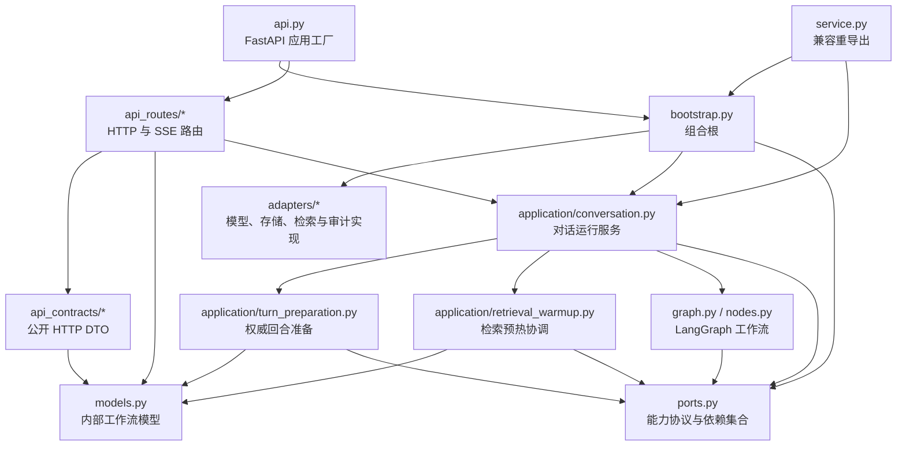
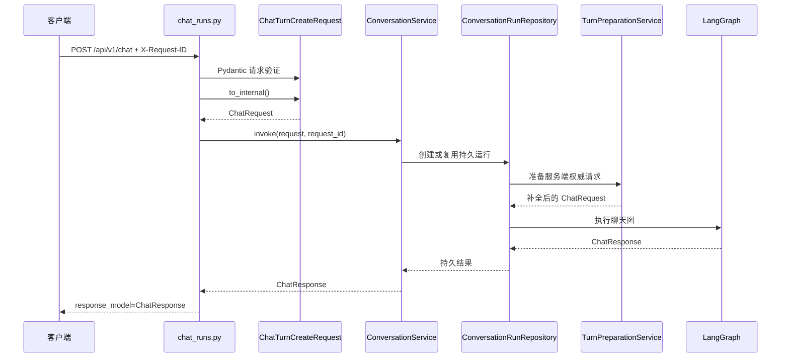

# Mindspace 后端架构

本文描述当前 Python 后端的实际实现。它不是目标架构提案，也不表示所有模块已经完成领域层、应用层和基础设施层的彻底分离。

## 1. 当前边界

后端当前采用模块化单体结构，主要边界如下：



允许的核心依赖方向是：

```text
api_routes → api_contracts → models
api/api_routes → bootstrap/application
bootstrap → application/ports/adapters
application → ports/models/graph 及进程内应用组件
service → bootstrap/application
```

当前不允许反向形成：

```text
models → api_contracts
api_contracts → api_routes
application → api_routes
application → 具体语言模型 Adapter
adapters → api_routes
```

## 2. 文件职责

| 文件 | 当前职责 |
|---|---|
| `src/mindspace_graph/api.py` | 创建 FastAPI 应用、组装应用生命周期、建立 `ApiContext`、挂载静态目录并注册路由。 |
| `src/mindspace_graph/bootstrap.py` | 唯一产品组合根；创建具体数据库、Repository、Retriever、LLM、审计和应用服务，并返回 `ProductContainer`。 |
| `src/mindspace_graph/service.py` | 旧导入路径兼容层；只重导出 `ConversationService`、`ProductContainer` 和 `build_container`。 |
| `src/mindspace_graph/ports.py` | 定义 Retriever、Profile、Session、LanguageModel、LanguageModelFactory、RolePolicy、Audit、Cancellation、Emotion 等协议，以及当前聚合式 `Dependencies`。 |
| `src/mindspace_graph/models.py` | 保存内部聊天请求、聊天响应、图状态、模型调用、检索、写回和审计所需的 Pydantic 模型。 |
| `src/mindspace_graph/api_contracts/chat.py` | 定义公开 HTTP 聊天请求 `ChatTurnCreateRequest`，隐藏 server-owned 字段，并显式转换为内部 `ChatRequest`。 |
| `src/mindspace_graph/api_routes/chat_runs.py` | 定义聊天、聊天流、运行恢复、中断和会话管理路由；把公开 DTO 转成内部请求后调用应用服务。 |
| `src/mindspace_graph/application/conversation.py` | 管理持久对话运行、LangGraph 调用、SSE 生产、取消、模型刷新、压缩、角色审查和记忆回写调度。 |
| `src/mindspace_graph/application/turn_preparation.py` | 把内部客户端请求补全为服务端权威请求，集中处理角色、会话、活动、场景、引用、模型配置和检索状态。 |
| `src/mindspace_graph/application/retrieval_warmup.py` | 持有检索预热就绪集合和后台任务，记录预热审计，并负责关闭时取消与排空。 |
| `src/mindspace_graph/graph.py` | 构建 LangGraph 图。 |
| `src/mindspace_graph/nodes.py` | 实现图节点，依赖 `Dependencies` 中的能力。 |
| `src/mindspace_graph/adapters/*` | 实现具体存储、检索、语言模型和审计能力。 |

## 3. 组合根与模型工厂

`bootstrap.py` 中的 `build_container()` 执行当前全部产品级具体组装：

```text
AppSettings
→ 目录与配置
→ ProductDatabase
→ Repository / Store / Retriever
→ Audit / Capability / Emotion
→ LanguageModelFactory
→ Dependencies
→ ConversationService
→ ProductContainer
```

语言模型由私有 `_ConfiguredLanguageModelFactory` 创建：

```text
settings.llm_mode == "openai"
→ OpenAICompatibleLanguageModel

其他模式
→ DeterministicLanguageModel
```

该工厂通过 `Dependencies.language_model_factory` 注入应用服务。`ConversationService.refresh_language_model()` 只调用 `LanguageModelFactoryPort.create()`，不导入或判断具体模型实现。

`ProductContainer` 当前有意保留具体 Repository 和 Store 类型。它是应用拥有的产品容器，不是通用领域对象，因此没有为了形式统一把所有字段泛化为协议。

## 4. 普通聊天请求链

普通聊天入口为：

```text
POST /api/v1/chat
```

实际链路如下：



`X-Request-ID` 继续作为持久运行的幂等标识。公开 DTO 转换不会重写 `ChatRequest.idempotency_digest()`，旧客户端隐藏兼容字段仍按原类型进入内部模型。

普通 `/api/v1/chat` 使用 `response_model=ChatResponse`。这只适用于普通 JSON 返回。

## 5. 流式聊天请求链

流式入口为：

```text
POST /api/v1/chat/stream
GET /api/v1/runs/{run_id}/stream
```

首次流式请求同样执行：

```text
ChatTurnCreateRequest
→ to_internal()
→ ConversationService.prepare_stream()
→ ConversationService.stream()
→ text/event-stream
```

SSE 不声明普通 JSON `response_model`。事件恢复继续使用持久运行、序列号、`after` 和 `Last-Event-ID`，不会通过 HTTP DTO 层改写事件内容。

## 6. 公开请求与内部请求

公开 HTTP 请求是：

```python
mindspace_graph.api_contracts.chat.ChatTurnCreateRequest
```

内部工作流请求是：

```python
mindspace_graph.models.ChatRequest
```

`ChatTurnCreateRequest` 继承 `ChatRequest` 以复用当前字段和交叉验证，但用 `SkipJsonSchema` 隐藏以下服务端权威字段：

```text
session_mode
voice_tts_provider
server_received_at
activity_context
scene_context
reply_context
system_prompt
api
```

这些字段仍作为隐藏兼容输入存在。旧客户端继续得到原字段类型验证，`to_internal()` 继续完整构造内部 `ChatRequest`，随后由 `TurnPreparationService` 使用服务端权威数据覆盖。

以下字段不能简单隐藏，因为当前准备流程仍会读取它们：

```text
character_id
user_name
character_name
activity_session_id
reply_to_message_id
retrieval
```

## 7. TurnPreparationService

`TurnPreparationService.prepare()` 保持一次回合准备的完整顺序：

1. 使用指定会话快照或加载会话历史。
2. 按 `character_id` 解析权威角色。
3. 拒绝已归档角色。
4. 从角色来源确定真实会话模式。
5. 加载角色档案与记忆。
6. 构建运行角色状态。
7. 建立或恢复会话绑定。
8. 从历史消息解析引用内容。
9. 更新角色最后使用时间。
10. 从活动仓库解析活动上下文。
11. 从会话绑定解析场景上下文。
12. 从服务端设置构建模型配置。
13. 计算本轮温度和最大输出长度。
14. 读取检索预热就绪状态。
15. 写入检索延迟原因。
16. 通过 `model_copy(update=...)` 返回权威内部请求。

`ConversationService._server_request()` 当前仍存在，但只是兼容委托。准备逻辑的权威实现位于 `TurnPreparationService`。

## 8. RetrievalWarmupCoordinator

`RetrievalWarmupCoordinator` 持有：

```text
_retrieval_ready: set[(session_id, character_id)]
_retrieval_warmups: dict[(session_id, character_id), asyncio.Task]
```

成功回合持久化后，`ConversationService` 调用 `retrieval_warmup.kick(server_request)`。Coordinator 负责：

- 拒绝重复或已就绪的预热。
- 加载会话消息。
- 使用 `asyncio.to_thread()` 调用 Retriever 的 `prewarm()`。
- 记录 `retrieval_warmup_started`。
- 记录 `retrieval_warmup_failed`。
- 记录 `retrieval_warmup_completed`。
- 使用 `retrieval-warmup-{session_id[:12]}` 作为任务名。
- 在任务结束时清理任务表。
- 在关闭时取消并等待后台任务。

`TurnPreparationService` 只接收 `retrieval_is_ready(session_id, character_id)` 查询函数，不知道任务表、审计或预热实现。

## 9. ConversationService 当前剩余职责

`ConversationService` 仍负责：

- 构建和调用 LangGraph。
- 创建、复用、恢复和订阅持久运行。
- 生产 SSE 事件。
- 管理请求取消。
- 调度检索预热。
- 刷新当前语言模型。
- 调度上下文压缩。
- 调度角色一致性审查。
- 调度结构化记忆写回。
- 调度事件记忆写回。
- 排空后台任务并关闭资源。
- 为会话创建提供初始角色状态。
- 提供角色审查和记忆写回的模型配置。

它当前仍直接构造部分进程内组件，包括 `ContextCompactionService`、`RoleAuditService`、`MemoryWritebackService`、`EventMemoryWritebackService` 和 `ConversationRunRepository`。这些是当前实现，不应在文档中描述成已经通过独立 Port 注入。

## 10. 如何扩展新的应用服务

新增应用服务时按当前结构处理：

1. 在 `src/mindspace_graph/application/` 新建职责完整的服务文件。
2. 构造函数显式接收它需要的 `Settings`、`Dependencies`、协议或查询函数。
3. 不在应用服务内导入具体语言模型、JSON Repository 或其他 Adapter。
4. 如果服务只属于对话运行生命周期，由 `ConversationService` 创建并调度。
5. 如果服务是产品级共享能力，在 `bootstrap.py` 创建并放入 `ProductContainer`。
6. 如果需要新外部能力，先在 `ports.py` 增加最小协议，再由组合根注入具体实现。
7. 不要为了移动一行代码创建没有独立状态、规则或生命周期的空壳服务。

## 11. 如何扩展新的语言模型实现

新增语言模型实现时：

1. 在 `adapters/` 中实现 `LanguageModelPort` 当前要求的方法。
2. 在 `bootstrap.py` 的 `_ConfiguredLanguageModelFactory.create()` 中增加配置到实现的选择。
3. 保持模型构造只发生在组合根或具体 Adapter 工厂中。
4. 不在 `ConversationService`、`TurnPreparationService`、图节点或路由中导入新模型类。
5. 保持刷新过程仍通过 `Dependencies.language_model_factory` 完成。

当前 `LanguageModelFactoryPort` 只有 `create()`，工厂通过持有同一个 `AppSettings` 实例读取最新模型模式和配置。

## 12. 如何扩展新的 HTTP 路由

新增普通 JSON 路由时：

1. 在 `api_contracts/` 定义公开请求 DTO，不直接把包含 server-owned 字段的内部模型作为 HTTP 输入。
2. 为 DTO 提供显式内部模型转换。
3. 在 `api_routes/` 增加路由模块或扩展对应领域路由。
4. 路由只做 HTTP 参数、状态码、错误映射和应用服务调用。
5. 返回稳定 Pydantic 模型时声明 `response_model`。
6. 在现有路由注册入口中注册新路由。

新增 SSE、文件、音频或其他流式路由时：

- 继续使用对应的 `StreamingResponse`、`FileResponse` 或 `Response`。
- 不为了生成 OpenAPI 而强行套普通 JSON `response_model`。
- 不改变现有缓存头、恢复游标或媒体类型语义。

## 13. 禁止事项

- 禁止在 `application/` 中直接实例化 OpenAI、Deterministic 或未来供应商模型。
- 禁止在 `api_routes/` 中创建具体 Adapter 或直接操作 Adapter 私有函数。
- 禁止让 `models.py` 反向导入 `api_contracts`。
- 禁止让 `api_contracts` 导入 `api_routes`。
- 禁止把 `ProductContainer` 或 `build_container()` 重新放回 `ConversationService` 模块。
- 禁止在 `service.py` 中增加新业务逻辑。
- 禁止让客户端提交的 API 密钥、模型地址、系统提示词、活动上下文或场景上下文成为权威值。
- 禁止把检索预热任务表和就绪集合重新放入 `ConversationService`。
- 禁止在 `TurnPreparationService` 中启动预热后台任务。
- 禁止给 SSE 端点声明普通 JSON 响应模型。
- 禁止为了减少文件数量重新合并组合根、HTTP DTO、回合准备和后台预热职责。

## 14. 兼容入口

以下旧 Python 导入路径继续有效：

```python
from mindspace_graph.service import ConversationService
from mindspace_graph.service import ProductContainer
from mindspace_graph.service import build_container
```

权威实现位置分别为：

```text
ConversationService
→ mindspace_graph.application.conversation

ProductContainer / build_container
→ mindspace_graph.bootstrap
```

FastAPI 应用入口继续是：

```python
from mindspace_graph.api import create_app
```

`create_app(settings=None, container=None)` 的容器注入方式未改变。现有聊天 URL、状态码、`X-Request-ID`、SSE 恢复路径和公开 JSON 结构不因本轮物理分层而改变。

## 15. 当前仍存在的具体依赖

当前后端尚未实现完全依赖倒置，仍有以下真实情况：

- `ProductContainer` 字段使用具体 Repository 和 Store 类型。
- `Dependencies` 仍包含 `ContextLedger`、`EntityRegistry` 和 `ProductDatabase` 具体类型。
- `Dependencies` 中部分扩展能力仍使用 `Any`。
- `TurnPreparationService` 和 `RetrievalWarmupCoordinator` 依赖聚合式 `Dependencies`，尚未缩小为逐项 Port。
- `ConversationService` 直接构造若干进程内应用组件。
- `api.py` 仍直接创建 `AudioService` 和 `DestinyService`。
- 路由仍通过 `ApiContext.container` 访问多个产品服务。
- 检索预热就绪状态只保存在当前进程内，Core 重启后会重新预热。

这些内容是当前维护边界和后续改动时必须考虑的事实，不应被描述为已经解决。
