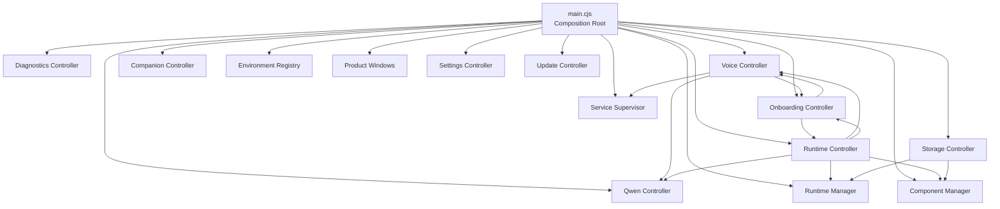

# Mindspace Desktop Architecture

## 1. Purpose

This document defines the maintained Electron host architecture for Mindspace 0.9.0.

The desktop application is a modular monolith. `desktop/main.cjs` is the composition root, not a general-purpose implementation file. Product-specific state and workflows belong to controllers. Native managers and policies remain replaceable infrastructure dependencies injected by the composition root.

The rules in this document apply to all future desktop changes.

## 2. Source and runtime boundary

| Location | Responsibility |
|---|---|
| `A:\RAG\Mindspace-admin` | Only editable development source |
| `A:\Mindspace` | Installed or deployed desktop runtime |
| `A:\Mindspace\data` | User data; deployments must not overwrite it |
| `desktop/main.cjs` | Electron composition root and application lifecycle |
| `desktop/package.json` | Electron entry point and packaged file allowlist |

Do not develop directly inside `A:\Mindspace`. Runtime inspection may use that directory, but product changes must originate in the source repository.

## 3. Architecture overview



Controllers may coordinate through narrow injected callbacks. They must not import `main.cjs`, access another controller's private state, or register the same IPC channel in multiple places.

## 4. `main.cjs` responsibility

`main.cjs` owns only host-wide composition and lifecycle concerns:

- Electron application startup and shutdown.
- Single-instance behavior.
- Controller and manager construction.
- Dependency injection through callbacks and getters.
- Global layout initialization.
- Launcher and product-window composition.
- Tray composition.
- Service-wide startup and shutdown ordering.
- Renderer, GPU, and child-process failure recovery.
- The aggregate Launcher snapshot.
- Thin compatibility forwarding functions used by existing modules.
- IPC that is genuinely host-wide and does not belong to a controller.

`main.cjs` must not own:

- Download or installation state machines.
- Voice provider state.
- Onboarding state.
- Storage migration state.
- Qwen preflight caches.
- Companion window state.
- Diagnostic report construction.
- Component extraction rules.
- Product-specific IPC action switches.

Thin forwarding is allowed when it avoids unnecessary changes to established call sites. A forwarding function must contain no business branching, mutable state, path policy, retry policy, or error translation.

## 5. Controller ownership

### 5.1 Diagnostics Controller

File: `desktop/diagnostics-controller.cjs`

Owns:

- Diagnostic report generation.
- Diagnostic directory creation.
- Sensitive log redaction.
- Tail-log reading.
- Install-log discovery.
- Diagnostic log copies.

State ownership:

- No long-lived product state.
- Report timestamps and output paths exist only for the current operation.

IPC ownership:

| Channel | Registration | Handler owner |
|---|---|---|
| `runtime:diagnostics` | Thin registration in `main.cjs` | Diagnostics Controller |

The returned object remains `{ ok: true, path }`. Opening the report directory remains an Electron shell responsibility at the forwarding boundary.

### 5.2 Qwen Controller

File: `desktop/qwen-controller.cjs`

Owns:

- Qwen runtime-root discovery.
- WSL launcher discovery.
- WSL distribution detection.
- WSL NVIDIA and VRAM preflight.
- Qwen model and weight readiness checks.
- Preflight command execution and timeouts.
- Preflight result caching and in-flight request reuse.
- Qwen supervisor state adaptation.
- Model-loading status enrichment.

State ownership:

- Preflight cache.
- Preflight expiration.
- Current in-flight preflight task.

IPC ownership:

- No public IPC channel.
- Qwen behavior is reached through Runtime, Voice, and Service Supervisor operations.

The Qwen Controller must not download WSL, vLLM, or model weights implicitly.

### 5.3 Voice Controller

File: `desktop/voice-controller.cjs`

Owns:

- TTS provider selection.
- Local versus remote provider classification.
- GPT-SoVITS voice selection and readiness.
- Local TTS service-name mapping.
- TTS provider transition state.
- Mutual exclusion between `tts` and `qwenTts`.
- Background voice-component preparation.
- Voice-component generation cancellation.
- Provider reconciliation.
- Voice-related Core settings synchronization.

State ownership:

- Observed TTS provider.
- TTS transition and transition task.
- Background download state and task.
- Background generation counter.
- Provider reconciliation task.

IPC ownership:

| Channel | Actions |
|---|---|
| `launcher:voice` | `snapshot`, `install`, `select`, `provider` |

The controller must preserve the nine-second TTS shutdown wait, provider failure cooldown, GPU checks, Qwen preflight, and existing response structures.

### 5.4 Onboarding Controller

File: `desktop/onboarding-controller.cjs`

Owns:

- First-run snapshot construction.
- Onboarding version and progress persistence.
- Voice-choice progression.
- Base-runtime installation progression.
- LLM connectivity testing.
- LLM settings persistence.
- Voice retry and acknowledgement.
- Completion eligibility and completion timestamp.

State ownership:

- Persistent onboarding state is stored in Launcher configuration.
- The controller does not duplicate Voice or Runtime state.

IPC ownership:

| Channel | Actions |
|---|---|
| `launcher:onboarding` | `snapshot`, `select-voice`, `install-base`, `test-llm`, `save-llm`, `retry-voice`, `acknowledge-voice`, `finish` |

The LLM connection timeout remains 20 seconds. Existing HTTP error messages and payload shapes are compatibility contracts.

### 5.5 Runtime Controller

File: `desktop/runtime-controller.cjs`

Owns:

- Unified runtime snapshot construction.
- Runtime and model pipeline status.
- Runtime install, retry, cancel, repair, and removal actions.
- Component download and removal actions.
- Download-source selection.
- Runtime proxy synchronization.
- Component target-path resolution.
- Environment Registry target reuse.
- PowerShell component installers.
- Installer process cancellation.
- Installer progress parsing.
- Safe archive extraction.
- GPT-SoVITS reference-audio finalization.

State ownership:

- Runtime and component state remains authoritative inside Runtime Manager and Component Manager.
- Runtime Controller composes those snapshots and does not duplicate their operation state.
- Original process proxy values are owned by Runtime Controller for restoration.

IPC ownership:

| Channel | Actions |
|---|---|
| `launcher:component` | `snapshot`, `download`, `download-all`, `cancel`, `remove` |
| `runtime:action` | `snapshot`, `cancel`, `install-all`, `repair`, `remove`, `install`, `retry` |
| `runtime:snapshot` | `snapshot` |
| `runtime:install` | `install` |
| `runtime:cancel` | `cancel` |
| `runtime:retry` | `retry` |
| `runtime:repair` | `repair` |
| `runtime:source` | `official`, `china` |
| `runtime:proxy` | Proxy update and synchronization |

The direct `launcher:component download` behavior and `runtime:action install` behavior must remain distinct unless a deliberate compatibility migration is approved.

### 5.6 Storage Controller

File: `desktop/storage-controller.cjs`

Owns:

- Development and packaged Core-root resolution.
- Development-root persistence.
- Workspace creation.
- Legacy layout migration.
- Migrated-source cleanup.
- Legacy model-path reconciliation.
- Storage alignment inspection.
- Cross-volume storage migration.
- Post-migration relaunch.

State ownership:

- Workspace state.
- Storage migration state and progress.
- Model-path reconciliation result.

IPC ownership:

| Channel | Behavior |
|---|---|
| `launcher:select-root` | Select and initialize a development Core root |
| `launcher:select-storage` | Select and migrate to a storage directory |
| `launcher:migrate-recommended-storage` | Apply the recommended migration target |

Storage migration must not run while Runtime Manager or Component Manager reports an active operation. A failed migration must preserve the original location. A successful migration retains the 700 ms relaunch delay.

### 5.7 Companion Controller

File: `desktop/companion-controller.cjs`

Owns:

- Companion configuration normalization and persistence.
- Companion BrowserWindow creation.
- Window bounds and display selection.
- Position and size clamping.
- Move and resize persistence.
- Click-through behavior.
- Visibility synchronization.
- Companion release-state snapshot.
- Companion QA capture modes.
- Capture delay and FPS sampling.
- Companion window destruction.

State ownership:

- Companion BrowserWindow.
- Companion load error.
- Bounds-save timer.
- Parsed companion capture arguments.

IPC ownership:

| Channel | Actions |
|---|---|
| `companion:snapshot` | Snapshot |
| `companion:action` | Currently only `snapshot` succeeds |

The controller must not enable the companion before the product release gate is intentionally changed. QA capture support does not imply user-facing availability.

## 6. Host-wide IPC remaining in `main.cjs`

| Channel | Reason it remains host-wide |
|---|---|
| `launcher:snapshot` | Aggregates all controllers and managers |
| `launcher:service` | Direct Service Supervisor operation |
| `launcher:all` | Host-wide service orchestration |
| `launcher:open` | Opens product window or host directories |
| `launcher:external` | Safe external navigation |
| `launcher:maintenance` | Host maintenance facade |
| `launcher:shortcut` | Electron shell shortcut creation |

Settings and Update controllers register their own IPC through their existing `registerIpc()` methods. Their channel names must not be duplicated in `main.cjs`.

## 7. State ownership rules

| State | Sole owner |
|---|---|
| Diagnostic operation output | Diagnostics Controller |
| Qwen preflight cache | Qwen Controller |
| TTS provider and transitions | Voice Controller |
| Voice background preparation | Voice Controller |
| Onboarding persistence | Onboarding Controller and Launcher config |
| Runtime installation state | Runtime Manager |
| Model/component operation state | Component Manager |
| Unified runtime presentation | Runtime Controller |
| Workspace readiness | Storage Controller |
| Storage migration progress | Storage Controller |
| Legacy model reconciliation | Storage Controller |
| Companion window and bounds timer | Companion Controller |
| Service children and desired state | Service Supervisor |
| Launcher and product windows | Product Windows plus composition references in `main.cjs` |
| Global layout singleton | `main.cjs` |
| Application quitting/final-exit state | `main.cjs` |

No state may be mirrored in `main.cjs` for convenience. Consumers must use controller snapshots or narrow getters.

## 8. `build.files` invariant

Electron Builder uses an explicit file allowlist. Every CommonJS module required at runtime must appear in `desktop/package.json` under `build.files`.

The following controller files are mandatory:

```text
diagnostics-controller.cjs
qwen-controller.cjs
voice-controller.cjs
onboarding-controller.cjs
runtime-controller.cjs
storage-controller.cjs
companion-controller.cjs
```

Rules:

- Adding a runtime controller requires adding it to `build.files` in the same change.
- Adding a policy, catalog, preload dependency, or dynamically loaded local module also requires an explicit entry.
- Do not assume Electron Builder discovers transitive CommonJS imports automatically.
- Do not add tests, development fixtures, user data, logs, secrets, downloaded models, or runtime operation output to `build.files`.
- Do not remove an existing module from `build.files` until all packaged-runtime imports are removed.

## 9. Path invariants

- `currentLayout()` is the single host layout accessor.
- Packaged Core resolves to `currentLayout().core`.
- User data resolves through the configured Mindspace home and must survive deployment.
- Models, environments, tools, logs, state, virtual environments, and Core must retain separate layout paths.
- Development mode resolves the active source checkout and must not silently run an installed Core.
- `MINDSPACE_ROOT` remains a supported development override.
- Invalid configured drives must not be selected as development roots.
- Environment Registry reuse must occur before requesting a new component download.
- Component target paths must remain inside managed model, environment, tool, state, or virtual-environment roots.
- Archive extraction must preserve traversal checks for source, staging, destination, rename, and reference-audio paths.
- Storage migration failure must not switch the configured home or delete the source.
- Desktop synchronization must never overwrite `A:\Mindspace\data`, API settings, downloaded models, or user memories.

## 10. Process invariants

- Service startup order remains controlled by `SERVICE_START_ORDER`.
- Text Core is the baseline service; voice services remain optional.
- `tts` and `qwenTts` must not consume GPU memory simultaneously.
- A provider switch must stop and observe the inactive TTS service before starting the target.
- An unmanaged service on the target port must not be killed automatically.
- Qwen WSL supervisor handling remains isolated behind Qwen Controller and Service Supervisor.
- Component installer processes use hidden non-interactive PowerShell.
- Installer cancellation must terminate the child process tree and return the existing cancellation error.
- Runtime repair or base-runtime replacement must stop affected services first.
- Component removal must stop the associated ASR or TTS worker before deleting files.
- Proxy environment changes must update Electron session proxy and process proxy variables together.

## 11. Exit invariants

The normal shutdown sequence remains:

```text
before-quit
→ mark quitting
→ destroy Companion window and timer
→ stop all managed services
→ wait 450 ms for audio/GPU handles
→ destroy Tray
→ app.exit(0)
```

Rules:

- `before-quit` must remain idempotent.
- Only one shutdown task may run.
- Companion destruction must occur before service shutdown waiting.
- Unmanaged WSL processes must not make application exit unbounded.
- Diagnostic or stability-log failures must never create a second crash.
- Renderer and GPU recovery must not run after quitting begins.

## 12. Adding a new IPC channel

Use this sequence:

1. Identify the controller that owns the state changed or queried by the IPC.
2. Add the handler to that controller's `registerIpc(ipcMain)` method.
3. Preserve a single registration owner for the channel.
4. Define the payload default, accepted actions, return shape, and errors next to the handler.
5. Inject host capabilities such as `dialog`, `shell`, `session`, managers, or other controllers through narrow callbacks.
6. Add no mutable product state to `main.cjs`.
7. Use a thin `main.cjs` handler only when the operation is genuinely host-wide or must compose several controller snapshots.
8. If a new module is introduced, add it to `build.files` in the same change.

Do not:

- Import `main.cjs` from a controller.
- Reach into another controller's closure or private fields.
- Register a second handler for an existing channel.
- Change payload or return structures solely to simplify internal code.
- Convert an existing synchronous snapshot into an asynchronous contract without a migration plan.
- Expose secrets, raw diagnostic data, or arbitrary filesystem paths to the renderer.

## 13. Adding a component installer

Runtime Controller owns the installer adapter used by Component Manager.

Required steps:

1. Add the component to the authoritative component manifest or catalog.
2. Define its managed target path through Runtime Controller path policy.
3. Reuse Environment Registry results before requesting a download.
4. Add explicit hardware eligibility when the component requires CUDA, VRAM, WSL, or another host capability.
5. Use the existing `installComponent(component, signal, onProgress)` contract for script-backed installers.
6. Keep PowerShell non-interactive, hidden, and rooted at the active Core.
7. Emit deterministic stage markers from the installer script.
8. Map stage markers to stable progress percentages and user-facing messages.
9. Preserve cancellation through `AbortSignal` and process-tree termination.
10. Write installer output to the component install log.
11. Return actionable errors without exposing credentials.
12. Use `finalizeComponent(component, targetRoot)` for archive extraction and post-download assembly.
13. Enforce path containment before copying, renaming, extracting, or deleting.
14. Stop associated services before repair, replacement, or removal.
15. Add every new runtime-required script or module to the appropriate packaging manifest.

An installer must not:

- Scan complete drives synchronously.
- Download an existing reusable environment again.
- Write into user data or unrelated model roots.
- Disable archive traversal checks.
- Start a second GPU-heavy TTS worker.
- Add installer-specific state to `main.cjs`.
- Change shared progress fields without updating all consumers.

## 14. Cross-controller coordination

Allowed coordination uses narrow callbacks injected by `main.cjs`:

- Runtime may update Onboarding after base installation.
- Runtime may schedule Voice preparation after components become ready.
- Runtime may query Qwen preflight and Voice transition snapshots.
- Voice may update Onboarding and request Qwen preflight.
- Onboarding may request Runtime installation and Voice selection.
- Storage may query Runtime and Component activity before migration.
- Product Windows may request Companion visibility synchronization.

Disallowed coordination:

- Controller-to-controller private imports.
- Shared mutable global objects.
- Circular module imports.
- Direct mutation of another controller's state.
- IPC used internally as a substitute for a direct controller callback.

If coordination expands beyond these narrow relationships, introduce an application-level orchestrator instead of adding more callbacks to `main.cjs`.

## 15. Maintenance rule: do not refill `main.cjs`

Any change adding one of the following to `main.cjs` requires an architecture explanation:

- A new long-lived mutable state variable.
- A new product-specific action switch.
- A new installation or migration loop.
- A new subprocess protocol.
- A new path-selection policy.
- A new retry, cooldown, timeout, or cache policy.
- A new multi-step IPC workflow.
- A new BrowserWindow other than the Launcher or product composition boundary.

The default destination is the controller that owns the affected state. If no controller owns it, create a focused controller rather than placing the implementation in `main.cjs`.

Do not split `main.cjs` merely to reduce line count. Composition, lifecycle, global service ordering, and aggregate snapshots legitimately belong there. The objective is stable ownership, not the smallest possible entry file.

## 16. Current stopping point

The desktop host is sufficiently decomposed for maintenance. Further mechanical extraction should stop unless a remaining responsibility develops independent state or behavior.

Potential future modules are limited to:

- A Service Orchestrator if service-wide startup and recovery become independently complex.
- A Launcher IPC registry if host-wide IPC registration grows materially.

Neither should be introduced only for cosmetic line-count reduction. Future work should prioritize contract checks, packaged-runtime verification, and behavior regression coverage before another structural split.
