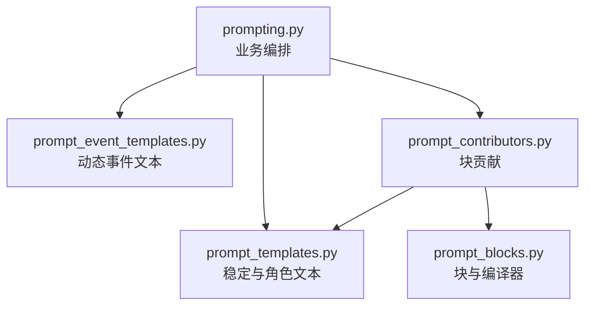

# Mindspace Prompt 架构

本文记录 Mindspace 当前 Prompt 组装实现的职责、依赖、顺序和维护规则。本文描述的是现有代码边界，不是未来重写方案。

## 1. 架构目标

Prompt 子系统必须同时满足以下约束：

- 角色扮演规则、业务状态和模型可见文本之间有明确边界。
- `build_prompt()` 与 `build_messages()` 的公开签名保持稳定。
- 稳定角色前缀、动态召回、近期历史和本轮控制保持固定顺序。
- 动态工具、语音、场景和运行状态不得污染可缓存的角色前缀。
- 模板只渲染已经判定好的简单值，不读取服务、存储或运行时对象。
- Contributor 只贡献消息块，不重复业务文本或重新判断业务条件。
- Compiler 只处理块顺序、去重、渲染和审计，不理解角色扮演语义。
- 重构不得无意改变字符、换行、消息角色、缓存边界或事件顺序。

## 2. 当前文件与职责

| 文件 | 权威职责 | 不负责 |
|---|---|---|
| `src/mindspace_graph/prompting.py` | 业务判定、状态计算、数据筛选、ContextLedger 接入、事件 metadata、模板调用顺序、`PromptBuild` 返回 | 大段纯文本、PromptBlock 创建、块排序和去重 |
| `src/mindspace_graph/prompt_templates.py` | 稳定角色、权威状态、post-history、互动、引用和附件等纯文本渲染 | 请求判定、模型调用、事件 metadata、缓存阶段 |
| `src/mindspace_graph/prompt_event_templates.py` | 语音、场景、活动、事件记忆、ASR、情绪、主动陪伴和当前输入等动态事件文本 | 事件是否出现、事件顺序、持久化和召回资格 |
| `src/mindspace_graph/prompt_contributors.py` | 把已生成消息贡献到固定阶段，设置块 ID、顺序、缓存边界和审计来源 | 业务判定、角色规则、请求解析、重复业务文本 |
| `src/mindspace_graph/prompt_blocks.py` | 不可变 PromptBlock、稳定排序、块 ID 去重、消息渲染和审计记录 | Prompt 文案、角色状态、ContextLedger、事件业务 |

## 3. 依赖方向



允许的依赖方向为：

```text
prompting -> prompt_templates
prompting -> prompt_event_templates
prompting -> prompt_contributors
prompt_contributors -> prompt_templates
prompt_contributors -> prompt_blocks
```

`prompt_templates.py`、`prompt_event_templates.py` 和 `prompt_blocks.py` 应只依赖 Python 标准库。

## 4. prompting.py 的业务编排职责

`prompting.py` 是 Prompt 应用层编排器。它可以决定内容是否出现，但不应继续堆积大段静态文案。

当前保留职责包括：

- 构造 `PromptBuild`。
- 稳定 JSON 序列化。
- 裁剪 V2 角色档案。
- 计算角色运行状态。
- 读取用户、角色和关系数据中的已确认值。
- 处理成人模式、语音模式、展示模式和主动陪伴条件。
- 校验 quick interaction 的许可、性别归属和去重。
- 选择引用、附件、ASR 和情绪事件是否出现。
- 计算本地物理时间及历史时间索引。
- 对近期历史和 RAG 结果去重。
- 保持最近三轮原始对话窗口。
- 调用 ContextLedger 或 fallback 前缀。
- 生成 `pending_events` 及其 metadata。
- 选择 current-user 标签和 initiative 分支。
- 调用纯模板并把结果交给 Contributor。
- 返回最终 `messages`、`pending_events` 和 `context_snapshot`。

`build_messages()` 是兼容入口，必须继续等价于 `build_prompt(...).messages`。

## 5. 纯模板职责

### 5.1 prompt_templates.py

当前模板覆盖：

- `build_persona_template()`：角色身份、身体一致性、V2 档案和角色扮演合约。
- `build_contract_template()`：已确认状态优先级。
- `build_authoritative_state_template()`：fallback 权威状态包装。
- `build_physical_time_control_lines()`：现实时间控制行。
- `build_history_time_index_template()`：历史物理时间索引。
- `build_quick_interaction_template()`：已通过业务校验的互动结果。
- `build_reply_context_template()`：本轮明确引用。
- `build_attachment_item_template()`：单个附件展示。
- `build_attachments_template()`：附件数据边界。
- `join_turn_data_templates()`：引用和附件块连接。
- `build_post_history_template()`：post-history 角色校准与成人模式规则。

模板输入必须是字符串、数字、布尔值或由这些值组成的不可变 tuple。模板不得接收 `ChatRequest`、`ProfileBundle`、ContextLedger、数据库对象或模型客户端。

### 5.2 prompt_event_templates.py

当前模板覆盖：

- 实时语音启用和关闭文本。
- Qwen3-TTS 与普通流式语音控制行。
- 上一条语音交付状态。
- 面对面场景和普通场景。
- 陪伴活动权威状态。
- ASR 低置信候选。
- 隐藏情绪观察。
- 中期事件记忆。
- 主动续话、连续陪伴和普通 initiative 控制行。
- 当前用户互动、引用和附件后缀。
- 当前用户消息最终包装。

是否启用语音、是否存在场景、是否有低置信候选、initiative 属于哪个分支等条件，必须先在 `prompting.py` 判断。

## 6. Contributor 职责

`prompt_contributors.py` 当前提供以下真实 Contributor：

| Contributor | 阶段 | 缓存边界 | 内容来源 |
|---|---|---|---|
| `StaticPrefixContributor` | `stable_prefix` | `provider_stable_prefix` | persona、contract |
| `PrefixContributor` | `stable_prefix` | `context_ledger_prefix` 或 `provider_stable_prefix` | ContextLedger 或 fallback |
| `RetrievalContributor` | `retrieval_context` | `dynamic_tail` | 低可信召回事件 |
| `HistoryTimeIndexContributor` | `history_time_index` | `dynamic_history` | 历史物理时间索引 |
| `RecentHistoryContributor` | `recent_history` | `dynamic_history` | 展示模式投影后的近期历史 |
| `DynamicTailContributor` | `dynamic_tail` | `dynamic_tail` | 场景、输入、语音、ASR、情绪和 post-history |

`build_static_prompt_messages()` 生成传给 ContextLedger 的稳定 persona 和 contract。

`compile_prompt_messages()` 按固定顺序贡献前缀、召回、时间索引、近期历史和动态尾部，最后调用 Compiler 渲染。

Contributor 可以设置块级审计元数据，但不得改变模板文本、重新判断模式或访问服务。

## 7. PromptBlock 与 PromptCompiler

### 7.1 PromptBlock

`PromptBlock` 使用冻结 dataclass 和 slots，字段如下：

| 字段 | 用途 | 是否模型可见 |
|---|---|---:|
| `block_id` | 稳定块身份和去重键 | 否 |
| `role` | 最终消息角色 | 是 |
| `content` | 最终消息正文 | 是 |
| `phase` | 编译阶段 | 否 |
| `order` | 阶段内顺序 | 否 |
| `cache_boundary` | 缓存边界说明 | 否 |
| `audit_metadata` | 来源等审计信息 | 否 |

最终渲染结构只能是：

```json
{"role":"system|user|assistant","content":"..."}
```

审计信息不能泄漏进模型可见消息。

### 7.2 阶段和排序

Compiler 当前阶段优先级：

| 阶段 | 优先级 | 语义 |
|---|---:|---|
| `stable_prefix` | 0 | 稳定角色和 ContextLedger 前缀 |
| `retrieval_context` | 10 | 低可信召回 |
| `history_time_index` | 20 | 历史时间事实数据 |
| `recent_history` | 30 | 最近原始对话 |
| `dynamic_tail` | 40 | 本轮动态控制、输入和 post-history |

排序键固定为：

```text
phase priority -> block order -> insertion index
```

未知阶段当前排在已知阶段之后。新增未知阶段不是安全扩展方式；需要新增阶段时必须显式更新阶段表并增加顺序快照。

### 7.3 去重

去重键是 `block_id`。

- 相同 ID 且块内容完全一致时保留排序后的第一项。
- 相同 ID 但内容、角色、阶段、顺序、缓存边界或审计信息不同时抛出 `ValueError`。
- 禁止按正文去重，因为不同来源可能有相同文本但不同语义位置。
- ID 必须使用稳定前缀，例如 `stable:`、`prefix:`、`retrieval:`、`history-time:`、`history:` 和 `tail:`。

### 7.4 审计

`audit_records()` 当前输出：

- `block_id`
- `role`
- `phase`
- `order`
- `cache_boundary`
- `content_length`
- `metadata`

审计记录用于调试、执行详情和回归分析，不应作为下一轮模型输入。

## 8. 模型可见顺序与缓存边界

最终顺序必须保持：

```text
稳定 persona
-> 稳定 contract
-> ContextLedger/fallback 权威前缀
-> 低可信召回
-> 历史物理时间索引
-> 最近原始对话
-> 中期事件、场景、活动和本轮控制
-> 当前用户输入及隐藏辅助数据
-> post-history 角色演绎校准
```

关键约束：

- Persona 和 contract 是稳定前缀，动态状态不得写入其中。
- ContextLedger 负责稳定连续性包时，其 prefix 顺序不可被 Contributor 重排。
- RAG 必须位于稳定前缀之后，并以低可信 user 数据出现。
- 近期原始历史必须位于召回之后、当前输入之前。
- post-history 必须靠近生成端，防止旧助手文本稀释当前角色校准。
- 工具提示、工具执行状态和能力结果属于动态尾部，禁止进入 persona 或 contract。
- 语音、ASR、情绪、活动和场景都是本轮动态数据，不得扩大稳定缓存前缀。

## 9. 禁止的导入和职责穿透

### prompt_templates.py 和 prompt_event_templates.py

禁止导入：

- `prompting`
- `prompt_contributors`
- `prompt_blocks`
- `models`
- `nodes`
- `service`
- `api` 或 `api_routes`
- adapters、数据库和文件存储
- ContextLedger
- LLM、RAG、ASR 或 TTS 客户端

### prompt_contributors.py

禁止导入：

- `prompting`
- `ChatRequest` 和 `ProfileBundle`
- `nodes`、`service`、API 或存储
- 角色业务判定模块

### prompt_blocks.py

禁止导入任何 Prompt 模板、Contributor、请求模型、业务服务或基础设施模块。

### prompting.py

禁止重新直接创建 `PromptBlock` 或操作块排序。所有块贡献必须经过 `prompt_contributors.py`。

## 10. 如何新增 Prompt 规则

新增规则前先判断它属于哪一层：

| 问题 | 应放位置 |
|---|---|
| 是否启用、允许或选择某个分支 | `prompting.py` |
| 已算好的值如何变成具体文字 | `prompt_templates.py` 或 `prompt_event_templates.py` |
| 一条新消息位于哪个阶段和缓存边界 | `prompt_contributors.py` |
| 块如何排序、去重和审计 | `prompt_blocks.py` |

推荐步骤：

1. 在 `prompting.py` 用现有请求和状态完成判定。
2. 把模板需要的输入压缩为简单值，不把完整请求传给模板。
3. 稳定角色或 post-history 文本写入 `prompt_templates.py`。
4. 本轮语音、场景、工具或事件文本写入 `prompt_event_templates.py`。
5. 复用现有阶段时不要新增 Contributor。
6. 只有消息需要新的独立语义位置时才新增 Contributor 或阶段。
7. 为新块分配稳定且唯一的 `block_id`。
8. 明确新块属于稳定前缀、动态历史还是动态尾部。
9. 增加模型可见消息和审计记录快照。
10. 确认普通聊天、角色扮演、语音和成人模式未被无关规则污染。

## 11. 不破坏角色扮演的规则

- 不要把同一行为规则同时写入 persona、动态控制和 post-history。
- 不要为了工具调用把角色回复改成客服或规划器语气。
- 工具协议应保持短小并位于动态尾部。
- 引用、附件、RAG、网页和工具结果必须标记为数据，不能提升成 system 规则。
- 模式判定必须显式；成人文本不能进入普通或语音分支。
- 语音专属格式不能进入普通文本聊天。
- 当前用户输入必须保持独立边界，不能与召回或历史混为同一消息。
- 未确认的动作、情绪、地点和共同经历不能由模板补写。
- 模板不得根据关键词自行切换成人模式、语音模式或工具模式。
- 修改篇幅规则时必须尊重用户明确的长度偏好。
- 角色名、用户称呼、性别和身体反应必须使用 `prompting.py` 已确认的值。
- 不要为了缩短源码改变中文标点、换行或消息角色。

## 12. 必须快照的内容

以下快照应比较完整 `role`、`content` 和消息顺序，而不是只搜索关键词。

### 稳定前缀

- 普通文本 persona 和 contract。
- 不同性别组合。
- V2 档案内容。
- 用户 persona 为空和非空。
- ContextLedger 与 fallback 权威状态。
- 稳定前缀缓存边界和块 ID。

### 历史与召回

- 无召回和多来源召回。
- 与近期原始历史重复的聊天召回。
- 三轮历史窗口。
- 历史物理时间索引存在和缺失。
- dialogue、scene 两种 presentation mode。
- 召回、时间索引、历史和动态尾部的相对顺序。

### 互动和本轮数据

- 普通 quick interaction。
- 成人模式下按角色性别允许的互动。
- 性别不匹配互动被过滤。
- 多互动去重和顺序。
- 引用消息。
- 单附件、多附件和空文本附件。
- 引用与附件同时存在。
- 当前用户消息为空但有结构化互动或附件。

### 语音和动态事件

- 普通文本模式。
- Qwen3-TTS 语音模式。
- 非 Qwen3 流式语音模式。
- 上一条语音含 unheard text。
- 面对面场景。
- 普通场景。
- 陪伴活动。
- ASR 低置信候选。
- 隐藏情绪状态。
- 中期事件记忆存在和缺失。

### 主动陪伴

- 普通用户输入。
- `idle_continuation`。
- `continuous_companionship` 及 sequence/limit。
- 普通 initiative。
- initiative 的 UI、持久化和召回 metadata。

### Post-history 和成人模式

- 普通非成人 compact directive。
- 成人 dialogue 模式。
- 成人 scene 模式。
- 成人 voice 模式。
- `direct_output_required` 开启和关闭。
- 明确继续信号和明确停止信号。
- 短、简洁、适中和默认篇幅偏好。
- post-history 始终位于动态尾部最后。

### Compiler 和审计

- 五个已知阶段的优先级。
- 同阶段按 `order` 排序。
- 同 order 按插入顺序稳定排序。
- 相同 ID 相同块去重。
- 相同 ID 冲突块抛错。
- `render()` 只包含 role 和 content。
- `audit_records()` 不进入模型消息。
- cache boundary、来源 metadata 和 content length。

### 公开兼容性

- `build_prompt().messages` 与 `build_messages()` 完全一致。
- `PromptBuild.pending_events` 的类型、顺序和 metadata 不因模板重构变化。
- `context_snapshot` 在 ContextLedger 和 fallback 路径中的行为不变。
- 中文字符、全角标点、空格和换行做字节级比较。
- `_json()` 的 key 顺序、紧凑分隔符和非 ASCII 输出保持稳定。

## 13. 何时停止拆分

当前架构已经达到合理粒度。后续不应单纯为了减少 `prompting.py` 行数继续拆分业务算法。

满足以下条件时应保留在 `prompting.py`：

- 代码在决定内容是否出现。
- 代码在读取请求、角色、历史、召回或 ContextLedger。
- 代码在进行性别、成人模式、语音模式或互动许可判断。
- 代码在计算 metadata、可见性、持久化或召回资格。
- 代码在维护本轮事件顺序和业务状态。

满足以下条件时才应继续迁移到模板：

- 输入已经是简单值。
- 函数只负责字符串和换行渲染。
- 函数没有服务、存储、请求或模型依赖。
- 相同文本需要独立快照、复用或版本审计。

维护目标不是让 `prompting.py` 尽可能短，而是让业务判定、文本渲染、块装配和编译规则各自只有一个权威位置。
