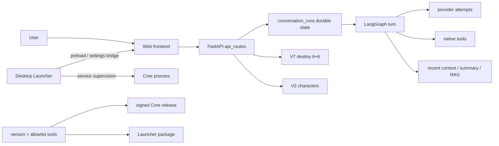

# Mindspace 0.9.0 Codebase Index

> 文档状态：generated。由 `scripts/generate-codebase-index.mjs` 生成；不得手工编辑。

## Coverage

维护文件总数：**467**。逐文件证据见 [CODEBASE_FILE_INDEX_0.9.0.md](CODEBASE_FILE_INDEX_0.9.0.md)。

- Core backend: 96
- Web frontend: 89
- Developer tooling: 77
- Desktop Launcher: 75
- Documentation: 65
- Tests: 46
- Governance/config: 8
- Repository root: 8
- Packaging adapter: 3

## Runtime boundaries

`frontend/` 和 Core 内嵌 Web 资产属于公开 Web；`desktop/` 属于公开 Launcher 与受限 preload/IPC；`src/mindspace_graph/` 和两份受管 voice worker 属于 Core 保护面；`scripts/`、`tests/`、大部分 `docs/` 是开发工具，不应随 Core 发布。provider 密钥只能通过桌面安全存储或进程环境进入运行时，索引、报告和发布清单不得包含秘密。

## Layer dependency map

## Main data flows

- Chat: `frontend/src/chat/useConversation.ts` -> `api_routes/chat_runs.py` -> `conversation_runs.py` -> `service.py` / `graph.py` -> provider/tool attempts -> ordered SSE replay.
- V7: seed -> 8 archetypes -> first six slots -> second six slots -> twelve selections -> V2 synthesis -> commit. A successful half-batch is retained when the other half fails.
- Settings: Web -> preload -> `settings-controller.cjs` -> Core public settings; provider secrets remain in OS-encrypted storage or process memory.
- Characters: `frontend/src/characters/` -> `api_routes/characters_cards.py` -> V2 character store and sessions.
- Release: `config/version.json` + `core-release-allowlist.json` -> version sync/policy checks -> dry-run -> signed packaging outside CI.

## Modification navigation

| Change | Start here | Required cross-check |
|---|---|---|
| API route | `src/mindspace_graph/api_routes/` | `tests/test_api_route_contract.py`, frontend API caller |
| Durable chat/recovery | `conversation_runs.py`, `service.py` | chat state-machine and frontend recovery tests |
| Tool/provider | `native_tools.py`, provider adapter | capabilities, native-tools, provider-attempt tests |
| V7 destiny | `destiny.py`, `destiny_routes.py` | 6+6 and dialogue regression tests |
| Frontend chat | `frontend/src/chat/` | contract, component and full frontend tests |
| Settings | frontend settings + desktop settings controller | secret and bridge tests |
| Desktop lifecycle/update | desktop controllers + main/preload | desktop full tests, CJS syntax, Windows dry-run |
| Release/version | `config/version.json`, scripts | version, policy, allowlist and source-map gates |

## Domain counts

- Core foundation: 62
- Version and release: 60
- Audio and voice: 45
- Documentation governance: 42
- Verification: 42
- Repository governance: 38
- Frontend shell: 32
- Desktop composition: 31
- Memory and retrieval: 26
- Characters and V2 cards: 18
- Chat and durable runs: 18
- Settings and provider: 12
- API composition: 11
- V7 destiny: 8
- Native tools: 7
- Desktop controllers: 3
- Frontend chat: 3
- Chat orchestration: 2
- Audio and scenes: 1
- Desktop bridge: 1
- Frontend characters: 1
- Frontend settings: 1
- Frontend transport: 1
- Legacy compatibility: 1
- Provider adapter: 1

## Exclusions

Excluded by design: `.git`, `node_modules`, virtual environments, runtime/user data, reports, test caches, build/dist directories, binary/media/model assets, desktop bootstrap payloads, third-party vendor trees, and generated Web hash files. The two Mindspace-maintained vendor worker adapters remain included. Generated index documents are explicit self-reference exceptions and must index themselves.
