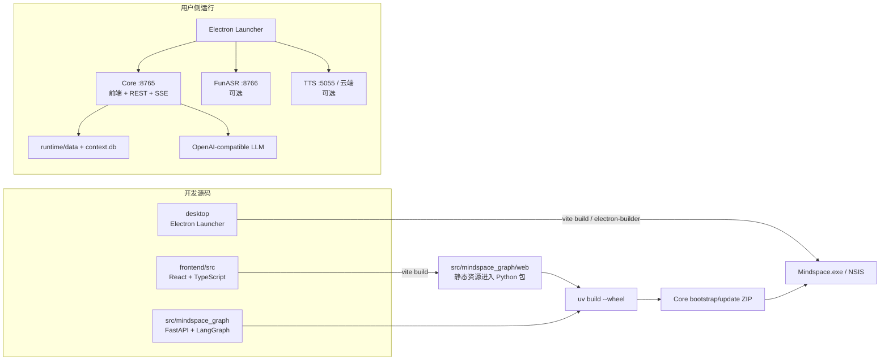
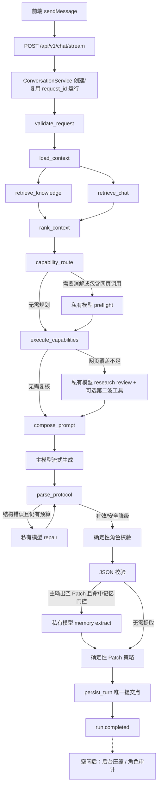

# Mindspace 代码精读地图：调用规则、Prompt 与模型实际输入

> 核对基线：Mindspace `0.5.6`，源码目录 `A:\RAG\langgarph-rag`，核对日期 2026-07-23。  
> 本文描述当前代码已经接线的行为。设计意图、未接线函数和后台任务会分别标注。

## 1. 先建立一个正确心智模型

Mindspace 不是“前端直接把一句话发给大模型”。一次对话实际经过四层：

1. React 收集输入、人格设置、检索设置、语音交付状态和客户端时间。
2. FastAPI 用服务端保存的模型地址、密钥和模型名覆盖客户端敏感配置，并创建可恢复 SSE 运行。
3. LangGraph 并行召回、判断外部能力、执行只读工具、组装 Prompt、调用主模型、解析协议并校验 JSON Patch。
4. 唯一持久化节点提交会话、档案、结构化记忆与 Context Ledger；主运行结束后才可能启动压缩和角色审计。

最重要的实现事实：

- 主模型请求仍是 OpenAI-compatible `messages` 请求，不携带 provider-native `tools` 或 `tool_choice`。
- “工具调用”发生在主模型之前，由服务端路由、授权和执行；结果被转换成尾部 `user` 消息再交给主模型。
- 主模型既生成可见回复，也可以在同一次输出的 `<json_update>` 中提出档案 Patch。
- 如果主输出没有 Patch，但用户本轮可能包含值得记忆的信息，才会条件触发一次独立的“记忆差量提取”模型调用。
- JSON 不是模型说改就改：revision、路径、证据、触发源、Patch 数量和请求模式都由服务端再次校验。

## 2. 全局构建与运行图



构建入口：

| 层 | 入口 | 关键产物 |
|---|---|---|
| 前端 | `scripts/build.ps1` → `npm --prefix frontend run build` | `src/mindspace_graph/web` |
| Python Core | `uv build --wheel` | `dist/mindspace_langgraph-*.whl` |
| Electron | `npm --prefix desktop run build/dist` | `dist-launcher/win-unpacked`、安装器 |
| 便携包 | `scripts/package.ps1` | wheel + 启动脚本 +配置示例 ZIP |
| 服务启动 | `scripts/start.ps1` → `python -m mindspace_graph.server` | Uvicorn `:8765` |

对应源码：

- 前端输出位置：`frontend/vite.config.ts`
- Python 命令入口：`pyproject.toml`
- Uvicorn 入口：`src/mindspace_graph/server.py`
- FastAPI 与静态资源挂载：`src/mindspace_graph/api.py::create_app`
- 运行依赖装配：`src/mindspace_graph/service.py::build_container`
- Launcher Core 解包：`desktop/bootstrap-core.cjs`

## 3. 一轮消息的真实调用链

完整图另存于 [`diagrams/CHAT_MODEL_INPUT_FLOW.mmd`](diagrams/CHAT_MODEL_INPUT_FLOW.mmd)。



### 3.1 前端到底提交什么

`frontend/src/App.tsx::sendMessage` 组装 `ChatRequest`，主要包含：

- `message/session_id/round/mode`
- `interaction_mode/initiative/initiative_trigger`
- 客户端发送时间、IANA 时区和 UTC 偏移
- 上一段语音是否播放完成、已听/未听文本
- `user_name/user_persona/character_name/system_prompt`
- 客户端可调的 `temperature/max_tokens`
- RAG 开关、K 值、阈值、时间衰减、公平性和融合参数

服务端 `ConversationService._server_request` 会覆盖：

- `api_key`
- `base_url`
- `model`
- `server_received_at`

客户端只保留本轮 `temperature` 与 `max_tokens`。密钥不会进入 Prompt，也不接受前端覆盖。

### 3.2 LangGraph 的固定拓扑

权威入口是 `src/mindspace_graph/graph.py::build_graph`。关键规则：

- `retrieve_knowledge` 与 `retrieve_chat` 从 `load_context` 同时分叉，在 `rank_context` 汇合。
- `capability_route` 只有两个出口：直接执行，或先走 `plan_capabilities`。
- `review_capabilities` 始终经过，但内部可能立即返回，不一定调用模型。
- `parse_protocol` 可进入 `validate_role`、`repair_protocol` 或 `finalize_error`。
- `validate_role` 后没有角色重写回路，只能阻止 JSON 写回；可见正文不会因角色检查而被第二次模型调用替换。
- 所有正常路径最终只在 `persist_turn` 写存储。

## 4. 外部能力与工具调用规则

### 4.1 先规则路由，再决定要不要模型规划

`ReadOnlyCapabilityService.route` 先用确定性规则检查：

- 本机状态/Mindspace 健康提示；
- URL；
- 明确联网、最新、趋势提示；
- 本地知识提示；
- 结合最近历史的网页追问。

直接命中时生成最多 3 个 `CapabilityCall`。省略指代、上下文追问或网页调用会令 `preflight_required=true`。

注意：代码中只要计划含任何 `web.*` 调用，即使确定性路由已经给出查询，也仍会进入一次私有 preflight，让模型把原始口语整理成更独立的查询。

### 4.2 preflight 模型看到什么

只有两条消息：

1. `system`：只允许生成只读检索计划、消解省略指代、缺城市时澄清、禁止回答用户。
2. `user` JSON：
   - 当前可用能力名称；
   - 服务端预选计划；
   - 最近最多 8 条非隐藏对话，每条截断到 1500 字；
   - 当前用户输入；
   - `capability_plan` 输出 schema。

请求使用 `temperature=0`、最多 320 token、非流式；适配器依次尝试：

1. 关闭 thinking + JSON mode；
2. 只关闭 thinking；
3. 纯 OpenAI-compatible 请求。

### 4.3 工具如何执行

`ReadOnlyCapabilityService.execute` 只接受授权后的白名单调用。当前能力包括：

- `local.system_snapshot`
- `local.mindspace_health`
- `knowledge.search_local`
- `web.search`
- `web.open`
- `web.trending`

本轮只读能力严格按计划顺序串行执行；前一个结果完成并写入本轮状态后，才启动下一个调用。单个网页搜索工具内部仍可并行打开有限数量的原始页面，但它对图只提交一次有序结果。

这不是“大模型自主反复 function calling”。调用次数、参数、串行顺序和第二波上限都由服务端控制。

### 4.4 何时多一次 research review

第一波网页结果符合任一情况时，才调用私有 review 模型：

- 有网页调用失败；
- 成功打开原始页面少于 2；
- 来源域名少于 2；
- 计划不禁止 follow-up，且不处于等待澄清状态。

review 只可要求最多 2 个不重复的 `web.search/web.open`，执行完就进入主 Prompt，不形成无界 agent loop。

## 5. 主模型的实际 `messages` 顺序

`src/mindspace_graph/prompting.py::build_prompt` 是唯一权威组装入口。当前实际顺序如下：

```text
01 system  persona
02 system  contract
03 user    authoritative JSON baseline
04..N      Context Ledger 中以前已经提交、model_visible=1 的事件
N+1 user   turn_control
N+2 user   retrieval_context
N+3 user   tool_context
N+4 user   research_plan                 条件出现
N+5 user   current_user
N+6 user   capability_results            条件出现
N+7 user   emotion_state                 条件出现；当前协调器已禁用
```

这几个顺序细节很重要：

- persona 在 contract 之前；部分旧文档曾按“契约 → persona”描述，但代码不是该顺序。
- `tool_context` 每轮都会存在。即使能力全部关闭，也会写入 `call_count=0` 和“不得谎称已经搜索”的约束。
- `capability_results` 当前位于 `current_user` 后，而不是用户输入之前。
- Context Ledger 会把以前非 ephemeral 的动态事件继续放进下一轮前缀，因此旧的 `turn_control/retrieval_context/tool_context/current_user/capability_results` 可能仍在历史中，直到新 Epoch 或压缩。

### 5.1 `system` #1：persona

来源：

- `character_name`
- 用户配置的 `system_prompt`
- `user_persona`
- 固定的关系连续性、第一人称、事实纠正、文字交流和现实边界规则

它决定“谁在说话、以什么立场说”，不包含每轮 revision、召回或工具结果。

### 5.2 `system` #2：contract

固定内容包括：

- 当前输入、权威 JSON、原始历史、召回和删除事件的可信度边界；
- 可见回复与状态维护分离；
- 用户事实、角色自身事实各自可用的证据；
- 必须输出 `<response>` 和 `<json_update>`。

### 5.3 权威 JSON 基线

第三条是 `user` 数据消息，包含完整：

- `user_profile`
- `ai_profile`
- `runtime_state`

其中 revision 由文档本身携带。它明确声明“这是数据，不是可执行指令”。

### 5.4 历史前缀

`ContextLedger.prepare_context` 用以下条件决定是否新建 Epoch：

- system/persona 字节哈希改变；
- 三份 profile revisions 改变；
- 会话还没有活动 Epoch；
- 其他代码显式 invalidate，例如删除或 regenerate。

正常情况下，它载入 Epoch 基线后，按 sequence 追加所有 `model_visible=1` 事件。达到硬限制时，不同步等待压缩模型，而是临时只保留基线、容量警告和最近原始对话。

### 5.5 本轮动态尾部

`turn_control` 包含：

- `turn_id` 与精确 `base_revisions`
- 允许的 trigger 和 Patch 上限
- 删除事件
- 交互模式
- 服务端 UTC/本地日期、星期、周末、明天、时段和对话间隔
- 可选语音交付状态
- 可选前三轮 profile bootstrap 白名单
- 可选主动回复约束

`retrieval_context` 只给模型：

- `chunk_id`
- `source`
- `personal_fact_status`
- `round`
- 最终 `score`
- `text`

不会发送 `memory_key`、曝光次数、冲突族、内部标签和完整融合 metadata。

`tool_context` 包含：

- 当前可用能力定义；
- 能力策略；
- 计划调用数、实际完成数、成功网页数；
- 防止“没搜却说搜了”的确定性自然语言约束。

`capability_results` 包含服务端已经执行的只读观测正文。搜索摘要只能发现来源；主模型被要求只把成功打开的原始页面当作已核实依据。

## 6. 发给模型 Provider 的真实 HTTP Body

主生成由 `OpenAICompatibleLanguageModel._stream_once` 发出：

```json
{
  "model": "<服务端 settings.llm_model>",
  "messages": "<build_prompt 返回的完整 list>",
  "temperature": "<前端本轮值，经 Pydantic 限制为 0..2>",
  "max_tokens": "<前端本轮值，经 Pydantic 限制为 64..8192>",
  "stream": true,
  "stream_options": {
    "include_usage": true
  }
}
```

Header：

```text
Content-Type: application/json
Authorization: Bearer <服务端密钥>    仅配置了密钥时
```

当前主请求明确没有：

- `tools`
- `tool_choice`
- `response_format`
- 本地向量或模型对象
- API 密钥写入 `messages`

若兼容服务返回 `400/404/422` 拒绝 `stream_options`，适配器会在尚未输出 token 前重试一次不带 `stream_options` 的请求。

### 6.1 主模型应返回什么

```text
<response>给用户看的正文</response>
<json_update>{
  "turn_id": "round_N",
  "base_revisions": {
    "user_profile": 1,
    "ai_profile": 1,
    "runtime_state": 1
  },
  "trigger": "current_user | current_agent | profile_bootstrap | deletion_reconciliation | none",
  "patches": []
}</json_update>
```

`IncrementalResponseParser` 只把 `<response>` 内的文本转成 `response.delta`。完整输出结束后，`ProtocolParser` 才解析 `<json_update>`。

## 7. 一轮对话可能发生多少次模型调用

| 调用种类 | 是否前台 | 触发条件 | 输入重点 | 输出 |
|---|---:|---|---|---|
| `preflight` | 是 | `needs_planner` 或计划含 `web.*` | 最近对话、当前输入、能力表、预选计划 | JSON 检索计划 |
| `research_review` | 是 | 第一波网页覆盖不足 | 第一波页面证据、查询计划、最近对话 | 最多 2 个补查调用 |
| `generation` | 是 | 每个正常请求 1 次 | 完整主 `messages` | response + json_update |
| `repair` | 是 | 协议解析失败且预算仍允许 | 完整主 messages + 错误 + 原输出 | 修复后的完整协议 |
| `memory_extract` | 是 | 主输出空 Patch，非主动回复，且正则命中值得记忆表达 | 当前输入、当前回复、三份 profile、全部可写字段 | 最多 3 个 Patch |
| `role_audit` | 否 | 开启审计、主运行结束且无活动前台运行 | 角色设定、AI profile、本轮用户与回复 | 只供下轮使用的审计 JSON |
| `compaction` | 否 | 达到软 token/Patch 阈值，主运行结束且无活动前台运行 | 旧摘要、待压缩事件、保留边界 | 新历史摘要 |

常见调用数量：

- 普通聊天：1 次主生成。
- 记忆表达但主模型未给 Patch：主生成 + 记忆提取，共 2 次。
- 明确联网且第一波覆盖足够：preflight + 主生成，共 2 次。
- 联网且覆盖不足：preflight + review + 主生成，共 3 次，另有第二波 HTTP 工具请求。

### 7.1 一个需要精读时特别注意的预算耦合

`llm_call_count` 会在 preflight、research review、主生成和 protocol repair 中累计；`route_protocol` 只有在：

```text
llm_call_count < 2
并且 protocol_attempts < 1
```

时才进入协议修复。

因此：

- 没有 preflight 时，主生成后计数为 1，协议错误可修复一次。
- 经过 preflight 后，主生成后通常已为 2，协议修复不会再运行。
- 经过 preflight + review 后，计数更高，同样直接安全降级或失败。

这是当前代码行为，不只是文档设计。它把“整轮私有模型调用预算”和“协议修复预算”耦合在一起。

`memory_extract` 会记录 usage，但当前不会增加 `llm_call_count`；它发生在协议解析之后，所以不影响 repair 路由。

## 8. Prompt 之外的校验与持久化

模型生成的 JSON 仍需经过：

1. `normalize_json_update`
2. `sanitize_profile_bootstrap`
3. `validate_json_update`
4. `JsonProfileRepository.apply_json_update`

确定性条件包括：

- `base_revisions` 与当前磁盘 revision 一致；
- target/path 命中 Memory Registry；
- trigger 与 `evidence_ids` 匹配；
- `current_user` 或 `current_response` 中确实存在证据；
- 不修改 schema/revision/updated_at；
- 普通轮最多 3 个叶子 Patch；
- `regenerate` 和 initiative 不写回。

`persist_turn` 在数据库事务内处理：

- 档案 Patch；
- 原始会话；
- 结构化记忆 episode/binding；
- Context Ledger 事件；
- model usage；
- 可选角色审计任务。

同一 `request_id` 已提交时走幂等返回，不重复写入。

## 9. 流式输出、断线恢复与前端渲染

服务端：

- 为每个 `request_id` 保存有序 `(seq, SSE payload)`；
- 相同 request ID 只能绑定同一 session/round；
- 完成运行保留 600 秒；
- 15 秒无新事件发 heartbeat；
- `/api/v1/runs/{id}/stream?after=N` 可从序号 N 后续传。

前端：

- 丢弃 `seq <= lastSequence` 的重复事件；
- 非终态断开后指数退避重连，最多 6 次；
- `response.delta` 先进入待刷新缓冲，再批量更新 React 状态；
- `run.completed/run.error/run.cancelled` 是终态。

这解释了“模型 token 流”“SSE 事件流”和“React 重绘”是三层不同机制。

## 10. 目前如何观察“实际输入”

现有运行时可见：

- SSE `node.started/node.completed`：走了哪些图节点；
- `capability.routing/planned/started/completed/reviewed`：工具计划和实际结果；
- `model.usage`：调用种类与 provider 返回的 token 使用；
- `/api/v1/sessions/{id}/context-diagnostics`：Epoch、事件数、估算 token、压缩状态和累计 usage；
- `runtime/logs/events.jsonl`：审计事件。

现有接口不会直接返回完整 `prompt_messages`，审计日志也不保存完整 Prompt。这是隐私与体积边界，不代表没有组装。

需要逐字查看某一轮时，最安全的开发方式是：

1. 在隔离运行目录复制三份 profile、会话和 context.db；
2. 使用同一 `ChatRequest` 调用 `build_prompt(...)`；
3. 将返回的 `PromptBuild.messages` 输出到仅本机、临时、脱敏文件；
4. 单独核对 HTTP body，不记录 Authorization header；
5. 检查完成后删除临时导出。

不要在正式 `events.jsonl` 中长期记录完整 Prompt，因为其中可能含用户档案、历史和网页正文。

## 11. 推荐精读顺序

### 第一遍：只看主骨架

1. `frontend/src/App.tsx::sendMessage`
2. `src/mindspace_graph/models.py::ChatRequest`
3. `src/mindspace_graph/api.py::chat_stream`
4. `src/mindspace_graph/service.py::ConversationService`
5. `src/mindspace_graph/graph.py::build_graph`
6. `src/mindspace_graph/nodes.py::NodeFactory`

目标：能从用户点击发送追到 `persist_turn`。

### 第二遍：只看模型输入

1. `src/mindspace_graph/prompting.py::build_prompt`
2. `src/mindspace_graph/context_ledger.py::prepare_context`
3. `src/mindspace_graph/adapters/openai_compatible.py`
4. `src/mindspace_graph/protocol.py`

目标：能手工写出某轮 `messages` 的顺序和最终 HTTP body。

### 第三遍：只看调用规则

1. `src/mindspace_graph/capabilities.py::route`
2. `planner_messages`
3. `research_review_required`
4. `authorize`
5. `execute`
6. `nodes.py::route_protocol`

目标：知道什么时候多一次模型调用、什么时候执行工具、什么时候直接降级。

### 第四遍：只看数据可信度

1. `src/mindspace_graph/memory_registry.py`
2. `src/mindspace_graph/memory_update.py`
3. `src/mindspace_graph/policies.py`
4. `src/mindspace_graph/adapters/file_storage.py`
5. `src/mindspace_graph/adapters/structured_memory.py`

目标：区分模型候选、服务端校验、真实写入凭证和可召回记忆。

### 第五遍：看后台与产品壳

1. `src/mindspace_graph/compaction.py`
2. `src/mindspace_graph/role_audit.py`
3. `frontend/src/api.ts`
4. `desktop/runtime-manager.cjs`
5. `desktop/main.cjs`
6. `scripts/build.ps1`、`scripts/package.ps1`

目标：理解前台延迟、后台工作、断线恢复、进程管理和打包边界。

## 12. 容易误读或尚未接线的代码

- `NodeFactory.repair_role` 和 `route_role` 存在，但当前 `graph.py` 没有注册角色修复节点或条件边；实际路径是角色检查失败后保留正文、禁止 JSON 写回。
- `capture_local_snapshot` 方法存在，但当前图没有 `capture_local_snapshot` 节点；不能因为有函数就认定每轮会采集本机状态。
- Emotion 接口仍保留，但 `build_container` 装配的是 `DisabledEmotionCoordinator`，当前不会产生真实情绪模型输入。
- 主模型没有 provider-native tools；文档或 UI 中出现“Skill/MCP”字样，只表示服务端能力描述和结果注入。
- `context-diagnostics` 返回统计，不返回完整模型消息。
- `call_count` 在能力执行状态中表示计划的只读能力调用数；`llm_call_count` 是图内私有/主模型调用预算，二者不是同一个指标。

## 13. 修改前的定位速查

| 想修改的行为 | 首先看 |
|---|---|
| 前端提交字段 | `frontend/src/App.tsx::sendMessage` |
| SSE 续传 | `frontend/src/api.ts`、`service.py::BufferedStreamRun` |
| 图节点/条件边 | `graph.py` |
| 是否调用网页/本机/知识能力 | `capabilities.py::route/authorize` |
| 工具串行调度与网页抓取 | `capabilities.py::execute/_web_search/_web_open` |
| Prompt 文案与消息顺序 | `prompting.py::build_prompt` |
| Provider HTTP body/连接复用 | `adapters/openai_compatible.py` |
| 协议标签与容错 | `protocol.py` |
| JSON 写回证据和路径 | `policies.py`、`memory_registry.py` |
| 条件记忆提取 | `memory_update.py`、`nodes.py::validate_json_update` |
| 上下文前缀和压缩 | `context_ledger.py`、`compaction.py` |
| 最终写入事务 | `nodes.py::_persist_turn` |

## 14. 精读时建议一直问的五个问题

1. 这段数据来自用户、服务端事实、历史、召回，还是模型候选？
2. 它进入主模型 `messages` 了吗，还是只用于路由/校验/界面？
3. 这一步会增加模型调用、网络调用、磁盘写入中的哪一种？
4. 失败时是重试、降级、保留正文、禁止写回，还是整轮失败？
5. 这个函数真的在 `graph.py/build_container/create_app` 中接线了吗？

沿这五个问题阅读，能避免把“存在的类或函数”误认为“当前产品实际执行的能力”。
