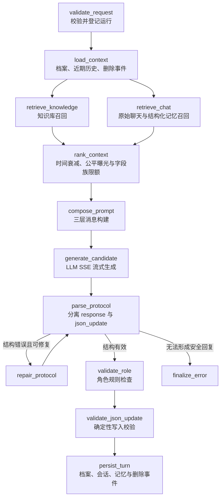

# Mindspace 0.4.5 记忆、召回、上下文与 Prompt 开发者手册

本文描述 0.4.5 当前代码实际执行的链路，用于架构评估、Prompt 调整和后续替换检索后端。它不是未来规划；文中“当前限制”均指现有实现仍存在的边界。

应用进程、语音、Launcher、在线更新和 Context SQLite 的完整说明见 [`APPLICATION_FULL_CHAIN.md`](APPLICATION_FULL_CHAIN.md)。

## 1. 一轮对话的总流程

入口是 `POST /api/v1/chat/stream`。`ConversationService` 把服务端保存的 LLM 配置覆盖到请求上，再调用 LangGraph。



知识库和聊天召回在 `load_context` 之后并行；它们都完成后才进入统一重排。可见回复在模型输出 `<response>` 时立即通过 SSE 发出，不等待 JSON 写回。

核心文件：

- 图拓扑：`src/mindspace_graph/graph.py`
- 节点实现：`src/mindspace_graph/nodes.py`
- SSE 包装：`src/mindspace_graph/service.py`
- 对话状态：`src/mindspace_graph/state.py`

## 2. 四类持久信息不是同一件事

| 类型 | 主要文件 | 是否每轮直接进入 Prompt | 是否参与召回 | 谁能修改 |
|---|---|---:|---:|---|
| 权威人物 JSON | `user-profile.json`、`ai-profile.json`、`runtime-state.json` | 是，完整注入 | 其成功 Patch 会形成结构化记忆 | LLM 候选 Patch 经服务端校验；记忆中心；高级 JSON 编辑 |
| 原始会话历史 | `data/sessions/{session}.json`、`data/context/context.db` | Context Epoch 按轮追加，异步压缩 | 当前会话非隐藏消息可召回 | 会话写入与删除接口 |
| JSON 字段结构化记忆 | `data/structured-memory.json` | 仅命中的原文进入 | 是，跨会话活动记忆 | 只由成功写入凭证或记忆中心生成 |
| 外部知识库 | `data/knowledge.json` | 仅命中的父块进入 | 是 | 知识库接口和前端管理页 |

因此，“记忆仍在历史那一路吗”的准确答案是：

- 原始聊天消息仍走 `retrieve_chat`；
- JSON 字段记忆也走同一个聊天召回节点，但使用 `source=memory`；
- 两者候选和计分独立，最后一起重排；
- 关闭“JSON 字段记忆”只过滤 `source=memory`，不会关闭原始聊天历史召回；
- `chat_enabled=false` 才会同时关闭这条节点上的原始聊天和结构化记忆召回。

## 3. 信息可信度和冲突处理

Prompt 明确规定以下层级：

1. 当前用户明确输入：唯一常规 JSON 变更触发源。
2. 当前版本权威 JSON：在其字段覆盖范围内是最高持久事实。
3. 未删除近期原始历史：用于理解上下文，不能独立触发写入。
4. 聊天召回：低可信补充，不能覆盖 JSON 或独立触发写入。
5. 知识库召回：外部资料补充，不得改写人物与关系 JSON。
6. 待处理删除事件：负向证据，是除当前输入外唯一特殊校正触发源。

服务端并不依赖模型自觉执行全部规则。`validate_json_update` 会再次验证 revision、trigger、证据 ID、路径、操作、值和 Patch 数量。回复可以保存，但不合格 Patch 不会写入。

## 4. 权威 JSON 与字段注册表

### 4.1 三份权威文档

- `user-profile.json`：用户身份、交流偏好、稳定偏好、经历和行为边界。
- `ai-profile.json`：角色身份、性格、关系规则、行为规则和长期连续性。
- `runtime-state.json`：关系阶段、当前目标/任务/话题、情绪线索、待回应事项、摘要和待办。

服务端管理 `schema_version`、`profile_type`、`revision` 和 `updated_at`。模型 Patch 不允许修改这些字段。

### 4.2 注册表是唯一分类词表

`memory_registry.py` 为每个允许写入的叶子字段声明：

- `field_code`：稳定机器标签，如 `user.preference.likes`；
- `target + path`：真实 JSON 位置；
- `display_name/category`：前端中文说明；
- `value_kind`：标量或列表；
- `reducer`：归并算法；
- `scope/lifecycle`：用户、角色或会话作用域，以及持久、临时或会话生命周期；
- `max_items`：字段容量；
- `conflict_group/polarity`：对立字段族和极性。

模型不额外生成自然语言标签。结构化记忆的标签来自服务端已经提交成功的 Patch，因此不会增加一次模型分类判断。

### 4.3 五种归并语义

| reducer | 用途 | 当前行为 |
|---|---|---|
| `replace_one` | 姓名、职业、当前目标等标量 | 新值覆盖旧值 |
| `unique_set` | 兴趣、习惯、边界等列表 | 规范化后去重，受 `max_items` 限制 |
| `opposing_set` | 喜欢/不喜欢、执行/避免 | 相同实体共用 `memory_key`，新极性替换旧极性 |
| `bounded_event` | 近期事件、冲突、情绪线索 | 超限淘汰旧活动项 |
| `lifecycle` | 开放问题、待办、未解决事项 | 通过 add/remove 管理活动状态，失效项留墓碑 |

### 4.4 对立字段如何自消除

喜欢和不喜欢共享 `conflict_group=user.preference`。列表值先规范化，再生成：

```text
family_key = user:user.preference
memory_key = family_key + SHA256(normalized_value)[0:20]
```

所以“喜欢草莓”和“不喜欢草莓”会落到同一个 `memory_key`。后一次成功 Patch 会把前一活动绑定移入墓碑，而不是增加第二条冲突记忆。行为规则中的 `always_apply/avoid` 使用相同机制。

当前对立消除是显式字段族算法，不使用语义相似度猜测。“喜欢草莓”和“不喜欢草莓蛋糕”不会自动视为同一实体。

## 5. 结构化记忆数据模型

`structured-memory.json` 分为四区：

```text
episodes    原始对话片段；同一轮只保存一份文本和一份向量
active      每条只绑定一个已提交 JSON 叶子字段
untagged    没有成功 Patch 的有界隔离池，不进入召回
tombstones  被替换、删除或容量淘汰的有界审计记录
```

### 5.1 成功 Patch 的记录流程

1. `JsonProfileRepository.apply_json_update` 原子写入每份目标 JSON，并产生 `JsonWriteReceipt`。
2. receipt 记录每个 Patch 的 `before`、`after` 和 `evidence_ids`。
3. `StructuredMemoryStore.record_turn` 保存一份 episode 原文。
4. 每个 receipt Patch 生成一个独立 binding；多字段共享 episode，不复制原文或向量。
5. 归并器按字段、值指纹、对立字段族和容量更新 `active`。

绑定元数据不会进入 Prompt。真正进入 Prompt 的只有被召回 episode 的原始文本、来源、轮次和最终分数。

### 5.2 无 Patch 的文本

没有成功写入凭证的普通对话进入 `untagged`：

- 不建立活动 JSON 标签；
- 不进入向量召回；
- 内容哈希去重，重复只增加 `repeat_count`；
- 每个会话最多 24 条，全局最多 128 条；
- 默认 14 天过期；
- 召回次数永远不能让它晋升为长期记忆。

这部分只是短期隔离与诊断数据，不是第二套隐式长期记忆。

### 5.3 手工记忆中心

记忆中心不是给模型发送一条指令，而是服务端直接修改权威 JSON，并生成 `evidence_ids=["memory_center"]` 的写入凭证：

- 编辑：立即更新 JSON 和活动 binding；
- 删除：立即从 JSON 删除/清空并将活动项移入墓碑；
- 恢复：从最近墓碑取值，重新写入 JSON 并生成活动 binding。

这与“删除一条 AI 回复”不同：记忆中心操作立即修改 JSON；消息删除遵循下一轮校正规则。

## 6. 前三轮人物档案快速补齐

服务端在每轮 `load_context` 中确定是否开启 bootstrap，模型不能自行开启：

- 仅普通 primary 对话；主动回复和 regenerate 不启用；
- 仅第 1–3 轮；第 4 轮强制关闭；
- 用户/AI 持久字段空缺率至少 30%；
- 有待处理删除事件时不启用；
- 服务端提供仍为空的白名单字段和每个字段允许引用的来源。

初始化上限：每轮最多 8 个不同字段、24 个展开后的叶子 Patch。候选值必须逐字存在于 `current_user`、`user_setup` 或 `character_setup` 对应原文中；不能释义、扩写或覆盖非空字段。服务端 `sanitize_profile_bootstrap` 会丢弃无法逐字对齐的候选。

普通轮次仍维持最多 3 个叶子 Patch。

## 7. 两路召回的实际算法

### 7.1 查询构造

知识和聊天都以 `current_message` 作为检索查询。用户名和角色名只作为有上限的元数据 Boost 信号，避免把固定前缀污染 BM25 文档频率或向量语义。

### 7.2 知识库召回

知识入库按段落切分：默认 child 700 字、parent 1400 字、overlap 100 字。检索时 child 用于匹配，返回 Prompt 的文本优先使用 parent，以保留完整语境。

当前融合顺序是：

```text
BM25+ 名次 + 向量名次 -> RRF -> bounded boost -> 时间/公平性 -> 可选 CrossEncoder
```

向量模型优先加载本地 `text2vec-base-chinese`；ONNX 后端失败会尝试 PyTorch 后端；模型不可用时保留 BM25+。中文词法使用确定性双字切分，英文使用字母数字词。

### 7.3 聊天与结构化记忆召回

候选包含：

- 当前会话非隐藏原始消息，`source=chat`；主动回复的隐藏传输信号在历史装载和检索层都会被过滤；
- 全局所有活动结构化记忆，`source=memory`，可跨会话命中。

两者使用相同的 BM25+/向量/RRF 融合。episode 向量第一次计算后缓存在 episode 上，多标签不重复保存向量。

候选生成阶段先保留约四分之一位置给低曝光结构化记忆，避免它们在进入全局重排前就被截断。

### 7.4 阈值、时间衰减和公平曝光

两个节点先分别取 `candidate_multiplier × k`，再过滤 `score < similarity_threshold`。统一重排时：

```text
round_weight = exp(-轮次差 / decay_rounds)
hour_weight  = exp(-小时差 / decay_hours)
base_score   = score × round_weight × hour_weight
final_score  = base_score + bounded_starvation_bonus
```

默认参数：相似度 0.5、轮次衰减 20、时间衰减 168 小时、低曝光保留比例 20%、同一记忆字段族先占最多 2 项、6 轮后产生有限饥饿补偿，补偿上限 0.12。

公平补偿只重排已达到阈值的候选，不能绕过阈值，也不能把 untagged 文本晋升为记忆。无低曝光候选时，保留位置归还相关性排序。

### 7.5 精排降级边界

BM25+、向量、RRF 和配置化 Boost 已接入。cross-encoder 只有本地模型目录存在且 `reranker_enabled=true` 时启用；否则明确降级到 RRF，运行时不会联网下载。每条召回的 `metadata` 保存各阶段分数，评估必须检查这些真实分量。

## 8. 最终上下文到底包含什么

`compose_prompt` 按缓存稳定性拆成多条消息。可信度由第一条 system 契约规定，不由消息距离决定。

### system #1：角色与数据契约

包含：

- 角色扮演、第一人称、风格与边界；
- “仅文字交流、没有现实实体互动”的限制；
- 信息可信度顺序；
- JSON trigger、evidence、路径及候选 Patch 的通用规则；
- `<response>` 与 `<json_update>` 的固定协议外形。

这里不包含每轮变化的 round、revision、交互模式、bootstrap 或主动回复状态，因此普通轮次之间可保持字节级稳定。它不把模型称为“协议输出器”，而是先定义角色身份，再定义持久数据规则。

### system #2：产品角色设定

包含：

- 用户配置的角色 `system_prompt`；
- 用户设定 `user_persona`。

用户角色提示词因此确实位于 system 层，不再混入普通 user 消息。

### 权威 JSON 快照

完整 `user_profile + ai_profile + runtime_state` 单独组成紧随 system 的 user 数据消息。JSON 使用固定键排序和紧凑序列化；只有实际成功写入才改变 revision 和快照。模型不直接改写这段文本，而是在输出尾部提交叶子 Patch，下一轮再装载新快照。

### Context Epoch 与增量历史

历史不再使用固定 10 轮窗口或每 5 轮重排。每轮把动态控制、召回、可选工具、当前输入、AI 正文和服务端已提交 JSON Patch 追加到当前 Epoch。下一轮以此前完整 Prompt 为字节级前缀，只追加新尾部。

system/人物设定改变、账本外 JSON revision 改变、删除/重新生成或后台压缩成功时才建立新 Epoch。删除与重新生成会先使旧 Epoch 和排队压缩任务失效，再从仍存在的原始会话和当前 JSON 重建。

达到软 token 阈值或 Patch 数阈值后，独立压缩服务在主运行结束后调用模型；成功后激活 `system + persona + 当前完整 JSON + 摘要 + 最近原始轮次`。压缩不在 LangGraph 主图中，也不阻塞 SSE 或 TTS。

### 本轮动态控制

位于历史之后，包含：

- 精确 `turn_id`、`base_revisions`、trigger 选择和 Patch 上限；
- 文字/语音模式；
- 待处理删除事件；
- 前三轮 bootstrap；
- 主动回复限制；
- 本轮精确空更新模板。

因此 round 和 revision 不再污染第一条 system 缓存。

### 召回、工具与当前输入

尾部按固定顺序包含：

1. 统一重排后的知识/聊天/结构化记忆文本；
2. 本轮动态提供的工具、Skill 与 MCP 能力清单；
3. 当前用户明确输入。

工具清单为空时不发送工具消息。未来能力集合由调度器动态生成，并始终位于召回之后、当前输入之前；工具变化因此不会破坏 JSON 和历史前缀。实际 provider-native tool schema 也必须遵守相同尾部策略。

召回条目传入模型的字段只有 `chunk_id/source/round/score/text`。`json_tags`、`memory_key`、曝光次数和字段族等 metadata 不进入 Prompt，满足“只记录、不增加模型判断负担”的设计。

“本轮引用”面板显示的是 `retrieval.completed` SSE 中的 ranked 列表，与 Prompt 的低可信召回来源一致；它不是权威 JSON、缓存历史或删除事件的完整展示。

## 9. Prompt 输出协议与流式行为

模型输出：

```text
<response>用户立即可见的角色回复</response>
<json_update>{
  "turn_id": "round_10",
  "base_revisions": {
    "user_profile": 3,
    "ai_profile": 2,
    "runtime_state": 8
  },
  "trigger": "current_user | profile_bootstrap | deletion_reconciliation | none",
  "patches": []
}</json_update>
```

`IncrementalResponseParser` 只把 `<response>` 内文本作为 `response.delta` 流出；遇到 `</response>`、`<json_update>` 或模型结束标记时停止。缺少 opening tag 时，普通自然语言仍可作为安全可见回复流出。

完整输出结束后，`ProtocolParser` 才解析 JSON。结构错误最多修复一次；如果已有可见回复但 JSON 仍无法修复，系统构造 `trigger=none, patches=[]` 的安全协议，保留回复且不写 JSON。

前台角色检查是确定性正则策略，主要阻止“忽略角色设定”“我不再是”等明显越界。失败时保留已流出的正文但禁止 JSON 写回。主请求完成后，独立语义审计任务检查复杂身份、边界和实体互动漂移；它不替换正文、不修改 JSON，严重且高置信结果只在下一轮追加纠偏事件。

`analysis`、`reasoning_summary`、`state_update`、`memory_promotion` 和模型生成的技能标签均不在当前协议中。

## 10. JSON Patch 决策与提交

### 10.1 允许的 trigger

- `current_user`：普通明确输入；每个 Patch 只能使用 `current_user` 证据。
- `profile_bootstrap`：前三轮服务端开启的空字段补齐。
- `deletion_reconciliation`：必须引用至少一个当前 pending 删除事件 ID，可同时引用 `current_user`。
- `none`：必须 `patches=[]`。

### 10.2 服务端确定性校验

提交前执行：

- `base_revisions` 必须恰好包含三份文档并与磁盘 revision 相等；
- 普通轮最多 3 Patch；bootstrap 使用单独上限；
- 路径必须命中字段注册表叶子；
- 标量只能 replace，不能 remove；
- 列表 add/remove 必须使用合法索引或 `/-`；
- 非 remove 必须有非 null value；
- 证据必须和 trigger 一致；历史和召回 ID 不能作为普通写入证据。

模型友好的“整个列表字段”操作会先被 `normalize_json_update` 展开成严格叶子 add/remove。例如 replace 一个列表会删除不再需要的旧项，再添加新项。

### 10.3 提交条件

只有同时满足以下条件才真正写入 JSON：

- 请求是 `mode=primary`；
- 不是主动回复；
- JSON 校验有效；
- 规范化后至少有一个 Patch。

`regenerate` 和“让 AI 说点什么”都不会修改 JSON。校验失败时，对话回复仍可保存，`writeback_applied=false`，错误通过 SSE 和审计日志可见。

## 11. 删除回复与下一轮校正

### 11.1 删除单条 AI 回复

`DELETE /api/v1/sessions/{session_id}/messages/{message_id}` 只接受 assistant 消息：

1. 删除 AI 回复，保留对应普通用户消息；
2. 删除对应写入凭证；
3. 立即从结构化记忆中移除关联 episode 和活动 binding；
4. 权威三份 JSON 当场保持不变；
5. 保存 pending 删除事件，包括被删文本和原写入凭证；
6. 下一次普通 primary 对话把事件作为负向证据放入 Prompt；
7. 模型可选择撤回、修正或保持 JSON；
8. JSON 校验有效且 trigger 为 `none` 或 `deletion_reconciliation` 后，事件标记 resolved。

LLM 失败、取消、regenerate、主动回复或 JSON 校验失败都不会消费 pending 事件。

### 11.2 其他删除接口的差异

- 删除整轮和清空会话会立即移除相关原始消息与结构化记忆，并为被删 AI 回复逐条创建下一轮校正事件；
- 删除整个会话会移除该会话的 Context 账本和删除事件，因为之后不存在同一会话的下一轮校正；
- 三种破坏性操作都会使旧 Context Epoch 失效，避免被删文本继续进入模型。

### 11.3 主动回复

主动回复把传输占位转换为“`{用户实际名称}不想说什么，但是想让你说点什么。`”，隐藏该用户信号，只展示 AI 回复。它不写 JSON、不生成结构化记忆，删除主动回复也不创建 pending 校正事件。

## 12. SSE 事件与前端检查器

常用事件：

| 事件 | 用途 |
|---|---|
| `run.accepted` | 返回 run/request ID |
| `node.started/completed` | 执行详情节点时间线 |
| `retrieval.completed` | 知识、聊天候选数和最终 ranked 引用 |
| `response.delta` | 首次候选的可见流式文本 |
| `response.replace` | 旧客户端兼容；当前主链路锁定已流出的可见正文 |
| `validation.completed` | 角色或 JSON 校验结果 |
| `json_update.committed` | 会话保存、Patch 数和删除事件消费结果 |
| `run.completed/error/cancelled` | 终态 |

前端“执行详情”显示节点和校验数据；“本轮引用”显示 ranked 召回。两者用于诊断，不参与 Prompt。

## 13. 运行数据与接口速查

默认运行根目录来自 `MINDSPACE_RUNTIME_DIR`，桌面正式版由 Launcher 指向用户私有数据目录。

| 数据 | 相对路径/接口 |
|---|---|
| 三份权威档案 | `data/profiles/*.json`；`GET/PUT /api/v1/profiles/{name}` |
| 档案历史备份 | `data/profiles/history/{target}/*.json` |
| 原始会话 | `data/sessions/*.json`；`GET /api/v1/sessions/{id}` |
| Context 追加账本 | `data/context/context.db`；`GET /api/v1/sessions/{id}/context-diagnostics` |
| 写入凭证 | `data/memory-write-receipts.json` |
| 删除事件 | `data/memory-deletion-events.json` |
| 结构化记忆 | `data/structured-memory.json`；`GET /api/v1/memory/structured` |
| 字段注册表 | `GET /api/v1/memory/registry` |
| 记忆中心 | `GET/PUT/DELETE /api/v1/memory/items...`；`POST /api/v1/memory/restore` |
| 知识库 | `data/knowledge.json`；`GET/POST/DELETE /api/v1/knowledge...` |
| 审计日志 | `logs/events.jsonl` |
| 产品设置 | `config/settings.json`；`GET/PUT /api/v1/settings` |

高级 `PUT /api/v1/profiles/{name}` 是管理员整文档保存通道，会保留服务端管理字段并递增 revision，但不会经过普通 LLM Patch 白名单，也不会自动为每个改动生成结构化记忆 binding。开发工具使用它时应把它视为显式管理操作，而非普通对话写入。

## 14. 评估时应重点检查的边界

### 已具备

- LangGraph 节点化、双路并行召回和 SSE 流式输出；
- 权威 JSON 与低可信历史/召回分层；
- revision、路径、证据和 Patch 数量服务端校验；
- JSON Patch 自动生成结构化标签，不让模型额外分类；
- 对立字段按显式冲突族自消除；
- untagged 有界且不能靠曝光晋升；
- 结构化记忆跨会话，原始聊天限当前会话；
- 删除单条回复后次轮负向校正；
- 前三轮 30% 空字段快速补齐；
- Prompt 中没有 analysis 链路。

### 当前风险与后续优先级

六项数据与检索根基已按 `APPLICATION_ALGORITHM_FOUNDATION.md` 收口。剩余项属于能力扩展：

1. **精排模型可选**：没有本地 cross-encoder 时使用 RRF，不将“降级可用”误报为精排已运行。
2. **缓存遥测依赖厂商**：统一采集常见 cached-token 字段；厂商不返回时标记 `unreported`，不能估算成真实命中。
3. **别名必须治理**：实体表支持人工别名与合并，但不自动推断相似词，避免错误自消除。
4. **协议修复仍会二次调用主 LLM**：它锁定已流出的正文，不影响已播放 TTS，但会增加尾部成本。
5. **动态工具只有 Prompt 尾部预留**：真实自主工具/Skill/MCP 调度器尚未接入。

## 15. 修改入口建议

| 目标 | 首选修改位置 |
|---|---|
| 调整信息优先级、角色边界、输出协议 | `prompting.py::build_messages` |
| 增删 JSON 字段与冲突族 | `memory_registry.py`，同时更新默认 profile schema |
| 调整 Patch 证据和上限 | `policies.py::validate_json_update` |
| 改变前三轮补齐策略 | `profile_bootstrap.py` 与 `sanitize_profile_bootstrap` |
| 替换向量/BM25/RRF/重排 | 实现 `RetrieverPort`，尽量不改图节点 |
| 调整记忆合并、过期与墓碑 | `adapters/structured_memory.py` |
| 调整删除校正 | `JsonSessionRepository.delete_message` 与 `NodeFactory.persist_turn` |
| 调整协议解析和容错 | `protocol.py` |
| 替换 LLM 厂商 | 实现 `LanguageModelPort` |

所有改动至少应覆盖：正常流式回复、空 Patch、非法路径、revision 冲突、删除事件失败保留、regenerate 不写回、主动回复不写回、对立字段替换、低曝光公平位和 metadata 不进入 Prompt。

开发机先执行 `uv sync --extra dev`，再执行 `uv run pytest -q`。ASR 噪声门测试直接使用 NumPy 构造确定性波形，因此 NumPy属于测试依赖，不代表基础文字版运行时必须安装完整 ASR/CUDA 环境。
