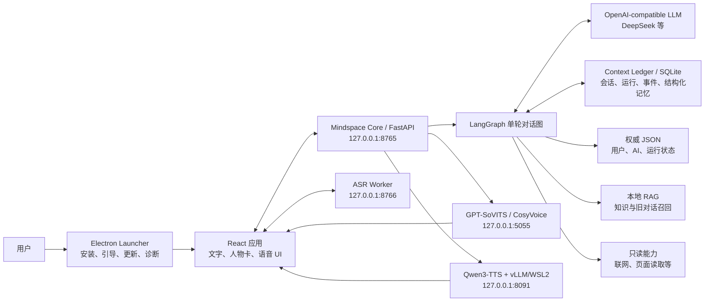
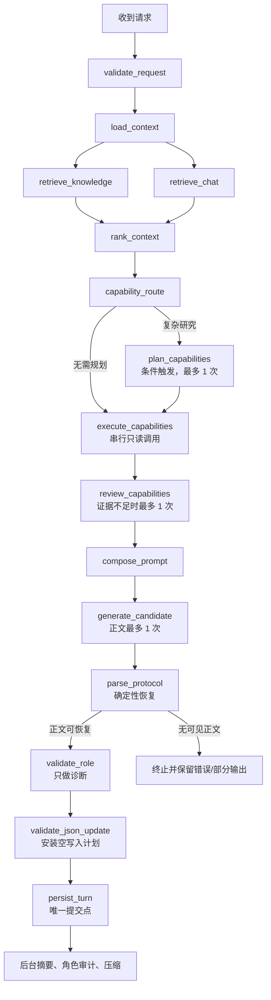
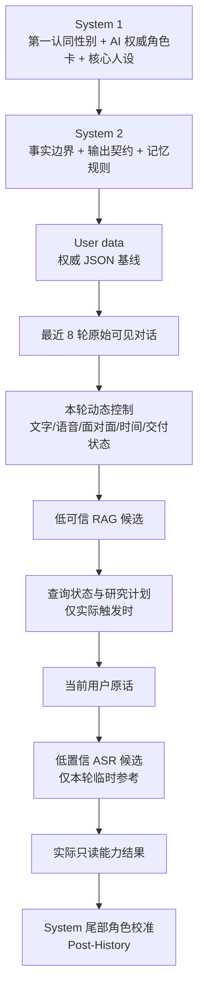
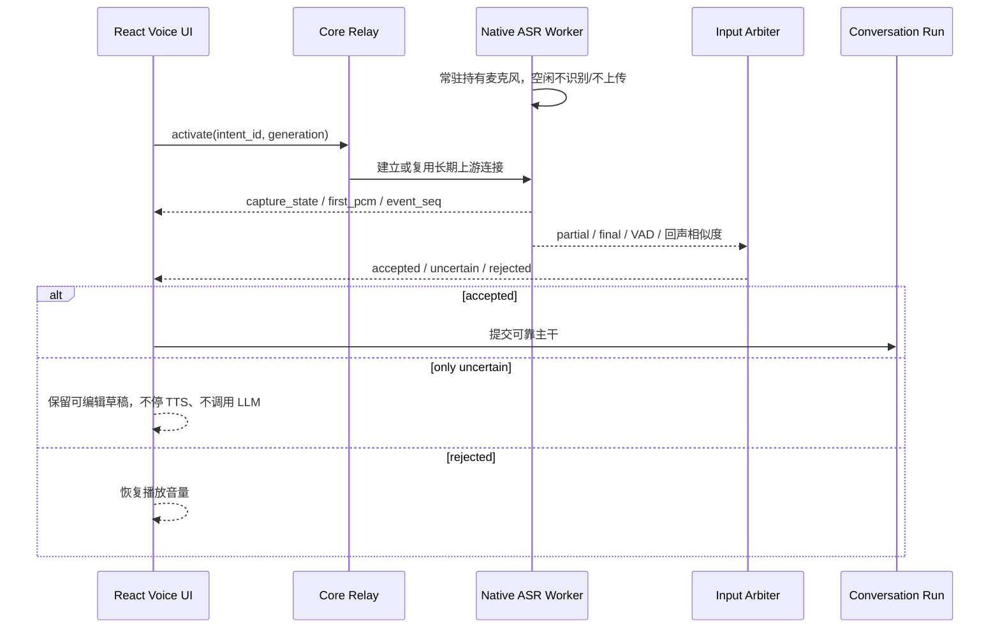

# Mindspace 整体设计演进与开发记录

> 当前 Core / Web 基线：`0.7.4`；Launcher 基线：`0.5.54`
>
> 源码主线：`A:\RAG\langgarph-rag`  
> 桌面程序：`A:\Mindspace\application`  
> 用户工作区：`A:\Mindspace\data`、`A:\Mindspace\models`、`A:\Mindspace\environment`  
> 文档状态：当前架构主记录，2026-07-30

本文不是更新日志的重复整理，而是回答五个问题：

1. Mindspace 最初想解决什么产品问题；
2. 为什么架构逐步变成现在这样；
3. 一轮对话、一次语音会话和一次安装启动实际经过哪些链路；
4. 历史上试过哪些方案，为什么保留、修改或撤回；
5. 产品、工程和后续研究应从哪里继续阅读。

如果本文件与早期专题文档在“当前实现”上发生冲突，以当前源码、自动化测试和本文件标注的
`0.7.4 当前状态`为准。`CHANGELOG.md`保留逐版本事实；专题文档仍可作为当时的设计快照阅读。

---

## 1. 产品定位与不变量

Mindspace 的核心不是把更多工具塞进聊天框，而是做一个以长期关系、角色一致性和本地数据为中心
的桌面陪伴应用。文字对话是最小可用产品，语音、RAG、只读联网能力和成人模式都是可选增强。

经过多轮重构后，产品形成了五条不变量：

- **文字优先可用**：只要 Core 和 LLM 配置有效，就应能进入应用并进行文字对话；ASR、TTS、
  CUDA、WSL2 或本地模型故障不能锁住文字聊天。
- **角色先于通用助手**：模型先按人物卡、关系和当下语境理解用户，再决定是否解释知识、调用
  工具或推进互动。
- **用户确认事实高于模型推测**：用户直接维护的档案、性别、纠正和删除记录是权威数据；
  检索候选、工具中间态、低置信 ASR 和情绪推测不能自动变成长期事实。
- **用户数据与程序分离**：安装、升级、卸载应用不得删除会话、人物卡、模型、环境、RAG、
  参考音频和断点下载。
- **前台只做必要工作**：普通聊天通常只使用一次正文模型调用；摘要、角色审计和压缩进入后台，
  语音组件按需启动，不能让非核心任务拖慢首个可见回复。
- **角色数据严格隔离**：0.6.0 起，AI 档案、运行状态、头像、共同经历、会话和聊天 RAG 均
  绑定 `character_id`；全局只共享用户基础档案、用户稳定偏好和手动知识库。

### 1.1 0.6.0 多角色设计路径

0.6.0 把“单张人物卡上的功能”提升为“多个可独立延续的角色空间”。应用就绪后先进入模式大厅：
不会写卡的用户使用“灵感抽卡”，只给出名称、性别、性格、缺陷、关系和用户称呼，Core 最多
调用一次 LLM 补齐与现有 Schema 相同的 JSON；熟悉人物卡的用户继续使用原自定义工作台。

生成结果先进入草稿，用户预览、编辑并确认后才成为正式角色。新建会话必须先选择角色，已有消息
的会话不能静默换绑；旧 0.5.52 档案与会话通过事务迁移成为“原有角色”，失败则整体回滚。
美术采用原创二次元典藏卡册风格，SVG 负责边框与图标，WebP 负责底纹与占位头像；用户私人头像
和人物卡永远不进入公共资源、安装包样例或在线更新清单。

## 2. 当前系统总图



### 2.1 进程边界

| 进程或层 | 责任 | 是否为进入应用所必需 |
|---|---|---|
| Launcher | 选择工作区、引导安装、服务调度、更新、诊断 | 是 |
| Core | API、SSE、LangGraph、Prompt、RAG、持久化 | 是 |
| LLM API | 生成正文，必要时规划或复核只读研究 | 是 |
| ASR Worker | 常驻原生麦克风采集、识别、打断仲裁 | 否 |
| GPT-SoVITS | 多种二次元角色声线、流式合成 | 否 |
| CosyVoice | 克隆型本地语音、流式合成 | 否 |
| Qwen3-TTS | CustomVoice、语气指令、整轮单次合成 | 否 |

### 2.2 目录边界

| 路径 | 内容 | 升级或卸载策略 |
|---|---|---|
| `A:\Mindspace\application` | Electron 程序与受管 Core 代码 | 可替换、可回滚 |
| `A:\Mindspace\data` | 会话、档案、SQLite、RAG、配置 | 永不随应用卸载删除 |
| `A:\Mindspace\models` | ASR、TTS、向量模型 | 独立下载、独立保留 |
| `A:\Mindspace\environment` | PowerShell、Git、uv、Python、虚拟环境 | 独立准备、独立保留 |
| `A:\Mindspace\downloads` | 断点下载与更新缓存 | 可诊断、不可被安装器误删 |
| `A:\Mindspace\logs` | 启动、服务、下载和故障日志 | 保留供诊断 |

## 3. 设计演进时间线

这里按架构阶段整理；逐补丁内容仍以 `CHANGELOG.md`和`docs/release-history.json`为准。

### 阶段 A：本地应用骨架与可安装性（0.3.x–0.4.7）

这一阶段解决“代码能运行”和“普通用户能安装”：

- Electron Launcher 承担 Core 启动、健康探测和桌面入口；
- Core、前端、运行时与用户数据开始分层；
- 引入本地 Python 环境、更新清单、SHA-256/Ed25519 校验和回滚；
- 0.4.0–0.4.7 安装器曾内置基础运行时，因此体积约 `264–270MB`；
- 修复更新误删私有环境、ASR 残留环境误判和本地 TTS 选择回跳。

这个阶段的主要教训是：**安装器既负责程序又负责大型运行环境时，安装耗时、杀毒扫描、
文件占用和回滚范围都会放大。**

### 阶段 B：角色、时间与语音基础（0.5.0–0.5.6）

重点从“能运行”转为“像一个持续存在的角色”：

- 启动器按基础环境、语音、存储和更新分类；
- 文字与语音统一使用服务端时间和对话间隔；
- ASR 加入自适应噪声基线、流式识别和中文整句复核；
- 角色设定提高到高优先级 System；
- 本机状态从每轮无条件采集改为能力触发时采集；
- 人物档案开始支持用户表单编辑、版本和错误反馈；
- 联网与时间判断开始区分“实际查询结果”和“模型推测”。

### 阶段 C：成熟化、可信分层与输入可解释（0.5.7–0.5.16）

0.5.7 首次系统化处理了七类成熟应用问题：

- 模型调用按用途计数和限额；
- SSE/运行事件可恢复，Core 重启后保留已生成部分而不自动重跑；
- 数据按确认程度和可见性分层；
- 用户可以直接编辑人物档案；
- 增加 Prompt Inspector；
- ASR 引入有效输入仲裁、回声判断和打断限频；
- 情绪能力关闭，只保留接口边界。

随后又形成了当前 Prompt 与记忆的关键取舍：

- AI 人物卡成为权威角色层，性别成为用户手动维护的最高优先身份事实；
- 通话和面对面成为两种可保存的语音互动模式；
- 借鉴 Post-History Instructions，在历史尾部追加紧凑角色校准；
- 删除 AI 读取本机硬件/健康状态的能力；
- 原始对话只直接发送最近 `8` 轮；
- 更早对话仍可通过 RAG 选择性召回。

### 阶段 D：语音可靠性与并发治理（0.5.17–0.5.37）

0.5.17–0.5.34 连续暴露出语音链路中“在线不等于可用”的问题：

- Worker 进程在线，但浏览器麦克风可能没有产生持续 PCM；
- 首次 `getUserMedia`、权限、AudioContext、Worklet 和 USB 端点存在竞态；
- ASR、TTS、页面状态相互覆盖，导致“正在连接”循环或整页锁死；
- 快速开关语音会留下旧 WebSocket、计时器和播放任务；
- 多段 TTS 并发请求导致播放不完整、队列阻塞和服务崩溃。

0.5.37 将修补式方案收束为统一 Voice Session：

- 原生 ASR Worker 独占并常驻麦克风；
- UI 只激活/停用订阅，不反复重建采集；
- 每轮语音使用 `VoiceIntent(intent_id, generation, event_seq)`；
- 旧意图、旧连接、旧定时器的结果直接丢弃；
- ASR、LLM、TTS 和播放使用隔离取消域；
- TTS 同一时刻只允许一个实际合成请求；
- 关闭通话只截断当前输出，不重启全部服务；
- 浏览器采集只作为用户主动选择的备用方案。

### 阶段 E：Qwen3-TTS 与声音一致性试验（0.5.38–0.5.47）

0.5.38 将 Qwen3-TTS 作为第三套本地语音引擎接入：

- Core 保持原 PCM 接口；
- Qwen 服务与 ASR 解耦并独立预热；
- CustomVoice 接收有限语气标签；
- GPT-SoVITS 与 Qwen 互斥运行，避免显存双占；
- WSL2、NVIDIA GPU 和内存条件由启动器预检。

这一阶段出现过一次有价值的“试验—撤回”：

| 版本 | 方案 | 结果 |
|---|---|---|
| 0.5.44 | 首句先合成，余下正文再合成 | 首声更快，但同一回复出现跨段声线和韵律不一致 |
| 0.5.46 | 完整正文使用一次 CustomVoice 声学请求 | 等待正文完成，但声线、节奏和上下文一致性显著更稳定 |

因此当前 Qwen 使用“**尽快拿到完整正文，再整轮单次合成**”，而 GPT-SoVITS、CosyVoice 仍可按
流式文本进入各自的流式朗读链路。这个差异由 Provider 路由决定，不能共用一套前端切分协议。

同期角色层也从“礼貌、克制、理想伴侣”回到有缺点、有欲望和有自主选择的角色；成人模式形成
通用 Director、风格库和单次生成内的强度阶梯，但不额外发起第二次正文重写。

### 阶段 F：产品化引导与分层安装（0.5.48–0.5.49）

当前新手流程被固定为四步：

1. 可选声音；
2. 基础环境一键准备；
3. LLM API 配置；
4. 完成并进入应用。

核心规则是：

- 不需要声音也能对话；
- 选择 TTS 后不在第一页立即下载；
- 基础环境就绪即可启动 Core；
- TTS 可在后台继续，完成后再提示重启或暂时忽略；
- 已完成配置的用户下次直接进入更新、诊断和服务管理；
- 启动器与应用内 TTS 使用同一个配置源；
- NSFW 首次开启需等待三秒并确认成年，确认只存在本机。

## 4. 当前一轮对话的真实调用链



### 4.1 并行与串行边界

- `retrieve_knowledge`和`retrieve_chat`是两个无写入分支，可并行执行；
- `rank_context`等待两路召回完成；
- 外部只读能力按计划顺序串行执行，每个结果进入共享状态后才开始下一个；
- 主模型正文只有一次；
- `persist_turn`是前台唯一提交点；
- 摘要、角色一致性复核和压缩在回复后运行，不阻塞可见正文。

### 4.2 当前模型调用预算

`0.5.49`源码中的前台预算为：

| 用途 | 单轮上限 | 触发条件 |
|---|---:|---|
| `planner` | 1 | 确实需要复杂研究目标拆解 |
| `research_review` | 1 | 第一波网页证据覆盖不足 |
| `generation` | 1 | 生成当前可见正文 |
| 合计 | 3 | 任意路径不可突破 |

普通闲聊不会调用 planner 或 research review，通常只有一次 `generation`。

早期 `0.5.7` 文档记录过总上限 `5`，其中包含 `protocol_repair`和`memory_extract`。当前主图已经
移除这两个前台模型调用：协议恢复是确定性处理，近期事件摘要在后台完成。因此不能再用旧的
“最多五次”描述当前延迟。

### 4.3 当前 JSON 写入权

模型生成人物档案 Patch 的方案已经停用：

- 模型即使输出旧 `<json_update>`，服务端也会忽略；
- 前台安装 `trigger=none, patches=[]` 的空计划；
- 用户和 AI 人物档案只能通过用户直接编辑 API 保存；
- revision、Schema 校验、审计和索引重建由服务端负责；
- 近期事件摘要、事件推进和角色审计可由后台更新各自受限投影，但不能覆盖用户权威档案。

保留 `validate_json_update` 节点是为了协议兼容、审计和迁移稳定，不代表模型仍有写档案权限。

## 5. Prompt 的实际构成

当前 Prompt 不是单一字符串，而是“稳定前缀 + 最近历史 + 本轮动态尾部”。



### 5.1 各层作用与可信等级

| 层 | 作用 | 能否成为长期用户事实 |
|---|---|---|
| 性别与 AI 角色卡 | 决定身份、人格、自主性和关系立场 | 只有用户手动保存后才改变 |
| 权威 JSON | 用户资料、AI 档案、运行状态的当前投影 | 是 |
| 最近 8 轮 | 保留自然对话的原始语气和局部上下文 | 用户原话和最终回复可作为对话证据 |
| RAG 候选 | 找回更早对话或知识片段 | 否，需权威 JSON 或原始对话确认 |
| 工具结果 | 本轮已完成的只读观测 | 否 |
| 低置信 ASR | 帮助理解含糊发音 | 否，只在可靠主干成立时进入本轮 |
| Post-History | 防止长上下文稀释角色演绎 | 否 |

### 5.2 为什么只直接发送 8 轮

完整历史仍保存在 Context Ledger 中，用于页面显示、恢复、审计和召回；但全量原文进入模型会：

- 线性增加 token、首包等待和费用；
- 把过期状态、旧工具结果和旧风格反复带入当前轮；
- 稀释人物卡与当前输入；
- 让 RAG 已经解决的“按需找旧内容”失去意义。

因此当前采用：

`最近 8 轮原文 + 权威 JSON + 旧对话 RAG 命中 + 当前输入`

RAG 与最近 8 轮去重时只对直接历史去重，不能拿完整数据库去重，否则旧对话即使召回命中也会被
误删。

### 5.3 文字与语音 Prompt 的区别

| 模式 | 模型正文格式 | TTS 处理 |
|---|---|---|
| 文字 | 台词在括号外；动作、神态、距离和触感可在全角括号内 | 默认不自动朗读 |
| GPT-SoVITS 语音 | 只输出自然口语；无括号、动作旁白、声线标签 | 流式读取正文 |
| CosyVoice 语音 | 只输出自然口语；无 Qwen 指令 | 流式读取正文 |
| Qwen3 语音 | 一个隐藏 `[[voice:...]]` + 可直接说出口的完整正文 | 剥离标签后整轮单次合成 |
| 面对面语音 | 场景常驻加载，但仍只输出亲口说的话 | 按当前 Provider 执行 |

Qwen 标签不显示、不进入会话历史、不进入 RAG，也不允许改变 speaker。它只映射为有限的
CustomVoice `instructions`。

## 6. 记忆、RAG 与数据权威

### 6.1 四类持久状态

| 类型 | 典型内容 | 存储 |
|---|---|---|
| 权威人物档案 | 性别、身份、关系、偏好、人物卡 | JSON + revision + 审计 |
| 完整会话账本 | 原始消息、运行、SSE 事件、删除与纠正 | SQLite / Context Ledger |
| 结构化长期记忆 | 经确认的事实、事件、关系连续性 | SQLite/结构化索引 |
| 语义检索索引 | 旧对话片段、知识文档、可召回摘要 | 本地向量索引 |

### 6.2 什么可以进入长期记忆或 RAG

可以进入：

- 用户确认的正式输入；
- 最终助手回复；
- 用户直接保存的人物档案版本；
- 删除、纠错和角色修订记录；
- 后台产生、且受 Schema 与来源约束的近期事件摘要。

不能直接进入：

- 工具调用结果和网页搜索摘要；
- 检索候选和重排中间分数；
- ASR 低置信草稿；
- 调度状态、端口状态和服务统计；
- 已关闭的情绪接口状态；
- 模型自行推断的人物事实。

### 6.3 冲突处理

1. 用户当前明确纠正；
2. 用户直接维护的权威 JSON；
3. 最近原始对话；
4. 结构化记忆；
5. RAG 候选；
6. 外部常识或工具结果。

高层级覆盖低层级。删除记录表示旧事实失效，不允许被相似度召回重新“复活”。

## 7. MCP、工具与只读能力设计

Mindspace 当前不是让正文模型自由循环调用任意工具，而是采用受控链路：

1. 确定性路由先判断本轮是否真的需要能力；
2. 简单目标直接生成计划，复杂研究最多调用一次 planner；
3. 服务端授权能力、限制参数和调用数；
4. 工具串行执行；
5. 网页证据覆盖不足时最多一次 research review；
6. 成功结果作为低可信本轮数据进入 Prompt；
7. 正文生成后再做能力声明的确定性校验。

特别规则：

- `call_count=0` 时服务端禁止回复声称“我搜了、网上显示、查到官网”；
- 只有成功打开的原始页面可作为已核实内容，搜索摘要只用于发现来源；
- 工具输出不写入人物档案或长期用户事实；
- 不再给 AI 提供本机硬件、健康状态和常驻扫描能力；
- 动态能力信息放在 Prompt 尾部，避免破坏稳定角色前缀和缓存。

这套方案用少量确定性调度换取真实性和延迟可控；代价是通用 Agent 自由度低于完全开放的工具
循环，但更适合长期角色扮演。

## 8. 语音会话与并发治理

### 8.1 ASR 链路



关键防呆：

- 同一规范化文本三秒内只处理一次；
- 普通有效打断有 1.5 秒冷却；
- 明确停词仍需通过 VAD 和回声排除；
- 连续误候选临时提高能量门和最短持续时间；
- 采集卡死只重建采集端点一次，不重启 Core/TTS、不刷新页面；
- 快速关闭再打开生成新 generation，旧事件自动丢弃。

### 8.2 TTS 链路

所有 Provider 共用：

- 一个 `audio_intent`；
- 一个实际合成队列；
- 同一时刻一个本地合成请求；
- 取消只影响当前音频意图；
- 单段瞬断最多重试一次；
- 播放失败不得覆盖 ASR 的监听状态。

Provider 差异：

- GPT-SoVITS、CosyVoice：正文可流式进入合成与播放；
- Qwen3：等待清理后的完整正文，固定模型、speaker、seed 和整体语气，单次合成；
- 切换本地引擎时先停止旧 Worker、释放端口和显存，再启动新 Worker；
- Qwen 不与另一套本地 TTS 自动双开。

### 8.3 中断与恢复

- LLM 被打断：保留已有可见正文，当前 run 进入 interrupted；
- TTS 被打断：只清理当前播放和未播队列，不关闭 ASR；
- SSE 断线：按事件序号续传，避免重复 token；
- Core 重启：未完成运行标记 interrupted，不自动重新扣模型调用；
- 用户重新开启语音：建立新 VoiceIntent，不接收旧音频或旧转写。

## 9. 启动器、安装器与体积变化

### 9.1 当前安装器包含什么

`0.5.49` 安装器实际包含：

- Electron/Chromium 桌面程序；
- Launcher 前端与调度代码；
- `mindspace-core.zip`，当前约 `8.05MB`；
- 运行时下载清单；
- 安装、卸载、更新和诊断逻辑。

它**不包含**：

- PowerShell 7、MinGit、uv、CPython 的完整目录；
- Core Python 依赖虚拟环境；
- ASR、GPT-SoVITS、CosyVoice、Qwen3 模型；
- WSL2 或 vLLM；
- 用户人物卡、会话、RAG 和参考音频。

### 9.2 为什么从约 270MB 变成约 113MB

本机历史构建的实测值：

| 版本 | 安装器大小 | 分包状态 |
|---|---:|---|
| 0.5.39 | 270.72MB | 内置基础运行时 |
| 0.5.40 | 112.79MB | 基础运行时改为首次引导下载 |
| 0.5.49 | 112.83MB | 延续分层安装，内置当前 Core |

0.5.39 的安装器中可以直接看到 `resources\runtime\bundled`。其解压后目录约 `528.95MB`：

| 组件 | 解压后大小 |
|---|---:|
| PowerShell | 282.22MB |
| MinGit | 103.97MB |
| Python | 72.21MB |
| uv | 70.54MB |

0.5.40 起不再把该目录写入 NSIS，只保留运行时清单，由新手引导第 02 步按国内源优先、可取消、
可重试、可断点续传地下载。因此安装包减少约 `158MB` 是**基础环境外置**，不是 Qwen、TTS、
角色逻辑或 Core 被误删。

### 9.3 这项取舍的收益与代价

收益：

- 安装器更快下载、解压和校验；
- 减少安装卡住、杀毒扫描长时间占用和旧程序锁文件；
- Launcher、Core、运行时、模型可独立更新；
- 没有语音需求的用户不必下载 TTS；
- 高配 Qwen 组件不会误装到不满足条件的电脑。

代价：

- 第一次使用依赖网络完成基础环境；
- 下载源不可用时，用户能打开 Launcher 但不能启动 Core；
- “安装完成”和“应用可对话”之间多了一个明确准备阶段；
- 完全离线场景需要单独发行离线包。

推荐保留两种交付物，而不是重新把所有模型塞回一个安装器：

| 交付物 | 面向用户 | 内容 |
|---|---|---|
| 在线安装器 | 大多数普通用户 | 当前约 113MB；环境和声音按需下载 |
| 基础离线安装器 | 无网或网络受限用户 | Launcher + Core + 四个基础运行时；仍不内置大型语音模型 |

两种交付物必须使用不同文件名和清晰标签，不能让用户猜测为什么体积不同。

## 10. 关键设计决策与被撤回方案

| 问题 | 放弃或限制的方案 | 当前方案 | 原因 |
|---|---|---|---|
| 长历史 | 全量原文进入 Prompt | 最近 8 轮 + RAG | 降 token、避免过期状态稀释角色 |
| 本机状态 | 每轮无条件扫描 | 能力触发才采集，且已移除 AI 本机观测 | 降延迟和隐私风险 |
| 人物档案 | 模型输出 JSON Patch | 用户直接编辑，服务端维护 revision | 防止误写和覆盖用户 |
| 工具 | 正文模型无界循环 | 路由、授权、串行执行、一次复核 | 控制延迟、错误和状态竞争 |
| 协议错误 | 连续模型修复 | 确定性提取可见正文，否则失败 | 不为格式错误重复调用 |
| 语音采集 | 每次进页面重建浏览器麦克风 | 原生 Worker 常驻，浏览器手动备用 | 消除首启和快速开关竞态 |
| 页面恢复 | 麦克风超时整页 reload | 当前意图内有限恢复 | 避免状态、播放和运行全部丢失 |
| TTS 并发 | 多段同时合成 | 单调度队列 | 防止 Worker 崩溃和乱序 |
| Qwen 首声 | 首句抢跑、后文另请求 | 完整正文单次合成 | 声线和韵律一致性优先 |
| 启动服务 | 默认拉起所有服务 | Core 默认；ASR/TTS 按选择启动 | 降显存、内存和启动阻塞 |
| 安装包 | 内置全部基础运行时 | 在线分层准备 | 降安装耗时和更新体积 |

## 11. 代码入口地图

| 想研究的内容 | 当前主入口 |
|---|---|
| 单轮图拓扑 | `src/mindspace_graph/graph.py` |
| 各节点、调用预算、持久化 | `src/mindspace_graph/nodes.py` |
| Prompt 层级和实际 messages | `src/mindspace_graph/prompting.py` |
| 会话运行、SSE 恢复、后台任务 | `src/mindspace_graph/service.py` |
| API 与语音 relay | `src/mindspace_graph/api.py` |
| 模型 HTTP 请求体 | `src/mindspace_graph/adapters/openai_compatible.py` |
| 工具路由、授权、执行和声明保护 | `src/mindspace_graph/capabilities.py` |
| Context Ledger | `src/mindspace_graph/context_ledger.py` |
| 结构化记忆 | `src/mindspace_graph/memory_service.py` |
| TTS Provider | `src/mindspace_graph/audio.py` |
| Qwen 语气与文本适配 | `src/mindspace_graph/voice_render.py` |
| 前端聊天、语音和播放状态 | `frontend/src/App.tsx` |
| Launcher 生命周期 | `desktop/main.cjs` |
| 服务与运行时管理 | `desktop/runtime-manager.cjs` |
| 可选模型下载 | `desktop/component-manager.cjs` |
| 新手流程规则 | `desktop/onboarding-policy.cjs` |
| 安装器配置 | `desktop/package.json`、`desktop/build/installer.nsh` |

## 12. 文档权威顺序与阅读路线

### 12.1 当前事实优先级

1. 当前源码和自动化测试；
2. 本文；
3. `CHANGELOG.md`和`docs/release-history.json`；
4. 当前专题文档；
5. 早期版本设计快照。

以下文件包含重要历史，但部分内容不是 `0.5.49` 当前状态：

- `docs/LLM_JSON_ORCHESTRATION.md`：记录模型生成 JSON Patch 的旧方案；
- `docs/MATURITY_HARDENING.md`：记录 0.5.7 的五次模型预算；
- `docs/DEVELOPER_MEMORY_RAG_PROMPT.md`：部分章节仍以 0.4.5 为基线；
- `docs/voice-session-architecture.md`：标题版本早于当前三 TTS 和整轮 Qwen 方案；
- `docs/PRODUCT_ARCHITECTURE.md`：适合看总体分层，Provider 列表不一定最新。

### 12.2 产品阅读路线

1. 本文第 1–3 节：产品目标和演进；
2. 第 9 节：安装、首次使用与体积；
3. `docs/MINDSPACE_0.5.49_PRODUCT_DELIVERY_PLAN.md`：交付与验收；
4. `CHANGELOG.md`：逐版本变化。

### 12.3 工程阅读路线

1. 本文第 4–8 节；
2. `docs/CODE_READING_GUIDE.md`；
3. `docs/APPLICATION_FULL_CHAIN.md`；
4. `docs/ENGINEER_HANDBOOK.md`；
5. 按第 11 节进入源码。

### 12.4 LLM 角色扮演研究路线

研究“额外 MCP/工具/RAG/协议对角色扮演的影响”时，可以把 Mindspace 拆成四组变量：

| 变量组 | 可控内容 | 观察指标 |
|---|---|---|
| 角色层 | 人物卡、Post-History、身份优先级 | 一致性、主动性、角色自主 |
| 记忆层 | 8 轮原文、RAG、权威 JSON | 事实正确率、连续性、误记率 |
| 能力层 | 无工具、确定性工具、规划+复核 | 自然性、延迟、工具声明真实性 |
| 协议层 | 文字、流式语音、Qwen 标签、NSFW Director | 格式遵循、表达质量、角色稀释 |

测试时必须固定模型、温度、人物卡、用户输入和历史，只改变一组变量；同时记录实际
`messages`、token、模型调用数、工具调用数、首 token 和完整耗时。否则无法判断差异来自协议、
模型波动还是检索内容。

## 13. 当前技术债与后续边界

已知但不应与“当前功能缺失”混为一谈的工程债：

- 安装器尚未做 Authenticode 公共代码签名；
- 完整安装包已内嵌 uv 与 CPython；PowerShell、Git、Core Python 依赖和可选语音组件仍按
  组件清单独立安装，后续需根据用户失败率决定是否提供更大的全基础环境离线包；
- Qwen3 依赖 WSL2/vLLM 和较高显存，不能成为默认大众方案；
- 三套 TTS 的公开下载、许可证和再分发边界仍需逐项确认；
- ASR 仍需要不同 USB、蓝牙、阵列麦克风的长时间实机 soak test；
- 早期专题文档存在版本漂移，需要逐步加历史快照标记；
- Prompt Inspector 的完整内容按隐私策略只短期留在内存，长期研究需导出脱敏结构指标；
- 自动化测试能覆盖状态机与协议，但不能替代真实声音主观一致性测试。

## 14. 今后的开发记录规范

后续每个跨模块改动应同时留下四类记录：

1. **设计决策**：问题、证据、选项、决策、代价、回滚条件；
2. **版本事实**：写入 `CHANGELOG.md`和`release-history.json`；
3. **验证证据**：单元、集成、性能、故障和真实桌面验收；
4. **代码入口**：指出修改了哪条调用链，不只列文件名。

建议每条重大决策使用以下模板：

```text
决策编号：
问题与用户感受：
运行证据：
候选方案：
最终选择：
不选择其他方案的原因：
数据与权限影响：
并发与取消影响：
性能预算：
测试与验收：
回滚点：
进入版本：
```

本文维护架构“为什么”，`CHANGELOG.md`维护“改了什么”，测试与交付报告维护“如何证明能用”。
三者缺一时，不应将功能标记为正式完成。

## 15. Python 与 uv 离线首装

**问题与用户感受**：Python 独立发行包托管在 GitHub/Astral 上；控制域名不可用或用户没有
可用代理时，Launcher 会长时间停在 Python 阶段。原安装包虽然声明了 `bundled` 路径，却没有
把对应目录写入 Electron `extraResources`，因此运行时管理器只能退回网络安装。

**最终选择**：完整 Windows 安装包只内嵌 `uv 0.11.26` 与 `CPython 3.11.15`，保持 Core、
PowerShell、Git、模型和语音运行时的现有组件策略。Launcher 从
`resources/runtime/bundled` 部署到用户选择的 Mindspace 私有环境，完成探测后才写就绪标记；
包内资源缺失或损坏时才允许走原有网络修复路径。

**边界与验证**：

- 不注册系统 Python、不写系统 `PATH`，不读取宿主机 Conda 或虚拟环境；
- uv 与 Python 使用独立 staging，探测成功后原子切换；
- 受控断网且宿主 Python 环境变量全部无效时，网络调用为 0，两项运行时仍部署成功；
- 安装包新装、运行中覆盖、Core 0.7.2 展开、卸载和用户数据保留均通过隔离 QA。

## 16. 冷态 RAG 与首轮快速聊天

**问题与用户感受**：本地向量模型在第一次 `search_knowledge/search_chat` 时加载，首轮还会
同时补齐旧知识、历史消息和结构化记忆的向量。普通寒暄因此承担与正文无关的冷启动等待。

**最终选择**：每个 Core 进程内按 `session_id + character_id` 保存检索就绪状态。新会话首轮
仍完整保存用户消息、助手回复和审计，但两路检索返回明确的 `index_warmup_pending`；提交成功后
才在线程池中执行一次无查询词的索引预热。预热成功后放行后续轮次，失败则保持快速路径并允许
下一次成功回复后重试。

**边界**：

- 预热不伪造查询、不改变召回曝光计数，也不增加 LLM 调用；
- 前端传入的就绪值会被服务端覆盖；
- 预热与会话写入不并发争夺唯一提交，消息落盘优先；
- Core 重启后重新预热，避免把“曾经热过”误当成当前模型仍驻留；
- 普通聊天不再经过空的工具执行与研究复核节点。

**验证**：测试固定证明首轮召回数为 0、两条消息已经持久化、预热读取到提交后的消息，
以及第二轮恢复知识检索；另有测试证明客户端不能绕过冷态门控。

## 17. 安装盘存储、组件包管理与硬件防呆

**问题与用户感受**：安装器允许选择 D 盘，但旧路径策略仍把环境、模型和数据无条件放进
`%LOCALAPPDATA%`；可选语音包装上后没有统一卸载入口；低内存或低显存电脑只有在下载完成、
服务启动失败后才知道不能运行。

**最终选择**：

- 新安装从 `Mindspace.exe` 推导同盘并列的 `MindspaceData`，避免把私有数据放进会被更新器
  替换的安装目录内部；
- 旧数据优先识别，迁移必须由用户确认并经过复制、路径改写、校验、原子切换和重启验证；
- 可选组件采用清单、就绪标记、依赖关系和受管根目录共同决定安装、修复与卸载权限；
- RAM/VRAM 门槛由 Launcher 的确定性硬件策略判断，不进入 LLM Prompt，不产生常驻采集；
- Fun-ASR Nano 的旧错误目录在服务启动前原子认领，避免重复下载和“双份模型”。

**边界**：文字聊天、Core 基础包、中文向量模型和用户数据不可通过组件管理器删除；显存指标
读取失败时不凭空判定容量不足，但缺少 NVIDIA 时仍禁用本地 GPU 服务；云端 TTS 不受本地
硬件门槛影响。
