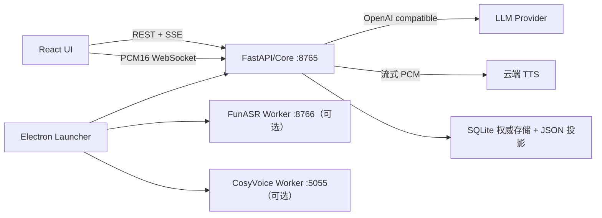
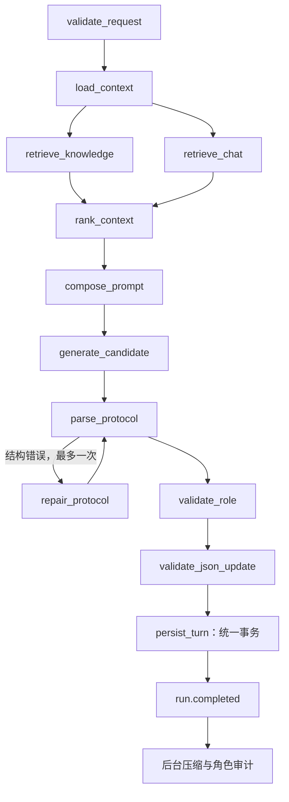
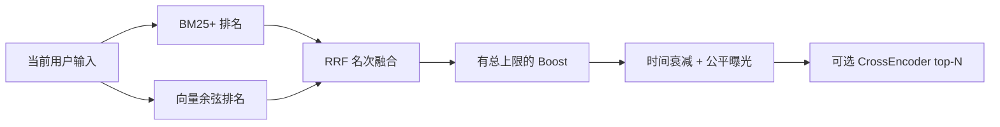

# Mindspace 工程师手册

## 1. 文档范围与稳定契约

本文面向应用开发、算法、测试、发布和运维工程师，以当前 `0.4.5` 仓库实现为准。六项基础契约已经冻结：

1. BM25+、向量、RRF、有界 Boost 与可选 reranker 的召回流水线；
2. 不阻塞可见回复和首段 TTS 的异步复杂角色审计；
3. 只用于计量、不参与模型决策的 Provider 缓存遥测；
4. 档案、会话、记忆与 Context Ledger 的统一 SQLite 事务；
5. 版本化 Profile Schema 与确定性结构化记忆重建；
6. 不依赖主模型猜测的实体规范化和人工别名注册表。

未来能力扩展可以新增 adapter、表、字段、模型或工具，但不得绕过这些契约。详细不变量见 `docs/APPLICATION_ALGORITHM_FOUNDATION.md`。

## 2. 仓库与运行目录

### 2.1 源码目录

```text
A:\RAG\langgarph-rag\
├─ src\mindspace_graph\       FastAPI、LangGraph、Prompt、存储与语音后端
├─ frontend\                  React/Vite 聊天前端
├─ desktop\                   Electron Launcher、运行时和更新器
├─ scripts\                   启动、验证、构建和发布脚本
├─ tests\                     Python 自动化测试
├─ assets\models\            开发环境本地模型
├─ runtime\                   源码运行数据
└─ docs\                      架构、算法、发布与运维文档
```

`A:\Mindscape` 与 `A:\Mindscape-app` 只作为只读来源，不得被新项目写入。

### 2.2 正式安装目录

```text
%LOCALAPPDATA%\Mindspace\
├─ application\              Launcher 与当前 Core
├─ environment\              私有 PowerShell、Git、uv、Python 和 venv
├─ models\                   向量、ASR 与可选本地 TTS 模型
├─ data\                     用户数据
├─ downloads\                可续传下载
└─ logs\                     Launcher 与服务日志
```

程序更新只能替换 `application`；环境、模型和用户数据独立演进。服务进程使用 Launcher 注入的绝对路径和私有 PATH，不调用系统 Python、pip、Git、uv 或 PowerShell。

## 3. 进程拓扑



- `8765`：静态前端、REST、SSE、ASR 代理 WebSocket。
- `8766`：本地流式 Paraformer/FSMN-VAD/标点服务。
- `5055`：本地 CosyVoice 服务。
- 主 LLM、上下文压缩和角色审计是三个调用目的；后两者不属于前台 LangGraph 主路径。

## 4. 开发环境启动

源码开发需要 PowerShell 7 和仓库虚拟环境；正式用户安装不需要这些系统依赖。

```powershell
Set-Location A:\RAG\langgarph-rag

pwsh -NoProfile -File .\scripts\start.ps1 -OpenBrowser
pwsh -NoProfile -File .\scripts\start-asr.ps1
pwsh -NoProfile -File .\scripts\start-tts.ps1
```

单独启动服务：

```powershell
$env:PYTHONPATH = 'src'
.\.venv\Scripts\python.exe -m mindspace_graph.server
```

开发入口：

- 应用：`http://127.0.0.1:8765/`
- OpenAPI：`http://127.0.0.1:8765/api/docs`
- 主诊断：`http://127.0.0.1:8765/api/v1/diagnostics`

不要在源项目目录之外调用系统 `pip` 安装运行依赖。依赖版本由 `pyproject.toml` 与 `uv.lock` 固定。

## 5. LangGraph 一轮执行



关键时序要求：

- `retrieve_knowledge` 和 `retrieve_chat` 由图并行调度。
- `<response>` 中的文本通过 `response.delta` 立即流出。
- 协议修复锁定已经流出的正文，只修正尾部结构。
- 正则角色校验位于前台；复杂角色语义审计位于 `run.completed` 之后。
- 只有 `persist_turn` 成功提交后才发送成功终态。
- 取消必须发生在任何写操作之前或让整个事务回滚。

图定义在 `src/mindspace_graph/graph.py`，节点实现在 `src/mindspace_graph/nodes.py`，SSE 封装在 `src/mindspace_graph/service.py`。

## 6. Prompt 构建和缓存稳定性

### 6.1 Epoch 基线顺序

1. `system`：角色扮演、纯文字边界、可信度和 JSON 协议。
2. `system`：产品中配置的角色 System Prompt 与用户设定。
3. `user`：三份完整权威 JSON 基线及 revision。

动态尾部依次追加：`turn_control`、`retrieval_context`、可选 `tool_context`、`current_user`、`assistant_message` 和真正提交后的 `authoritative_json_patch`。

在同一 Epoch 内，第 `N+1` 轮完整复用第 `N` 轮旧 Prompt 字节前缀。只有 system/persona 改变、档案在账本外变化、删除/重新生成或后台压缩成功时建立新 Epoch。不要恢复固定五轮搬移历史窗口的算法。

工具描述位于动态尾部，因为未来 Skill/MCP 能力集合会变化；不得把不稳定工具列表插进 system 与 JSON 基线之间。

### 6.2 信息可信度

```text
当前用户明确输入（可触发变更）
    > 当前权威 JSON（字段范围内最高持久事实）
    > 未删除原始历史
    > 聊天/结构化记忆召回
    > 知识库外部资料
```

删除事件是特殊负向证据。召回 metadata、实体 ID、曝光统计和 JSON 标签不进入主 Prompt。

### 6.3 Provider 缓存遥测

流式请求优先请求 usage。适配器兼容：

- `prompt_tokens_details.cached_tokens`
- `input_tokens_details.cached_tokens`
- `prompt_cache_hit_tokens`
- `cache_read_input_tokens`

数据写入 `model_usage` 并发出 `model.usage`。如果 Provider 不报告，必须保持 `unreported`，不能用本地字节前缀推算成账单命中量。

## 7. JSON 写回和 Profile Schema

权威文档：

| target | 投影文件 | 主要内容 |
|---|---|---|
| `user_profile` | `user-profile.json` | 用户身份、偏好、经历与边界 |
| `ai_profile` | `ai-profile.json` | AI 身份、性格、关系与行为规则 |
| `runtime_state` | `runtime-state.json` | 当前目标、话题、关系状态与待办 |

模型只能输出最多三个注册叶子 Patch。服务端验证 trigger、evidence、revision、操作、路径和值类型。`schema_version`、`profile_type`、`revision` 和 `updated_at` 永远由服务端管理。

高级整文档编辑还必须通过 `ProfileSchemaRegistry`：

- 必需顶层分区和注册字段存在；
- scalar/list 类型正确；
- 最大嵌套 12 层、文档 512 KiB；
- 数字有限，不接受 NaN/Infinity；
- 未知扩展字段允许保留；
- 未来 major schema 必须有显式迁移。

整文档编辑成功后，在同一事务内重建结构化记忆。

## 8. 结构化记忆和实体治理

结构化记忆不是第二个分类模型。只有已经提交的 JSON Patch 才能产生长期绑定：

- `episodes`：本轮原始文本；
- `active`：当前有效字段绑定；
- `untagged`：无 Patch 文本的有界隔离池，不参与长期召回；
- `tombstones`：替换、删除和容量淘汰的审计记录。

`MemoryRegistry` 定义 `field_code`、路径、value kind、reducer、scope、lifecycle、容量、冲突族和极性。实体层执行 NFKC、casefold、空白/标点清理和显式 alias 查询。

禁止让主对话模型自动判断同义词。正确流程是：创建或找到 canonical entity，人工添加 alias，再由 opposing-set reducer 自动删除冲突极性。

维护命令：

```powershell
mindspace-admin check --runtime <runtime目录>
mindspace-admin rebuild-memory --runtime <runtime目录>
mindspace-admin rebuild-memory --runtime <runtime目录> --apply --confirm REBUILD
```

不带 `--apply` 的重建只做预检。

## 9. 混合检索算法



规则：

- 中文采用确定性双字切分，英文采用字母数字词。
- BM25+ 和向量原始分数不直接相加；RRF 只融合名次。
- Boost 总量受 `max_total_boost` 限制，不能复活零相关候选。
- `candidate_multiplier × k` 决定融合前候选规模。
- reranker 只从本地路径加载，运行期禁止自动下载。
- 每条 `RetrievedChunk.metadata` 必须保留各阶段分数。
- 时间和饥饿补偿只能重排已通过阈值的候选。

知识使用 child 匹配、parent 入 Prompt；同一 parent 的重复精确 child 使用稳定首个证据锚点。隐藏主动信号在历史和检索层都必须过滤。

## 10. Context Ledger、压缩与角色审计

### 10.1 Context Ledger

核心表包括 `context_sessions`、`context_epochs`、`context_events`、`turn_commits`、`context_outbox` 和 `compaction_jobs`。事件分别记录 UI、模型、召回和持久化可见性，不能用一个 `hidden` 开关替代四种语义。

`request_id` 已用于 turn commit 幂等判断。同一 request 重试不得重复写入人物档案、会话或 Context。

### 10.2 后台压缩

主事务只写 outbox。软阈值或 Patch 数达到配置后，后台任务压缩较早对话，保留近期原始轮次。压缩只输出对话进展、未决事项、承诺和关系事件，无权修改人物 JSON。

激活前必须比较 source epoch 和 rewrite version；删除、重新生成或新压缩使旧任务变 stale。硬上限只为当前请求生成临时有界视图，不能同步等待压缩模型。

### 10.3 复杂角色审计

前台正则只处理明显越界。后台 `RoleAuditService` 在没有活动主运行时取持久任务，输出固定 JSON：一致性、严重度、置信度、证据和下一轮指令。

`style` 只记录；只有 `identity / boundary / reality` 且置信度至少 `0.85` 才追加下一轮纠偏事件。审计不能替换已发回复，不能写人物 JSON，失败任务最多重试三次。

## 11. 统一事务与数据投影

`data/context/context.db` 是权威存储。`ProductDatabase.transaction()` 统一提交：

- 三份档案；
- session 消息；
- 写入凭证和删除事件；
- 结构化记忆；
- Context event 和 turn commit；
- usage 与后台任务 outbox。

SQLite 开启 WAL、外键、`synchronous=FULL` 和 busy timeout。任一步抛错会回滚全部 canonical state。

原 JSON 文件是提交后投影，不再是权威源。投影失败不能让已提交事务返回失败；错误记录在 `projection_failures`。下一次构建容器会从 SQLite 重新生成投影，并将旧故障标记为已处理。

知识库 `knowledge.json` 是独立内容库，不参与单轮对话事务；新增和删除知识使用自身的原子文件替换。

发布门槛：`GET /api/v1/diagnostics` 中 `foundation.ok=true`、`sqlite=ok`、`open_transactions=0`、`projection_failures=0`。

## 12. 删除与重新生成

单 AI 消息删除：

1. 保留对应用户消息；
2. AI 内容退出 UI、聊天召回和结构化记忆；
3. 当场不修改人物 JSON；
4. 创建 pending 删除事件和原写入凭证；
5. 当前 Epoch 失效；
6. 下一次成功 primary 对话完成 JSON 校正并消费事件。

取消、LLM 失败、JSON 校验失败、主动回复和 regenerate 不消费 pending 事件。整轮与清空会话执行相同的事务边界；删除整个 session 会删除其 Context 和事件，因为不存在后续同会话校正。

## 13. 实时语音

浏览器 `pcm-worklet.js` 完成降采样、PCM16 和能量计算，通过 `/api/v1/audio/asr/stream` 发送固定帧。ASR partial 必须限频，不能让每个音频帧触发 React 消息列表重渲染。

VAD final 触发正常聊天 SSE。`asr.speech_start` 会取消当前 LangGraph run、TTS 请求和播放队列，形成插话。退出语音模式必须释放媒体轨、Worklet、AudioContext、WebSocket、AbortController 和音频缓冲。

TTS 客户端按完整自然句切分；括号动作过滤后调用 `/api/v1/audio/tts/stream`。当前句播放期间继续生成下一句。云端 SiliconFlow 和本地 CosyVoice 共用分句、队列、取消和错误语义，禁止异常时偷偷切换浏览器音色。

## 14. API 分类

| 范围 | 主要入口 |
|---|---|
| 健康与配置 | `/health`、`/config`、`/settings`、`/settings/test` |
| 对话 | `/chat`、`/chat/stream`、`/interrupt`、`/runs/{id}/cancel` |
| 会话 | `/sessions`、消息/轮次删除、clear、context diagnostics |
| 记忆 | `/memory/structured`、`/memory/items`、`/memory/registry`、`/memory/rebuild` |
| 实体 | `/memory/entities`、aliases、merge |
| 知识 | `/knowledge`、upload、stats、chunk delete |
| 档案与头像 | `/profiles/{name}`、card、`/avatar/config`、upload |
| 音频 | `/audio/status`、TTS、参考音频、ASR、ASR WebSocket |
| 系统 | `/diagnostics`、`/data/clear` |

所有实际路径带 `/api/v1` 前缀。接口模型以 `src/mindspace_graph/api.py` 和生成的 OpenAPI 为最终准据。

## 15. SSE 合约

每个事件信封包含 `version`、`event`、`seq`、`run_id`、`session_id`、`round`、`timestamp` 和 `data`。

重要事件：

- `run.accepted`
- `node.started` / `node.completed`
- `retrieval.completed`
- `response.delta`
- `model.usage`
- `validation.completed`
- `json_update.committed`
- `run.completed` / `run.error` / `run.cancelled`

前端不得把 `node.completed` 当作消息完成；只有 run 终态结束本轮。TTS 只消费 `response.delta` 内的可见正文。

## 16. 配置

产品设置位于 `runtime/config/settings.json`，由 `ProductConfigStore` 合并已知键、限制数值范围并脱敏公开快照。

重要环境变量：

| 变量 | 用途 |
|---|---|
| `MINDSPACE_RUNTIME_DIR` | 用户数据和运行状态 |
| `MINDSPACE_MODEL_ROOT` | 模型根目录 |
| `MINDSPACE_LLM_MODE` | `demo` 或 `openai` |
| `MINDSPACE_LLM_BASE_URL` | OpenAI 兼容端点 |
| `MINDSPACE_LLM_API_KEY` | LLM 密钥 |
| `MINDSPACE_LLM_MODEL` | 主模型 |
| `MINDSPACE_LLM_CONTEXT_WINDOW` | 上下文窗口估值 |
| `MINDSPACE_CONTEXT_COMPACTION_*` | 压缩模型和阈值 |
| `MINDSPACE_ROLE_AUDIT_ENABLED` | 后台复杂角色审计 |
| `MINDSPACE_ROLE_AUDIT_MODEL` | 审计模型，空则复用主模型名 |
| `MINDSPACE_TTS_PROVIDER` | 云端或本地 TTS |
| `MINDSPACE_ASR_*` | ASR 端点、模型和设备 |

密钥不得写入 Prompt、日志、公开配置、更新包或测试 fixture。

## 17. Launcher 与零环境运行时

Launcher 使用签名 `runtime-manifest.json` 管理 PowerShell、MinGit、uv、Python、venv 和模型依赖。下载保存为 `.partial`，部署到 `.staging-*`，通过探针后原子切换 `current.json`。

基础组件失败不得写“已安装”状态。CPU/AMD 设备必须能够完成 Core 安装；NVIDIA 驱动只能由系统提供，缺失时禁用本地语音而不是阻断应用。

进程启动必须使用私有绝对路径和下列环境变量：`MINDSPACE_HOME`、`MINDSPACE_ENVIRONMENT`、`MINDSPACE_MODEL_ROOT`、`MINDSPACE_DATA_ROOT`、`MINDSPACE_PWSH`、`MINDSPACE_UV`、`UV_PYTHON_INSTALL_DIR`、`UV_CACHE_DIR` 和 `UV_PROJECT_ENVIRONMENT`。

## 18. 在线更新与发布

更新分为 Core 与 Launcher：

- Core：业务、Prompt、RAG、前端和编排，小型 ZIP 增量更新。
- Launcher：Electron/安装器/更新器变化，使用 NSIS 更新。

发布顺序必须是：生成不可变版本文件、上传版本文件、验证远端大小与哈希、最后原子替换签名 catalog。Catalog sequence 永久递增，支持灰度比例；客户端验证 Ed25519、HTTPS、大小和 SHA-256。

```powershell
.\scripts\prepare-online-release.ps1 `
  -Version <version> `
  -Sequence <递增序号> `
  -Channel stable `
  -Rollout 10 `
  -Title '<标题>' `
  -Notes '<说明>'

node .\scripts\verify-online-release.mjs --full
```

私钥只能留在发布机。公开 Launcher 必须通过 Authenticode；`-AllowUnsignedLauncher` 只允许本地测试。

## 19. 测试与发布门槛

```powershell
Set-Location A:\RAG\langgarph-rag

.\.venv\Scripts\python.exe -m ruff check src tests
.\.venv\Scripts\python.exe -m pytest -q

Set-Location .\frontend
npm test -- --run
npm run build

Set-Location ..\desktop
npm test
npm run check
```

应用层故障测试至少覆盖：

- 事务中途异常后档案、session、记忆和 Context 全部保持原值；
- JSON 投影失败不影响 canonical commit，并可在下一次启动修复；
- 同义 alias 在 opposing set 中生成“删旧极性、加新极性”；
- 非法整文档被 Schema 拒绝；
- RRF 保留两路独立排名证据；
- cached-token 字段兼容解析；
- 复杂角色审计不改变当前回复，只追加下一轮纠偏。

当前基线（2026-07-20）：Python 78 项、前端 18 项、Launcher 23 项全部通过；Ruff、TypeScript 和生产前端构建通过。测试数量会随能力扩展增加，不应把固定数量写入 CI 判定。

## 20. 常见排障

### 固定演示回复

检查 `settings.llm.mode` 是否仍为 `demo`，然后执行 `/api/v1/settings/test` 的真实最小生成。

### 召回为空

检查 RAG/knowledge/chat 开关、阈值、知识库统计和 `retrieval.completed`。查看候选 metadata 的 `bm25_score`、`vector_score`、`rrf_score`、`boosts` 和 `final_score`，不要只看最终分数。

### 精排未运行

检查 `/api/v1/diagnostics.retrieval.reranker`。模型目录缺失时退回 RRF 是正常状态；禁止请求路径中临时下载模型。

### SQLite 或投影异常

```powershell
mindspace-admin check --runtime <runtime目录>
```

要求 SQLite 为 `ok`、open transaction 和 projection failure 为 0。JSON 内容与数据库冲突时以数据库为准，重启容器会重新投影；不要手工用 JSON 覆盖数据库。

### 语音一直聆听或误触发

检查浏览器麦克风权限、ASR WebSocket、能量阈值、噪声门、最短语音时长和 VAD 静音时长。必须用真实 `asr.partial/final/speech_start` 时间线判断，不能只看麦克风动画。

### TTS 首句慢

检查前端是否按句触发、云端首包时间、协议修复比例和是否把括号内容过滤。角色审计和上下文压缩不应出现在首句关键路径中。

## 21. 扩展开发守则

- 新记忆字段：先更新 Profile 默认结构和 Schema，再注册 `MemoryField`，补 reducer、迁移与测试。
- 新 Provider：实现 `LanguageModelPort`，保持 response-first 协议和 usage 遥测兼容。
- 新向量库或 reranker：实现 `RetrieverPort` 或精排 adapter，保留分数组件和无模型降级。
- 新 Skill/MCP：放入动态 `tool_context` 尾部，不能破坏稳定 Prompt 前缀；工具结果需要独立可信度与持久化资格。
- 新后台模型：必须走持久任务、租约、重试和 stale 检查，不能进入首字/首句 TTS 关键路径。
- 新存储：如果参与一轮对话事实提交，必须加入同一 `ProductDatabase` 事务；禁止恢复跨文件顺序写入。
- 新前端按钮：必须具备加载、成功、失败、空状态和禁用反馈，不允许无事件按钮。

## 22. 关联文档

- `APPLICATION_ALGORITHM_FOUNDATION.md`：冻结算法契约。
- `APPLICATION_FULL_CHAIN.md`：当前全链路实现。
- `DEVELOPER_MEMORY_RAG_PROMPT.md`：记忆、召回和 Prompt 深入说明。
- `ONLINE_UPDATE_RELEASE.md`：更新生成、上传和验收。
- `ZERO_ENVIRONMENT_RUNTIME.md`：私有运行时和组件状态机。
- `RUNTIME_RUNBOOK.md`：进程启动与健康检查。
