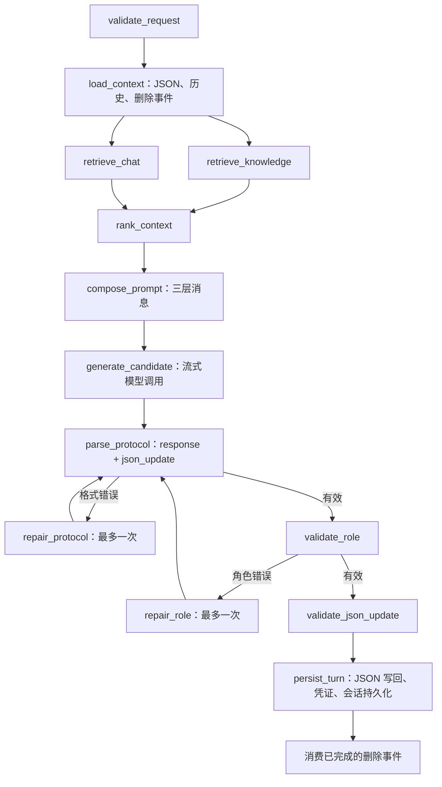

# LLM Prompt 与 JSON 决策编排

## 消息层级

模型调用固定发送三条消息：

1. `system`：角色扮演契约、信息可信度、JSON 修改规则和两段输出格式。
2. `system`：用户配置的角色提示、用户设定、AI 权威档案与行为约束。
3. `user`：权威 JSON、待处理删除事件、未删除历史、低可信召回和当前用户输入。

当前用户明确输入是唯一常规写回触发源。删除事件是唯一额外触发源。历史和召回只能辅助理解，不能独立写回，也不能覆盖 JSON。

## 模型输出

```text
<response>用户可见回复</response>
<json_update>{
  "turn_id": "round_10",
  "base_revisions": {
    "user_profile": 3,
    "ai_profile": 2,
    "runtime_state": 8
  },
  "trigger": "current_user",
  "patches": [
    {
      "target": "user_profile",
      "op": "replace",
      "path": "/identity/preferred_name",
      "value": "小林",
      "evidence_ids": ["current_user"]
    }
  ]
}</json_update>
```

无变更时必须返回 `trigger: "none"` 和 `patches: []`。服务端拒绝过期 revision、未知证据、非叶子路径和管理字段修改。普通轮次最多三个 Patch。

### 前三轮人物档案初始化

服务端只统计 `user_profile` 与 `ai_profile` 中注册为持久人物设定的叶子字段，不把本来就会动态变化的 `runtime_state` 计入空缺率。新会话第 1～3 轮内，若空字段达到 30%，且存在用户设定、角色 System Prompt、角色名称或当前明确输入，才开启 `profile_bootstrap`：

- 每轮最多补充 8 个不同字段；列表展开后最多 24 个叶子 Patch。只能填充服务端列出的空字段，不能删除或覆盖非空字段。
- `user_setup`、`character_setup` 和 `current_user` 由服务端分别约束到对应来源；历史与召回仍不可作为证据。
- 每个候选值必须逐字存在于声明的来源文本；服务端确定性过滤释义、扩写和无来源值，不允许为了填满档案而推测职业、偏好、经历或关系事实。
- 删除事件优先；重新生成不启动初始化。
- 第 4 轮无条件关闭初始化通道，并恢复普通每轮最多 3 个 Patch 的规则。

空缺检测、轮次窗口、候选路径和证据白名单均由服务端确定，模型只从已给设定中抽取值。字段代码、记忆键和归并元数据仍不进入 Prompt。

### AI 主动回复

输入区的“让 AI 说点什么”使用 `initiative=true` 调用正常流式编排。服务端从权威用户档案的 `identity.preferred_name` 读取实际称呼；字段仍为默认值时才回退到人物设置中的用户称呼，并生成内部意图：

```text
{实际称呼}不想说什么，但是想让你说点什么。
```

该模式会结合当前角色、权威 JSON、未删除历史与召回内容生成自然回应，但强制 `trigger=none`、`patches=[]`。内部用户信号不显示、不导出、不进入聊天召回或结构化记忆；会话公开视图只保存 AI 回复。重新生成继续保持主动回复模式，删除主动回复会同时清除内部信号且不创建 JSON 删除校正事件。

## LangGraph 流程



协议修复、角色修复和重新生成得到的结果都不能修改 JSON，也不能消费待处理删除事件。

## 删除回复

`DELETE /api/v1/sessions/{session_id}/messages/{message_id}` 只接受 AI 消息。删除后：

- 用户消息保留，AI 消息立即退出会话历史和聊天召回。
- 当前三份 JSON 不发生任何修改。
- 删除内容、轮次和该回复关联的写回凭证被保存为负向证据。
- 下一次未修复的正常主流程可提交修正 Patch；有效 `none` 表示复核后无需修改。
- 生成取消、结构失败、角色失败或 JSON 校验失败时，删除事件继续保留。

## JSON 所有权

- `user_profile`：用户身份、偏好、经历和行为边界。
- `ai_profile`：角色身份、性格、关系规则、行为规则和连续性。
- `runtime_state`：当前关系、用户状态、AI 待办和会话摘要。
- `schema_version`、`profile_type`、`revision`、`updated_at` 由服务端独占维护。
