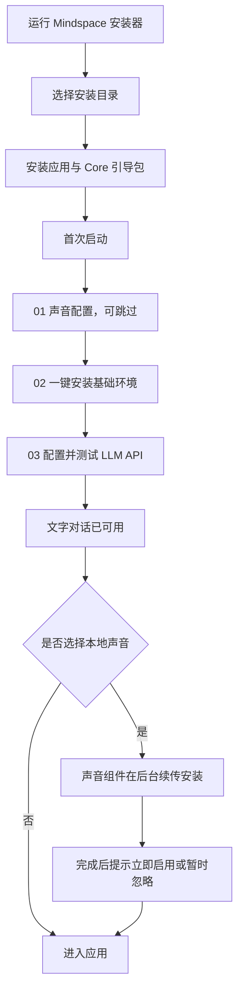

> 文档状态：historical。仅保留历史证据，不得作为当前操作说明；当前权威见 `docs/INDEX.md`。

# Mindspace 0.5.49 产品交付与安装方案

文档状态：产品评审版  
目标版本：0.5.49  
目标平台：Windows 10/11 x64  
安装范围：当前 Windows 用户  

## 1. 交付目标

本版本把 Mindspace 交付为标准 Windows 桌面应用。用户先完成轻量应用安装，再由启动器引导完成基础环境、对话模型和可选语音能力。

产品目标：

- 安装器能够快速完成，不在安装阶段下载模型、创建 Python 环境或启动 GPU 服务。
- 首次启动后，用户即使不安装语音，也能完成配置并使用文字对话。
- 基础环境支持断点续传、失败重试和已完成项复用。
- GPT-SoVITS、CosyVoice、Qwen3-TTS 互相独立，用户只安装自己选择的一套。
- 更新应用、修复环境和卸载程序时，默认保留会话、人物卡、用户 JSON、RAG、模型与参考音频。
- 任何语音或 GPU 故障只降级相应能力，不阻塞 Core 和文字聊天。

非目标：

- 安装器不自动安装 WSL2、显卡驱动或 vLLM。
- 安装器不自动下载大模型。
- 安装器不自动启动 ASR、TTS 或 Qwen3 服务。
- 0.5.49 不改变人物卡、Prompt、RAG 和用户资料结构。

## 2. 用户流程

### 2.1 Windows 安装

安装向导只提供必要选项：

1. 确认安装；
2. 选择应用程序目录；
3. 写入应用文件；
4. 创建桌面和开始菜单快捷方式；
5. 完成并启动 Mindspace。

安装阶段不得显示模型加载、ASR 预热、TTS 预热或 vLLM 启动进度。若旧版 Mindspace 正在运行，安装器应明确要求退出，并在用户确认后有限等待；失败时允许重试或取消，不能无限自动循环。

### 2.2 首次启动

首次引导分为四步：

1. **声音配置（可选）**：只保存选择，不立即下载。
2. **基础环境**：一个“一键安装”按钮，默认国内源，显示总进度和当前项目。
3. **对话模型**：提供 DeepSeek、SiliconFlow 和 OpenAI 兼容接口，附官方入口、连接测试和可操作错误提示。
4. **准备完成**：基础环境与 LLM 可用后即可进入；声音可以继续在后台下载。

用户已经完成配置后，后续启动直接进入服务管理页，不重复弹出向导。用户可主动进入“重新配置”修改声音或 LLM，并可返回上一步；已完成项目与已填写内容必须保留。

### 2.3 日常启动

- Launcher 启动后默认拉起 Mindspace Core。
- Core 可用时允许直接进入文字应用。
- ASR 未启用时明确提示“本次启动不存在语音功能”，但不阻止进入。
- TTS 未启用时只禁用朗读，不影响聊天、档案和 RAG。
- 关闭主窗口默认收至托盘；选择“退出”才停止受管服务。

## 3. 声音产品矩阵

| 选择 | 用户价值 | 建议硬件 | 安装与运行方式 | 读取方式 |
| --- | --- | --- | --- | --- |
| 不启用声音 | 最快开始文字对话 | 无独显要求 | 不下载语音组件 | 无 |
| GPT-SoVITS | 多套二次元角色音色 | 6–8 GB 显存 | Windows 本地运行时和选定音色 | LLM 纯口语输出，多段串行流式朗读 |
| CosyVoice | 使用参考音频克隆音色 | 6–8 GB 显存 | Windows 本地运行时、模型和参考音频 | LLM 纯口语输出，多段串行流式朗读 |
| Qwen3-TTS | 高质量、活人感较强的预置声线 | 16 GB 显存、32 GB 内存 | 仅在 WSL2、NVIDIA、模型和运行时预检通过后开放 | LLM 输出隐藏语气标签，整轮正文单次合成，PCM 可边到边播 |
| 云端 TTS | 无本地显存占用 | 稳定网络 | 用户自行配置兼容服务 | 由云端能力决定 |

约束：

- Qwen3-TTS 不作为普通用户默认选项。
- Qwen3 预检不满足时不开放下载按钮，只显示缺失条件。
- 同时只允许一个本地 TTS 引擎常驻，切换时先停止旧引擎并释放显存。
- 不允许因选定语音尚未安装而隐式启动另一套高占用引擎。

## 4. 包体与目录边界

### 4.1 安装包内容

NSIS 安装包只包含：

- Electron Launcher 与前端资源；
- Mindspace Core 引导 ZIP；
- 受签名约束的基础运行时清单；
- 图标、卸载器和快捷方式信息。

安装包不包含：

- Python、PowerShell、MinGit、uv 的完整归档；
- ASR、向量、GPT-SoVITS、CosyVoice、Qwen3 模型；
- WSL2、vLLM、CUDA 或显卡驱动；
- 用户会话、人物卡、JSON、RAG、参考音频和私有素材。

### 4.2 数据目录

| 类型 | 目录 | 更新策略 | 卸载默认策略 |
| --- | --- | --- | --- |
| 应用程序 | 用户选择的安装目录 | 安装器替换 | 删除 |
| Core | `<Mindspace Home>\application\core` | 签名包原子更新，可回滚 | 保留 |
| 私有环境 | `<Mindspace Home>\environment` | 组件级安装和修复 | 保留用户自选存储中的环境 |
| 模型 | `<Mindspace Home>\models` | 按组件下载 | 保留 |
| 用户数据 | `<Mindspace Home>\data` | 业务层迁移 | 永远默认保留 |
| 日志与下载 | `<Mindspace Home>\logs`、`downloads` | 可清理、可续传 | 可清理 |
| 备份 | `<Mindspace Home>\backups` | 更新和迁移前创建 | 保留 |

默认 Home 为 `%LOCALAPPDATA%\Mindspace`。用户修改存储位置后，程序通过 `storage-location.json` 定位新目录；安装目录和数据目录始终是两个概念。

## 5. 下载、安装与恢复策略

### 5.1 基础环境

依赖顺序：

`PowerShell 7 → MinGit → uv → Python 3.11 → Core venv → 中文向量模型`

规则：

- 默认使用国内镜像，可在高级设置切换官方源。
- 下载写入 `.partial`，服务器支持 Range 时断点续传。
- 每个归档必须校验声明大小和 SHA-256。
- 解压先写入临时目录，探针通过后原子切换到正式目录。
- 重启后读取组件凭证，不重复安装已完成项。
- 基础环境优先于可选语音；声音下载不能占住基础链。

### 5.2 可选声音

- 用户在第 01 步的选择只生成安装计划。
- 基础环境可用后才启动单一后台声音队列。
- 声音就绪后弹窗一次：“立即启用 / 暂时忽略”。
- 失败时保留断点、错误原因和重试入口。
- 取消下载只取消当前组件，不清空已完成组件。

### 5.3 运行恢复

- Core 失败：保留 Launcher，显示日志位置、重试和修复入口。
- ASR 失败：回退文字输入，不重启 Core/TTS，不刷新页面。
- TTS 失败：回退静音文字回复，不中断 LLM 流和 ASR。
- LLM 流被打断：结束当前运行，清空当前 TTS 队列，保留已显示正文，下一轮使用新意图。
- 应用退出：只停止受 Launcher 管理的进程；不误杀用户自行启动的 WSL 或其他 Python 服务。

## 6. 安装、升级、修复与卸载

### 6.1 全新安装

- 安装器退出码必须为 0。
- 安装目录包含主程序、资源包和卸载器。
- 首次启动可创建空白 Home，但不得导入或覆盖其他目录数据。
- 未配置声音时不得产生 GPU 模型进程。

### 6.2 覆盖升级

- 安装新版本前关闭旧版 `Mindspace.exe`。
- 只替换安装目录中的应用文件。
- 不删除 Home 下的数据、模型、私有环境和下载断点。
- 升级后读取原 Launcher 配置和存储位置。
- Core 更新失败时保留上一版本并提供回滚。

### 6.3 修复

- 修复以组件为粒度校验，不执行“全部删除后重装”。
- 对损坏归档重新下载，对已验证归档直接复用。
- 修复期间文字应用可在 Core 仍健康时继续使用。

### 6.4 卸载

- 卸载应用程序文件和快捷方式。
- 默认保留用户数据、模型、人物卡、RAG 和参考音频。
- 只有用户在可见确认框中主动选择时，才允许删除默认 Home 的个人数据。
- 自定义磁盘 Home 不由卸载器递归删除，避免路径误判造成数据损失。

## 7. 用户提示规范

每个错误必须同时包含“发生了什么、影响什么、用户能做什么”。

示例：

- “Core 尚未就绪：当前不能进入聊天。请点击重试；诊断日志位于……”
- “ASR 未启动：本次可正常文字对话，语音输入暂不可用。”
- “Qwen3 不满足条件：需要 16 GB 显存、32 GB 内存和已验证的 WSL2 运行时；未开始下载。”
- “声音仍在后台安装：文字对话已经可用，完成后会通知。”
- “Mindspace 仍在退出：请从托盘选择退出，然后重试安装；个人数据不会被修改。”

禁止使用只有“失败”“错误码”而没有影响范围和下一步的提示。

## 8. 发布验收

### 8.1 自动测试

- Core Python 测试。
- Web 前端测试、lint 和 production build。
- Desktop TypeScript 检查、Node 测试和 production build。
- 安装器策略测试：进程关闭、升级保护、卸载数据边界。
- Core 引导 ZIP 大小与 SHA-256 校验。

### 8.2 独立安装验证

必须在独立 QA 目录执行：

1. 静默全新安装并记录耗时和退出码；
2. 校验安装文件、产品版本和卸载器；
3. 使用隔离的 `MINDSPACE_HOME` 首次启动；
4. 验证 Launcher 自动启动 Core；
5. 验证未安装 ASR/TTS 时可进入文字模式；
6. 快速退出并重启，确认不出现重复进程；
7. 再次运行同版本安装器，验证覆盖安装；
8. 静默卸载，验证程序文件删除、隔离数据仍保留。

### 8.3 发布闸门

以下任一项失败，不得标记为可交付：

- 安装或卸载退出码非 0；
- 安装过程启动模型或 GPU 服务；
- Core 不能独立启动；
- 覆盖安装改写用户数据；
- 卸载默认删除用户数据；
- 组件下载不支持恢复或哈希不一致仍被标记为完成；
- 版本号在 Python、Desktop、Core 引导包或发布记录中不一致。

## 9. 签名与发布风险

Core 在线更新使用 Ed25519 清单和 SHA-256 校验；Windows 安装器仍需要 Authenticode 代码签名证书，二者不能互相替代。

若构建机没有可用证书，本地测试包可以生成，但必须标记为“未签名测试包”，不能宣称 Windows 发布者已验证，也不能直接进入公开稳定频道。

## 10. 本次交付物

- `Mindspace-0.5.49-x64.exe`：Windows NSIS 安装器；
- `Mindspace-0.5.49-x64.exe.blockmap`：差分更新索引；
- `latest.yml`：Electron 更新元数据；
- Core 0.5.49 引导 ZIP 与校验清单；
- 本文档；
- 安装验证记录：包体大小、SHA-256、签名状态、安装/覆盖/启动/卸载结果和已知限制。

