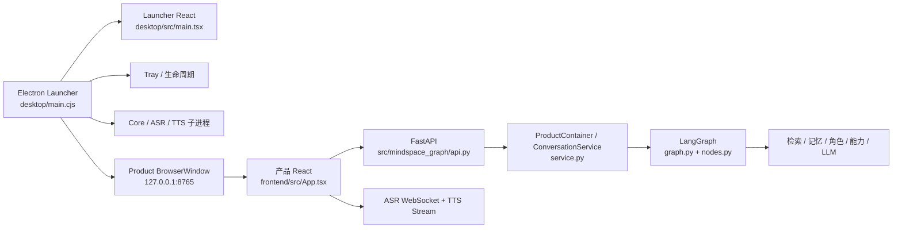

# Mindspace 0.7.4 功能图谱与增量修改路由

## 1. 维护基线

- 可编辑源码：`A:\RAG\langgarph-rag`
- Live2D 隔离工作树：`A:\RAG\langgarph-rag-live2d-companion`
- Live2D 分支：`feature/live2d-companion`
- 基线提交：`c43a22b28baa9a1ea43e4a5fce64e89165d4e303`
- 产品版本：Core `0.7.4`，Launcher `0.5.54`
- 安装/运行目录：`A:\Mindspace`、`A:\agent\Mindspace`，不得作为源码修改目标
- 官网源码：`C:\Users\Administrator\Documents\RAG`，不属于桌面产品源码

以后处理问题时先按本文定位到一个功能域，只读取该域入口、直接依赖和对应测试。除非入口无法确定，不对仓库、安装目录和历史产物做全局递归扫描。

## 2. 总体运行链路

## 3. 目录职责

| 路径 | 职责 | 修改边界 |
|---|---|---|
| `desktop/` | Electron 启动器、托盘、服务管理、更新、安装与打包 | 桌面生命周期和安装器只在这里改 |
| `desktop/src/main.tsx` | 启动器页面 | 服务面板、环境面板、桌宠入口 UI |
| `desktop/src/styles.css` | 启动器样式 | 不影响产品聊天页 |
| `frontend/` | Mindspace 产品页面 | 聊天、角色、场景、共同篇章、设置和语音交互 |
| `src/mindspace_graph/` | Python Core | API、LangGraph、记忆、角色、检索、语音编排 |
| `tests/` | Python Core 测试 | Core 修改必须有对应测试 |
| `desktop/*.test.cjs` | 启动器 Node 测试 | Electron 策略和生命周期修改的主要测试面 |
| `frontend/src/*.test.ts(x)` | 产品前端测试 | 产品页面交互修改使用 |
| `scripts/` | 构建、验收、发布、修复 | 不把业务逻辑塞进脚本 |
| `desktop/bootstrap/runtime-bundle/` | 离线运行环境 | 大体积二进制；常规定位禁止递归扫描 |
| `dist*`, `artifacts/`, `backups/` | 构建与历史产物 | 不是源码真相 |

## 4. Electron Launcher 功能图谱

### 4.1 主进程与窗口

| 功能 | 主入口 | 直接依赖/说明 |
|---|---|---|
| Launcher BrowserWindow | `desktop/main.cjs:createWindow()` | 加载 `desktop/dist/index.html`；关闭时隐藏到托盘 |
| 产品 BrowserWindow | `desktop/main.cjs:openProductWindow()` | 只加载 `http://127.0.0.1:8765/` |
| 麦克风权限 | `desktop/main.cjs:configureProductMediaPermissions()` | 仅允许 loopback Core 的音频权限 |
| 托盘 | `desktop/main.cjs:createTray()` | 打开产品、打开控制中心、停止服务、退出 |
| 单实例 | `desktop/main.cjs` 的 `requestSingleInstanceLock()` | 第二实例聚焦 Launcher |
| 退出清理 | `desktop/main.cjs` 的 `before-quit` | 停止服务、销毁托盘、退出 |
| 预加载桥 | `desktop/preload.cjs` | 仅暴露白名单 IPC，不启用 Node integration |
| Launcher 类型 | `desktop/src/vite-env.d.ts` | 新 IPC 必须同步类型 |

### 4.2 服务与运行环境

| 功能 | 路径 |
|---|---|
| Core/ASR/TTS 服务定义与监督 | `desktop/main.cjs` |
| 组件下载 | `desktop/component-manager.cjs` |
| 离线运行时安装、校验、卸载 | `desktop/runtime-manager.cjs` |
| 硬件门槛 | `desktop/hardware-policy.cjs` |
| 服务失败与重启策略 | `desktop/service-policy.cjs` |
| Qwen3 TTS 预检 | `desktop/qwen-runtime-policy.cjs` |
| 首次配置流程 | `desktop/onboarding-policy.cjs` |
| Core 首次释放 | `desktop/bootstrap-core.cjs` |
| 应用路径与旧目录迁移 | `desktop/app-paths.cjs` |
| 存储位置与跨盘迁移 | `desktop/storage-location.cjs` |

### 4.3 更新与发布

| 功能 | 路径 |
|---|---|
| Core 更新 | `desktop/update-manager.cjs` |
| Launcher 自更新 | `desktop/launcher-updater.cjs` |
| 更新公告显示策略 | `desktop/announcement-policy.cjs` |
| SDK/模型等额外资源打包 | `desktop/package.json > build.extraResources` |
| NSIS 安装器扩展 | `desktop/build/installer.nsh` |
| 在线发布脚本 | `scripts/prepare-online-release.ps1`, `scripts/publish-online-release*.ps1` |
| 发布验收 | `scripts/verify-online-release.mjs`, `scripts/test-update-e2e.ps1` |

### 4.4 Launcher IPC

所有 Launcher UI 到主进程的调用必须经过 `desktop/preload.cjs`。

现有通道分组：

- `launcher:snapshot`
- `launcher:service`
- `launcher:all`
- `launcher:open`
- `launcher:external`
- `launcher:maintenance`
- `launcher:select-root`
- `launcher:select-storage`
- `launcher:migrate-recommended-storage`
- `launcher:shortcut`
- `launcher:update`
- `launcher:component`
- `launcher:voice`
- `launcher:onboarding`
- `runtime:*`

Live2D 桌宠应新增独立的 `companion:*` 白名单，不复用可执行任意动作的通用 IPC，不增加后端网络端口。

## 5. 产品前端功能图谱

| 功能域 | 入口路径 | 对应 Core API |
|---|---|---|
| 会话、聊天、流式生成 | `frontend/src/App.tsx` | `/api/v1/sessions`, `/api/v1/chat/stream`, `/api/v1/runs/*` |
| 语音采集与 ASR | `frontend/src/App.tsx`, `microphone-capture.ts` | `/api/v1/audio/asr/stream` |
| TTS 流式播放 | `frontend/src/App.tsx`, `speech.ts`, `public/tts-playback-worklet.js` | `/api/v1/audio/tts/stream` |
| 角色创建/编辑/导入 | `frontend/src/CharacterExperience.tsx` | `/api/v1/characters*`, `/api/v1/character-drafts*` |
| 场景与陪伴活动 | `frontend/src/SceneExperience.tsx` | `/api/v1/scenes`, `/api/v1/activities*` |
| 日记、共同片段 | `frontend/src/SharedChapters.tsx` | `/journal`, `/moments` 路由组 |
| 设置、头像、声音 | `frontend/src/App.tsx` 设置面板 | `/api/v1/settings`, `/avatar/*`, `/audio/*` |
| 知识库 | `frontend/src/App.tsx:KnowledgePanel` | `/api/v1/knowledge*` |
| 结构化记忆 | `frontend/src/App.tsx:MemoryPanel` | `/api/v1/memory*` |
| 权威档案 | `frontend/src/App.tsx:ProfileEditor` | `/api/v1/profiles*` |
| 诊断与数据清理 | `frontend/src/App.tsx` | `/api/v1/diagnostics`, `/api/v1/data/clear` |

产品前端由 Core 作为静态资源提供。构建产物同步到 `src/mindspace_graph/web/`，但源码修改只发生在 `frontend/src/`。

## 6. Python Core 功能图谱

### 6.1 API 与容器

| 功能 | 路径 |
|---|---|
| FastAPI 路由 | `src/mindspace_graph/api.py` |
| 应用容器与会话编排 | `src/mindspace_graph/service.py` |
| 服务入口 | `src/mindspace_graph/server.py`, `cli.py` |
| 配置 | `src/mindspace_graph/settings.py`, `product_config.py` |
| 数据模型 | `src/mindspace_graph/models.py`, `state.py` |

### 6.2 LangGraph 与生成

| 功能 | 路径 |
|---|---|
| 图拓扑 | `src/mindspace_graph/graph.py` |
| 节点实现与模型调用 | `src/mindspace_graph/nodes.py` |
| Prompt 组装与缓存布局 | `src/mindspace_graph/prompting.py` |
| 流式协议解析 | `src/mindspace_graph/protocol.py` |
| 取消与中断 | `src/mindspace_graph/cancellation.py` |
| 上下文账本 | `src/mindspace_graph/context_ledger.py` |
| 上下文压缩 | `src/mindspace_graph/compaction.py` |
| Prompt 检查 | `src/mindspace_graph/prompt_inspection.py` |

### 6.3 角色、记忆与检索

| 功能 | 路径 |
|---|---|
| 角色仓库和草稿 | `characters.py` |
| 角色扮演层 | `roleplay.py`, `r18_director.py`, `role_audit.py` |
| 记忆字段注册 | `memory_registry.py` |
| 结构化记忆服务 | `memory_service.py`, `adapters/structured_memory.py` |
| 记忆抽取 | `memory_update.py` |
| JSON 写入策略 | `policies.py`, `profile_schema.py` |
| 用户/AI 档案持久化 | `adapters/file_storage.py` |
| 本地知识检索 | `adapters/local_retriever.py` |
| BM25/RRF/重排 | `retrieval_fusion.py` |
| 实体与别名 | `entity_registry.py` |
| 共同篇章 | `shared_chapters.py` |

### 6.4 能力与语音

| 功能 | 路径 |
|---|---|
| 只读工具/网页能力路由 | `capabilities.py` |
| 未执行工具时的声明保护 | `capabilities.py`, `nodes.py` |
| TTS 服务抽象 | `audio.py` |
| 情绪到声音提示 | `voice_render.py`, `emotion.py` |
| GPT-SoVITS 音色 | `gpt_sovits.py` |
| ASR WebSocket 与调度 | `streaming_asr.py` |
| 原生麦克风 | `native_microphone.py` |
| ASR 词表 | `asr_vocabulary.py` |

## 7. 按问题定位的最小读取表

| 问题 | 先读 | 对应测试 | 不先读 |
|---|---|---|---|
| Launcher 页面显示异常 | `desktop/src/main.tsx`, `styles.css` | `npm run check`, Launcher 截图 | Python Core |
| Launcher 窗口/托盘/退出 | `desktop/main.cjs`, `preload.cjs` | `desktop/*.test.cjs` 中生命周期相关项 | 前端聊天页 |
| 服务启动失败 | `main.cjs` 服务段、`service-policy.cjs` | `service-policy.test.cjs`, 实际日志 | 角色/记忆代码 |
| 环境安装失败 | `runtime-manager.cjs`, `runtime-manifest.json` | `runtime-manager.test.cjs` | LangGraph |
| 更新失败 | `update-manager.cjs` 或 `launcher-updater.cjs` | 同名测试、发布校验脚本 | ASR/TTS 模型目录 |
| 聊天流式问题 | `frontend/src/App.tsx` 流式段、`api.py` chat 路由、`service.py` | `test_streaming_protocol.py`, `App.test.tsx` | Launcher 安装逻辑 |
| Prompt/角色跑偏 | `prompting.py`, `roleplay.py`, `nodes.py` | `test_roleplay.py`, `test_prompt_cache_layout.py` | Electron UI |
| 记忆错误 | `memory_registry.py`, `memory_service.py`, `policies.py` | `test_memory_*`, `test_json_update_policy.py` | TTS |
| ASR 问题 | `streaming_asr.py`, `native_microphone.py`, 前端语音段 | `test_streaming_asr_noise.py`, `test_native_microphone.py` | 更新器 |
| TTS 问题 | `audio.py`, `voice_render.py`, 前端 TTS 段 | `test_audio.py`, `test_voice_render.py` | 角色切分资源 |
| Live2D 显示问题 | `desktop/companion*`, `desktop/assets/live2d*` | Companion 单测、Launcher 构建和窗口烟测 | Python Core、RAG、ASR |

## 8. Live2D 增量接入边界

Live2D 只允许触及以下区域：

- `desktop/main.cjs`：新增 CompanionWindow 生命周期和受限 IPC。
- `desktop/preload.cjs`：新增 `companion:*` 白名单。
- `desktop/src/main.tsx`：Launcher 上的显示/隐藏/常驻控制。
- `desktop/src/styles.css`：Launcher 预览区样式。
- `desktop/src/vite-env.d.ts`：IPC 类型。
- `desktop/companion/`：官方 Framework 派生的专用透明渲染工程；只在构建期使用。
- `desktop/companion-policy.cjs`：窗口尺寸、位置与配置归一化的纯策略模块。
- `desktop/assets/companion-renderer/`：构建后的 Core、Framework 和 v24 运行资源；随安装包离线携带。
- `desktop/assets/live2d/licenses/`：SDK、Core、Framework 许可证和可分发文件清单。
- `desktop/package.json`：仅增加静态资源打包映射。
- 新增 Companion 专项测试和文档。

明确不改：

- `src/mindspace_graph/api.py`
- `service.py`, `graph.py`, `nodes.py`
- RAG、记忆和角色档案结构
- ASR/TTS 服务端口
- 更新协议与 Core 包协议

## 9. 后续维护规则

1. 每个问题先从第 7 节选择一行，限定读取和修改范围。
2. 修改前核验目标是源码、安装目录还是构建产物。
3. 正常修复不扫描 `runtime-bundle`、`dist*`、`artifacts`、`backups` 和用户模型目录。
4. 新功能优先新增独立模块，通过小型接口接入现有入口。
5. 不向 Core 新增仅供桌面窗口使用的网络端口。
6. 模型损坏或 SDK 加载失败只能禁用/隐藏桌宠，不能影响 Launcher、聊天、ASR、TTS 和更新器。
7. 每个版本保留资源校验值、SDK 版本、许可文件和回退目录。
