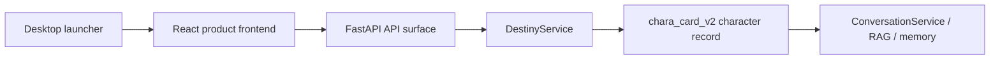

# Mindspace Current Function Map

## Source and runtime boundary

- Editable source: `A:\RAG\Mindspace-admin`
- Desktop runtime: `A:\Mindspace`
- User data and desktop API configuration: `A:\Mindspace\data`
- Never edit, replace, or clear runtime user data while developing or synchronizing code.
- Test source changes before a deliberate desktop synchronization. The runtime tree is not a second source checkout.

## Product flow

## V7 destiny creation

| Product responsibility | Source entry | API |
|---|---|---|
| V7 canvas, seed panel, selection and review | `frontend/src/DestinyCanvas.tsx` | `/api/v1/destiny/*` |
| Canvas visual system | `frontend/src/destiny-canvas.css` | None |
| Journey schema, prompts, validation and V2 synthesis | `src/mindspace_graph/destiny.py` | `/journeys`, `/archetypes`, `/cards`, `/selections`, `/synthesize`, `/commit` |
| Journey avatar lifecycle | `src/mindspace_graph/api.py` | `/destiny/avatars` |
| V2 card normalization and export | `src/mindspace_graph/character_card.py` | `/characters/{id}/card`, `/characters/{id}/export` |

The normal model path is exactly three business calls:

1. Generate eight direct character directions.
2. Generate all 96 lightweight cards in one call.
3. Synthesize the selected twelve cards into `chara_card_v2` text fields.

The journey records errors and call counts. Failed stages require an explicit retry and must not issue hidden repair calls.

## V2 character authority

- Canonical record: `chara_card_v2` plus `memory.preferences` and `memory.tasks`.
- Character library and historical migration: `src/mindspace_graph/characters.py`.
- Historical profile records are converted once to V2 and backed up before conversion.
- New manual draft, blueprint and legacy fate-authoring flows are retired. Their former API paths deliberately return `410 Gone` with a V7 migration message.
- The frontend must not call `/api/v1/character-drafts*`, `/api/v1/characters/fate-options`, or `/api/v1/characters/options`.

## Conversation and data services

| Domain | Main source | Core tests |
|---|---|---|
| Streaming conversation | `service.py`, `graph.py`, `nodes.py`, `api.py` | `tests/test_streaming_protocol.py` |
| Prompt and role state | `prompting.py`, `role_runtime.py`, `roleplay.py` | `tests/test_role_runtime.py`, `tests/test_prompt_cache_layout.py` |
| Memory and RAG | `memory_service.py`, `memory_update.py`, `adapters/local_retriever.py` | `tests/test_memory_*` |
| ASR and TTS | `streaming_asr.py`, `native_microphone.py`, `audio.py` | `tests/test_native_microphone.py`, `tests/test_audio.py` |
| Settings transactions | `api.py`, `settings.py`, `product_config.py` | `tests/test_stage1_hardening.py` |

## Required verification before desktop sync

1. `python -m ruff check src tests`
2. `python -m pytest --basetemp <new-writable-directory>`
3. `npm run check`, `npm run test`, and `npm run build` in `frontend`
4. One configured desktop-provider acceptance run when model or creation behavior changes.
5. Hash-compare selected Core files and frontend assets before copying. Do not touch `A:\Mindspace\data`.
