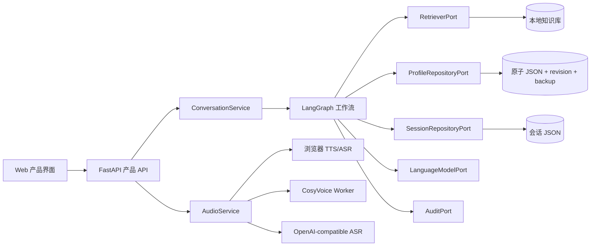

# 产品架构

## 总体结构



## 请求生命周期

1. 前端创建 `request_id` 并发起 `POST /api/v1/chat/stream`。
2. 服务端登记取消状态，发送 `accepted` SSE。
3. LangGraph 每完成一个节点就发送 `progress` SSE。
4. 知识和会话检索并行执行，在重排节点汇合。
5. 模型输出经协议解析、有限修复和角色校验。
6. 提交计划通过目标完整性、revision、路径和 JSON 值校验。
7. 关系状态通过明确性、当前时态、事件类型和置信度守卫。
8. 最终节点一次性写会话；只有首段、未修复、有效提交才允许写长期档案。
9. 服务端发送 `final`，前端可选择自动朗读。

## 打断语义

前端停止动作同时执行：

- `AbortController.abort()`：立即停止浏览器读取响应。
- `POST /api/v1/interrupt`：登记服务端取消信号。
- `speechSynthesis.cancel()`：停止浏览器朗读。
- `HTMLAudioElement.pause()`：停止后端音频播放。

每个有副作用的图节点都会检查取消信号。某些同步模型供应商无法中途终止已经发出的 HTTP 请求，但模型返回后会再次检查，因此不会继续保存会话或档案。

## 数据目录

所有可写数据默认位于本项目 `runtime/`：

```text
runtime/
├── data/
│   ├── profiles/
│   │   ├── user-profile.json
│   │   ├── ai-profile.json
│   │   ├── runtime-state.json
│   │   └── history/
│   ├── sessions/
│   ├── audio/
│   └── knowledge.json
└── logs/
    └── events.jsonl
```

## 当前检索策略

默认检索器执行 BM25+ 与本地 SentenceTransformer 向量双路召回、RRF、有界 Boost、时间/公平性排序，并支持可选离线 cross-encoder 精排。模型缺失时逐层安全退化，`RetrieverPort` 仍保持可替换。

## 安全边界

- API Key 只由服务端环境变量加载。
- 公共配置接口不返回密钥。
- 审计适配器递归脱敏 `api_key`、`authorization` 和 `token`。
- 档案写回只接受白名单 JSON Pointer。
- revision 不一致时拒绝提交，避免旧计划覆盖新状态。
- 默认只监听 `127.0.0.1`。
