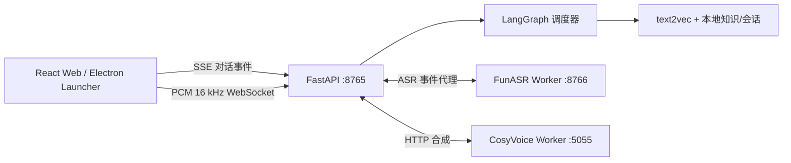
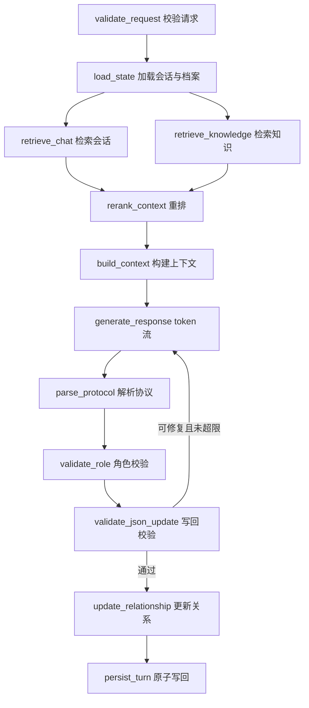

# Mindspace Graph 运行手册

## 进程边界



API、ASR、TTS 使用独立进程。大模型的加载或推理不会阻塞 LangGraph 的事件循环；Launcher 只管理由自身启动的进程，停止操作使用记录的进程树，不会按名称批量结束其他 Python 程序。

## LangGraph 调度



所有节点开始/结束、检索结果、模型增量、替换修复、校验结果和写回结果都使用统一事件信封：`version`、`event`、`seq`、`run_id`、`session_id`、`round`、`timestamp`、`data`。

## 实时语音与打断

1. 浏览器 AudioWorklet 读取麦克风，重采样为单声道 PCM16/16 kHz。
2. 主 API 通过 `/api/v1/audio/asr/stream` 将二进制帧代理给 FunASR Worker。
3. Worker 每 480 ms 做在线 Paraformer 推理，并用 FSMN-VAD 与能量阈值确定语音开始/静音端点。
4. `asr.speech_start` 到达主 API 时，当前 `run_id` 对应的 LangGraph 与 TTS 任务同时取消。
5. `asr.partial` 更新输入框；`asr.final` 加 CT-Punctuation 后按配置自动发送。

## 健康检查

```powershell
Invoke-RestMethod http://127.0.0.1:8765/api/v1/diagnostics
Invoke-RestMethod http://127.0.0.1:8766/health
Invoke-RestMethod http://127.0.0.1:5055/health
```

完整验证运行 `scripts\verify.ps1`；原工程只读验证运行 `scripts\verify-source-integrity.ps1`。
